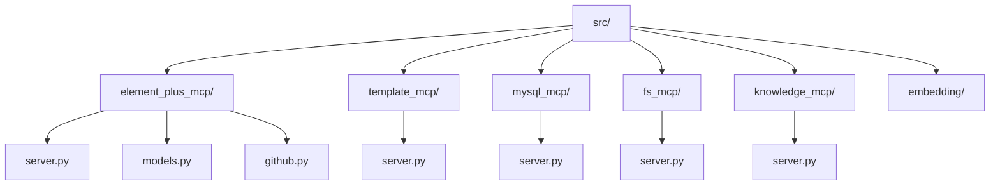
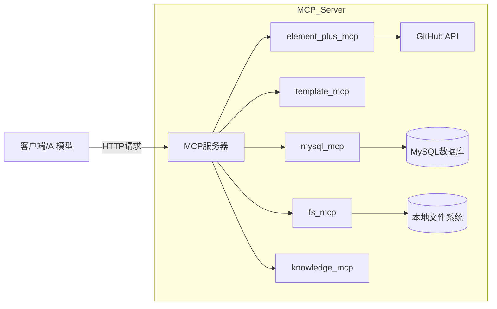
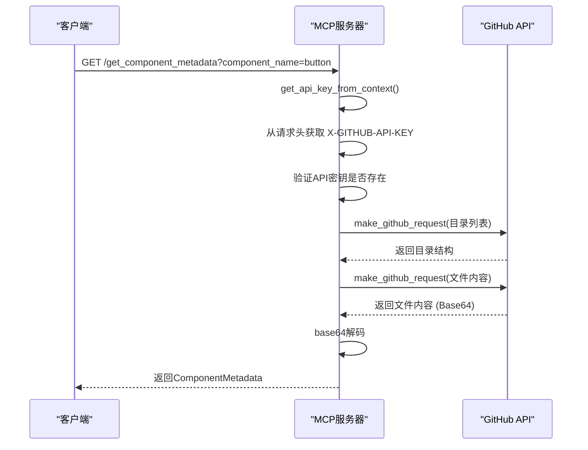
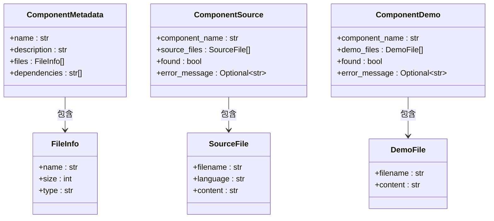
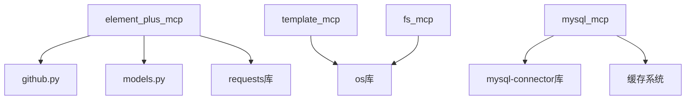

# API参考

<cite>
**本文档中引用的文件**  
- [server.py](file://src/element_plus_mcp/server.py)
- [github.py](file://src/element_plus_mcp/github.py)
- [models.py](file://src/element_plus_mcp/models.py)
- [server.py](file://src/template_mcp/server.py)
- [server.py](file://src/mysql_mcp/server.py)
- [types.py](file://src/mysql_mcp/types.py)
- [server.py](file://src/fs_mcp/server.py)
- [server.py](file://src/knowledge_mcp/server.py)
</cite>

## 更新摘要
**已做更改**  
- 在 **mysql_mcp 模块分析** 部分新增了关于 `prepare_template_context` 工具接口的详细文档。
- 更新了 **mysql_mcp 模块分析** 的 **本节来源**，添加了对 `server.py` 文件中新增接口的引用。
- 为 **template_mcp 模块分析** 和 **mysql_mcp 模块分析** 添加了缓存机制说明。
- 新增了 `get_sample_content` 和 `list_template_categories` 两个API端点的文档。
- 更新了相关代码文件的引用信息，反映最新的实现细节。

## 目录
1. [简介](#简介)
2. [项目结构](#项目结构)
3. [核心组件](#核心组件)
4. [架构概览](#架构概览)
5. [详细组件分析](#详细组件分析)
6. [依赖分析](#依赖分析)
7. [性能考虑](#性能考虑)
8. [故障排除指南](#故障排除指南)
9. [结论](#结论)

## 简介
本文档为 `test_mcp_server` 项目的完整RESTful API参考文档，涵盖所有MCP服务模块的公开API端点。文档详细描述了每个接口的HTTP方法、URL路径、请求参数、请求体结构、响应Schema、认证方式、头信息要求、权限控制、错误处理机制及使用示例。目标是为开发者提供清晰、准确、可操作的API使用指南。

## 项目结构
项目采用模块化设计，每个MCP服务模块独立封装在 `src` 目录下的子目录中。每个模块包含其自身的 `server.py` 文件作为API入口点，部分模块还包含 `models.py`（数据模型）、`github.py`（外部API集成）等辅助文件。整体结构清晰，职责分离明确。



**图示来源**
- [server.py](file://src/element_plus_mcp/server.py)
- [server.py](file://src/template_mcp/server.py)
- [server.py](file://src/mysql_mcp/server.py)
- [server.py](file://src/fs_mcp/server.py)
- [server.py](file://src/knowledge_mcp/server.py)

**本节来源**
- [server.py](file://src/element_plus_mcp/server.py)
- [server.py](file://src/template_mcp/server.py)

## 核心组件
项目的核心是多个独立的MCP服务模块，每个模块通过 `server.py` 文件暴露一组工具（Tool）作为API端点。这些工具由 `@mcp.tool()` 装饰器定义，可被外部系统（如AI模型）调用。核心组件包括：
- **element_plus_mcp**: 提供Element Plus组件的元数据、源码和演示代码。
- **template_mcp**: 提供代码生成模板的管理和访问。
- **mysql_mcp**: 提供对MySQL数据库的查询和表结构访问。
- **fs_mcp**: 提供对本地文件系统的读取功能。
- **knowledge_mcp**: 提供知识库相关的工具（具体功能需进一步分析）。

**本节来源**
- [server.py](file://src/element_plus_mcp/server.py)
- [server.py](file://src/template_mcp/server.py)
- [server.py](file://src/mysql_mcp/server.py)
- [server.py](file://src/fs_mcp/server.py)
- [server.py](file://src/knowledge_mcp/server.py)

## 架构概览
系统采用微服务架构思想，每个MCP模块是一个独立的服务单元。外部调用者通过HTTP请求与这些服务交互。服务内部通过定义好的工具函数处理业务逻辑，并可能调用外部API（如GitHub）或数据库。数据模型使用Pydantic定义，确保了数据的类型安全和序列化/反序列化的一致性。



**图示来源**
- [server.py](file://src/element_plus_mcp/server.py)
- [github.py](file://src/element_plus_mcp/github.py)
- [server.py](file://src/mysql_mcp/server.py)
- [server.py](file://src/fs_mcp/server.py)

## 详细组件分析

### element_plus_mcp 模块分析
该模块提供对Element Plus开源UI库的组件信息访问。

#### 认证机制
该模块使用API密钥进行认证。客户端必须在HTTP请求头中包含 `X-GITHUB-API-KEY` 字段，其值为有效的GitHub个人访问令牌（PAT）。

**认证流程序列图**


**图示来源**
- [server.py](file://src/element_plus_mcp/server.py#L34-L43)
- [github.py](file://src/element_plus_mcp/github.py#L21-L32)

#### 数据模型
使用Pydantic模型定义请求和响应结构。



**图示来源**
- [models.py](file://src/element_plus_mcp/models.py#L15-L68)

#### API端点

**1. 获取组件元数据**
- **HTTP方法**: GET
- **URL路径**: `/get_component_metadata`
- **请求参数**:
  - **查询参数**:
    - `component_name` (string, 必需): 组件名称。
- **认证方式**: `X-GITHUB-API-KEY` 头信息。
- **所需头信息**: `X-GITHUB-API-KEY: <your_github_pat>`
- **权限控制**: 需要有效的GitHub API密钥。
- **响应Schema**: `ComponentMetadata`
- **状态码**:
  - `200 OK`: 成功获取元数据。
  - `401 Unauthorized`: 未提供API密钥或密钥无效。
  - `500 Internal Server Error`: 服务器内部错误。
- **错误响应结构**: 响应体为 `ComponentMetadata` 对象，`found` 字段为 `false`，`error_message` 字段包含错误详情。
- **数据验证规则**: `component_name` 不能为空。
- **请求示例**:
  ```json
  GET /get_component_metadata?component_name=button
  Headers: {
    "X-GITHUB-API-KEY": "ghp_..."
  }
  ```
- **响应示例**:
  ```json
  {
    "name": "button",
    "description": "按钮组件",
    "files": [
      {"name": "index.ts", "size": 1024, "type": "ts"},
      {"name": "button.vue", "size": 2048, "type": "vue"}
    ],
    "dependencies": ["loading", "icon"]
  }
  ```
- **curl命令**:
  ```bash
  curl -X GET "http://localhost:3005/get_component_metadata?component_name=button" \
       -H "X-GITHUB-API-KEY: ghp_..."
  ```

**2. 获取组件源码**
- **HTTP方法**: GET
- **URL路径**: `/get_component_source`
- **请求参数**:
  - **查询参数**:
    - `component_name` (string, 必需): 组件名称。
- **认证方式**: `X-GITHUB-API-KEY` 头信息。
- **所需头信息**: `X-GITHUB-API-KEY: <your_github_pat>`
- **权限控制**: 需要有效的GitHub API密钥。
- **响应Schema**: `ComponentSource`
- **状态码**:
  - `200 OK`: 成功获取源码。
  - `401 Unauthorized`: 未提供API密钥或密钥无效。
  - `500 Internal Server Error`: 服务器内部错误。
- **错误响应结构**: 响应体为 `ComponentSource` 对象，`found` 字段为 `false`，`error_message` 字段包含错误详情。
- **数据验证规则**: `component_name` 不能为空。
- **请求示例**:
  ```json
  GET /get_component_source?component_name=button
  Headers: {
    "X-GITHUB-API-KEY": "ghp_..."
  }
  ```
- **响应示例**:
  ```json
  {
    "component_name": "button",
    "source_files": [
      {
        "filename": "packages/components/button/src/button.vue",
        "language": "vue",
        "content": "<template>...</template>"
      }
    ],
    "found": true,
    "error_message": null
  }
  ```
- **curl命令**:
  ```bash
  curl -X GET "http://localhost:3005/get_component_source?component_name=button" \
       -H "X-GITHUB-API-KEY: ghp_..."
  ```

**3. 获取组件演示代码**
- **HTTP方法**: GET
- **URL路径**: `/get_component_demo`
- **请求参数**:
  - **查询参数**:
    - `component_name` (string, 必需): 组件名称。
- **认证方式**: `X-GITHUB-API-KEY` 头信息。
- **所需头信息**: `X-GITHUB-API-KEY: <your_github_pat>`
- **权限控制**: 需要有效的GitHub API密钥。
- **响应Schema**: `ComponentDemo`
- **状态码**:
  - `200 OK`: 成功获取演示代码。
  - `401 Unauthorized`: 未提供API密钥或密钥无效。
  - `500 Internal Server Error`: 服务器内部错误。
- **错误响应结构**: 响应体为 `ComponentDemo` 对象，`found` 字段为 `false`，`error_message` 字段包含错误详情。
- **数据验证规则**: `component_name` 不能为空。
- **请求示例**:
  ```json
  GET /get_component_demo?component_name=button
  Headers: {
    "X-GITHUB-API-KEY": "ghp_..."
  }
  ```
- **响应示例**:
  ```json
  {
    "component_name": "button",
    "demo_files": [
      {
        "filename": "button-demo.vue",
        "content": "<template>...</template>"
      }
    ],
    "found": true,
    "error_message": null
  }
  ```
- **curl命令**:
  ```bash
  curl -X GET "http://localhost:3005/get_component_demo?component_name=button" \
       -H "X-GITHUB-API-KEY: ghp_..."
  ```

**4. 获取所有组件列表**
- **HTTP方法**: GET
- **URL路径**: `/get_component_list`
- **请求参数**: 无
- **认证方式**: `X-GITHUB-API-KEY` 头信息。
- **所需头信息**: `X-GITHUB-API-KEY: <your_github_pat>`
- **权限控制**: 需要有效的GitHub API密钥。
- **响应Schema**: `ComponentList`
- **状态码**:
  - `200 OK`: 成功获取组件列表。
  - `401 Unauthorized`: 未提供API密钥或密钥无效。
  - `500 Internal Server Error`: 服务器内部错误。
- **错误响应结构**: 响应体为 `ComponentList` 对象，`found` 字段为 `false`，`error_message` 字段包含错误详情。
- **请求示例**:
  ```json
  GET /get_component_list
  Headers: {
    "X-GITHUB-API-KEY": "ghp_..."
  }
  ```
- **响应示例**:
  ```json
  {
    "components": ["button", "input", "table"],
    "total_count": 3,
    "found": true,
    "error_message": null
  }
  ```
- **curl命令**:
  ```bash
  curl -X GET "http://localhost:3005/get_component_list" \
       -H "X-GITHUB-API-KEY: ghp_..."
  ```

**本节来源**
- [server.py](file://src/element_plus_mcp/server.py)
- [models.py](file://src/element_plus_mcp/models.py)
- [github.py](file://src/element_plus_mcp/github.py)

### template_mcp 模块分析
该模块提供代码生成模板的访问。

#### 缓存机制
该模块使用全局 `Cache` 实例对模板内容进行缓存。当首次调用 `get_template_content` 时，会从文件系统读取内容并存入缓存；后续调用将直接从缓存中获取，显著提高响应速度。缓存默认有效期为5分钟。

**本节来源**
- [server.py](file://src/template_mcp/server.py)
- [cache.py](file://src/common/cache.py)

#### API端点

**1. 列出所有模板**
- **HTTP方法**: GET
- **URL路径**: `/list_templates`
- **请求参数**: 无
- **认证方式**: 无
- **所需头信息**: 无
- **权限控制**: 无
- **响应Schema**: `Prompt`，包含所有模板的结构化信息。
- **状态码**:
  - `200 OK`: 成功获取模板列表。
- **请求示例**:
  ```json
  GET /list_templates
  ```
- **响应示例**:
  ```json
  {
    "name": "list_templates",
    "description": "列出所有可用的代码生成模板信息",
    "messages": [
      {
        "role": "user",
        "content": {
          "type": "text",
          "text": "# 可用模板列表\n\n## 后端代码\n\n- **domain**: Domain实体类模板 (`java/domain.java.vm`)\n- **mapper**: Mapper接口模板 (`java/mapper.java.vm`)\n...\n\n## 使用说明\n\n使用 `get_template_content` 工具，传入模板名称即可获取对应的模板文件内容。\n\n支持的模板名称:\n- `domain`\n- `mapper`\n..."
        }
      }
    ]
  }
  ```
- **curl命令**:
  ```bash
  curl -X GET "http://localhost:3005/list_templates"
  ```

**2. 获取模板内容**
- **HTTP方法**: GET
- **URL路径**: `/get_template_content`
- **请求参数**:
  - **查询参数**:
    - `template_name` (string, 必需): 模板名称。
- **认证方式**: 无
- **所需头信息**: 无
- **权限控制**: 无
- **响应Schema**: `list[TextContent]`，返回格式化的模板信息，包含描述、类别、路径和模板内容。
- **状态码**:
  - `200 OK`: 成功获取模板内容。
  - `404 Not Found`: 模板不存在。
- **错误响应结构**: 响应体为 `list[TextContent]`，`text` 字段包含错误信息。
- **数据验证规则**: `template_name` 必须是预定义的模板名称之一。
- **请求示例**:
  ```json
  GET /get_template_content?template_name=controller
  ```
- **响应示例**:
  ```json
  [
    {
      "type": "text",
      "text": "# 模板: controller\n\n**描述**: Controller控制器模板\n**类别**: 后端代码\n**路径**: java/controller.java.vm\n\n## 模板内容\n\n```velocity\npackage ${packageName}.controller;\nimport ...\n```\n"
    }
  ]
  ```
- **curl命令**:
  ```bash
  curl -X GET "http://localhost:3005/get_template_content?template_name=controller"
  ```

**3. 获取示例代码**
- **HTTP方法**: GET
- **URL路径**: `/get_sample_content`
- **请求参数**:
  - **查询参数**:
    - `template_name` (string, 必需): 模板名称。
- **认证方式**: 无
- **所需头信息**: 无
- **权限控制**: 无
- **响应Schema**: `list[TextContent]`，返回格式化的示例代码信息，包含描述、类别、路径和示例代码。
- **状态码**:
  - `200 OK`: 成功获取示例代码。
  - `404 Not Found`: 示例文件不存在。
- **错误响应结构**: 响应体为 `list[TextContent]`，`text` 字段包含错误信息。
- **数据验证规则**: `template_name` 必须是预定义的模板名称之一。
- **请求示例**:
  ```json
  GET /get_sample_content?template_name=controller
  ```
- **响应示例**:
  ```json
  [
    {
      "type": "text",
      "text": "# 示例代码: controller\n\n**描述**: Controller控制器模板\n**类别**: 后端代码\n**模板路径**: java/controller.java.vm\n**示例路径**: java/controller.java\n\n## 示例代码\n\n```java\npackage com.example.controller;\nimport ...\n```\n"
    }
  ]
  ```
- **curl命令**:
  ```bash
  curl -X GET "http://localhost:3005/get_sample_content?template_name=controller"
  ```

**4. 列出模板类别**
- **HTTP方法**: GET
- **URL路径**: `/list_template_categories`
- **请求参数**: 无
- **认证方式**: 无
- **所需头信息**: 无
- **权限控制**: 无
- **响应Schema**: `list[TextContent]`，返回按类别组织的模板列表。
- **状态码**:
  - `200 OK`: 成功获取模板类别列表。
- **请求示例**:
  ```json
  GET /list_template_categories
  ```
- **响应示例**:
  ```json
  [
    {
      "type": "text",
      "text": "# 模板类别\n\n## 后端代码\n\n- **domain**: Domain实体类模板\n- **mapper**: Mapper接口模板\n...\n\n## 前端代码\n\n- **api**: API接口文件模板\n- **vue_index**: Vue页面组件模板\n...\n"
    }
  ]
  ```
- **curl命令**:
  ```bash
  curl -X GET "http://localhost:3005/list_template_categories"
  ```

**本节来源**
- [server.py](file://src/template_mcp/server.py)

### mysql_mcp 模块分析
该模块提供对MySQL数据库的查询功能。

#### 缓存机制
该模块使用全局 `Cache` 实例对 `describe_table` 和 `list_tables` 的查询结果进行缓存。缓存键包含数据库名和表名，确保数据一致性。`prepare_template_context` 接口也使用表名作为键对生成的上下文进行缓存，避免重复的数据库查询和计算。

**本节来源**
- [server.py](file://src/mysql_mcp/server.py)
- [cache.py](file://src/common/cache.py)

#### API端点

**1. 执行SELECT查询**
- **HTTP方法**: POST
- **URL路径**: `/read_query`
- **请求参数**:
  - **Body**:
    - `query` (string, 必需): 要执行的SELECT SQL查询。
- **认证方式**: 无（依赖数据库配置）
- **所需头信息**: 无
- **权限控制**: 无（依赖数据库用户权限）
- **响应Schema**: `list[TextContent]`，结果以CSV格式的文本返回。
- **状态码**:
  - `200 OK`: 查询成功执行。
  - `400 Bad Request`: 查询不是SELECT语句。
  - `500 Internal Server Error`: 数据库错误。
- **错误响应结构**: 响应体为 `list[TextContent]`，`text` 字段包含错误信息。
- **数据验证规则**: `query` 必须以 `SELECT` 开头（不区分大小写）。
- **请求示例**:
  ```json
  POST /read_query
  Body: {
    "query": "SELECT * FROM users LIMIT 10"
  }
  ```
- **响应示例**:
  ```json
  [
    {
      "type": "text",
      "text": "id,name,email\n1,John,john@example.com\n2,Jane,jane@example.com"
    }
  ]
  ```
- **curl命令**:
  ```bash
  curl -X POST "http://localhost:3005/read_query" \
       -H "Content-Type: application/json" \
       -d '{"query": "SELECT * FROM users LIMIT 10"}'
  ```

**2. 描述表结构**
- **HTTP方法**: GET
- **URL路径**: `/describe_table`
- **请求参数**:
  - **查询参数**:
    - `table_name` (string, 必需): 表名。
- **认证方式**: 无
- **所需头信息**: 无
- **权限控制**: 无
- **响应Schema**: `list[TextContent]`，返回表的结构信息。
- **状态码**:
  - `200 OK`: 成功获取表结构。
  - `500 Internal Server Error`: 数据库错误。
- **请求示例**:
  ```json
  GET /describe_table?table_name=users
  ```
- **响应示例**:
  ```json
  [
    {
      "type": "text",
      "text": "Table users structure:\nField | Type | Null | Key | Default | Extra | Comment\n--------------------------------------------------------------------------------\nid | int | NO | PRI | NULL | auto_increment | 用户ID\nname | varchar(255) | YES | | NULL | | 用户名\n..."
    }
  ]
  ```
- **curl命令**:
  ```bash
  curl -X GET "http://localhost:3005/describe_table?table_name=users"
  ```

**3. 列出所有表**
- **HTTP方法**: GET
- **URL路径**: `/list_tables`
- **请求参数**: 无
- **认证方式**: 无
- **所需头信息**: 无
- **权限控制**: 无
- **响应Schema**: `list[TextContent]`，返回数据库中的所有表。
- **状态码**:
  - `200 OK`: 成功获取表列表。
  - `500 Internal Server Error`: 数据库错误。
- **请求示例**:
  ```json
  GET /list_tables
  ```
- **响应示例**:
  ```json
  [
    {
      "type": "text",
      "text": "Tables in mydb:\nusers: 用户信息表\norders: 订单信息表"
    }
  ]
  ```
- **curl命令**:
  ```bash
  curl -X GET "http://localhost:3005/list_tables"
  ```

**4. 准备模板上下文**
- **HTTP方法**: GET
- **URL路径**: `/prepare_template_context`
- **请求参数**:
  - **查询参数**:
    - `table_name` (string, 必需): 数据库表名。
- **认证方式**: 无
- **所需头信息**: 无
- **权限控制**: 无
- **响应Schema**: `VelocityContext`，返回为指定数据库表准备的模板上下文对象，包含类名、包名、字段列表等信息。
- **状态码**:
  - `200 OK`: 成功准备模板上下文。
  - `400 Bad Request`: 表不存在或无字段。
  - `500 Internal Server Error`: 服务器内部错误。
- **错误响应结构**: 抛出 `ValueError` 或 `RuntimeError`，由服务器捕获并返回。
- **数据验证规则**: `table_name` 必须是数据库中存在的表名。
- **请求示例**:
  ```json
  GET /prepare_template_context?table_name=users
  ```
- **响应示例**:
  ```json
  {
    "tplCategory": "crud",
    "tableName": "users",
    "functionName": "用户管理",
    "ClassName": "User",
    "className": "user",
    "moduleName": "system",
    "BusinessName": "User",
    "businessName": "user",
    "basePackage": "com.example",
    "packageName": "com.example.system",
    "author": "AutoGenerator",
    "datetime": "2023-10-27",
    "pkColumn": {
      "columnName": "id",
      "columnType": "int",
      "javaType": "Long",
      "javaField": "id",
      "isPk": "1"
    },
    "importList": [
      "com.example.system.domain.User"
    ],
    "permissionPrefix": "system:user",
    "columns": [
      {
        "columnName": "id",
        "columnType": "int",
        "javaType": "Long",
        "javaField": "id",
        "isPk": "1",
        "isRequired": "1"
      },
      {
        "columnName": "name",
        "columnType": "varchar(255)",
        "javaType": "String",
        "javaField": "name",
        "isPk": "0",
        "isRequired": "1"
      }
    ],
    "hasDatetimeQuery": true
  }
  ```
- **curl命令**:
  ```bash
  curl -X GET "http://localhost:3005/prepare_template_context?table_name=users"
  ```

**本节来源**
- [server.py](file://src/mysql_mcp/server.py)
- [types.py](file://src/mysql_mcp/types.py)
- [gen/gen.py](file://src/mysql_mcp/gen/gen.py)
- [gen/types.py](file://src/mysql_mcp/gen/types.py)

### fs_mcp 模块分析
该模块提供对本地文件系统的读取功能。

#### API端点

**1. 读取文件**
- **HTTP方法**: GET
- **URL路径**: `/read_file`
- **请求参数**:
  - **查询参数**:
    - `path` (string, 必需): 文件的本地路径。
- **认证方式**: 无
- **所需头信息**: 无
- **权限控制**: 无（依赖服务器进程的文件系统权限）
- **响应Schema**: `str`，返回文件内容。
- **状态码**:
  - `200 OK`: 成功读取文件。
  - `404 Not Found`: 文件不存在。
  - `500 Internal Server Error`: 读取文件时发生错误。
- **错误响应结构**: 直接返回错误信息字符串。
- **数据验证规则**: `path` 必须是有效的文件路径。
- **请求示例**:
  ```json
  GET /read_file?path=/path/to/config.json
  ```
- **响应示例**:
  ```json
  {
    "database": "mysql",
    "host": "localhost"
  }
  ```
- **curl命令**:
  ```bash
  curl -X GET "http://localhost:3005/read_file?path=/path/to/config.json"
  ```

**本节来源**
- [server.py](file://src/fs_mcp/server.py)

### knowledge_mcp 模块分析
该模块提供知识库相关的工具。由于 `server.py` 文件内容未知，具体API端点无法确定。

**本节来源**
- [server.py](file://src/knowledge_mcp/server.py)

## 依赖分析
各模块依赖关系清晰，耦合度低。



**图示来源**
- [server.py](file://src/element_plus_mcp/server.py)
- [github.py](file://src/element_plus_mcp/github.py)
- [models.py](file://src/element_plus_mcp/models.py)
- [server.py](file://src/mysql_mcp/server.py)
- [server.py](file://src/fs_mcp/server.py)

**本节来源**
- [server.py](file://src/element_plus_mcp/server.py)
- [github.py](file://src/element_plus_mcp/github.py)
- [server.py](file://src/mysql_mcp/server.py)
- [server.py](file://src/fs_mcp/server.py)

## 性能考虑
- **缓存**: `mysql_mcp` 模块对表结构、表列表和模板上下文查询结果进行了缓存，`template_mcp` 模块对模板内容进行了缓存，有效减少了对数据库和文件系统的重复查询。
- **超时**: `element_plus_mcp` 模块在调用GitHub API时设置了30秒的超时，防止请求长时间挂起。
- **连接管理**: `mysql_mcp` 模块使用上下文管理器（`with` 语句）确保数据库连接的正确打开和关闭。

## 故障排除指南
- **401 Unauthorized**: 检查 `element_plus_mcp` 的API调用是否提供了 `X-GITHUB-API-KEY` 头信息，并确认密钥有效。
- **404 Not Found**: 检查请求的URL路径是否正确，或请求的模板/文件是否存在。
- **500 Internal Server Error**: 检查服务器日志，查看具体的错误堆栈信息。常见原因包括数据库连接失败、GitHub API调用失败、文件读取权限不足等。
- **空响应或数据不全**: 检查 `element_plus_mcp` 的GitHub API调用是否因速率限制而失败。

**本节来源**
- [server.py](file://src/element_plus_mcp/server.py)
- [github.py](file://src/element_plus_mcp/github.py)
- [server.py](file://src/mysql_mcp/server.py)
- [server.py](file://src/fs_mcp/server.py)

## 结论
`test_mcp_server` 项目提供了一套功能丰富、结构清晰的MCP服务。每个模块职责单一，API设计规范。`element_plus_mcp` 模块通过GitHub API提供了强大的组件信息获取能力，`template_mcp` 和 `mysql_mcp` 模块为代码生成和数据查询提供了基础支持。开发者应遵循文档中的认证和调用规范，以确保API的正确使用。