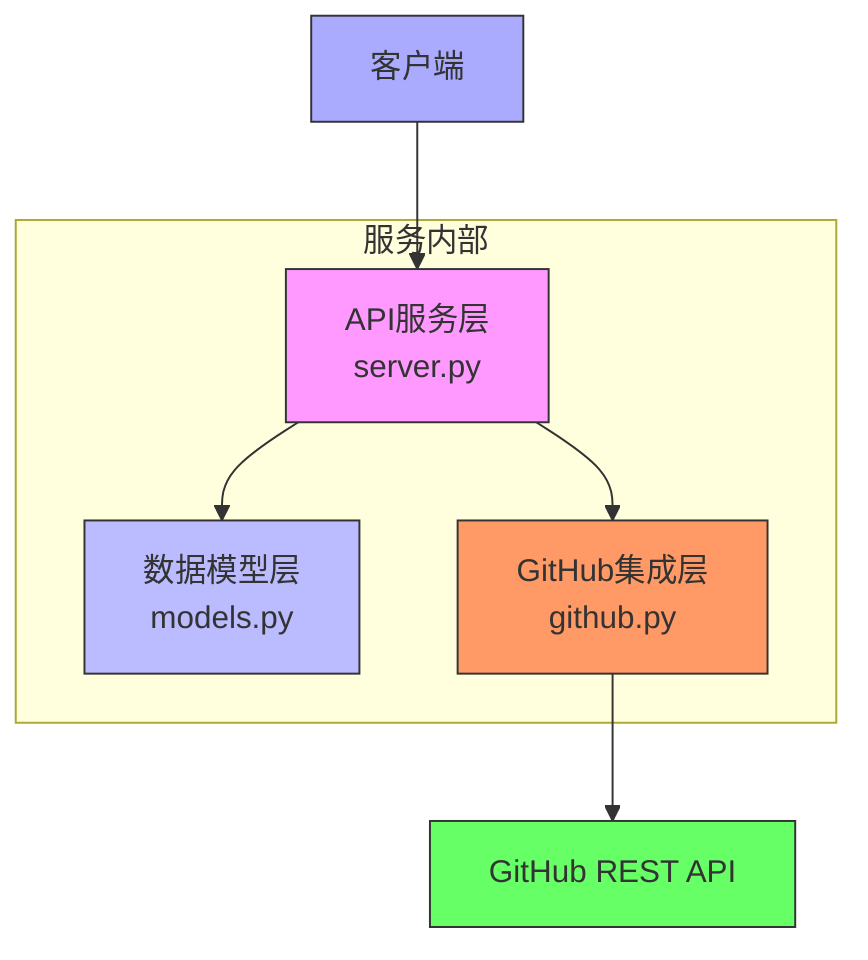
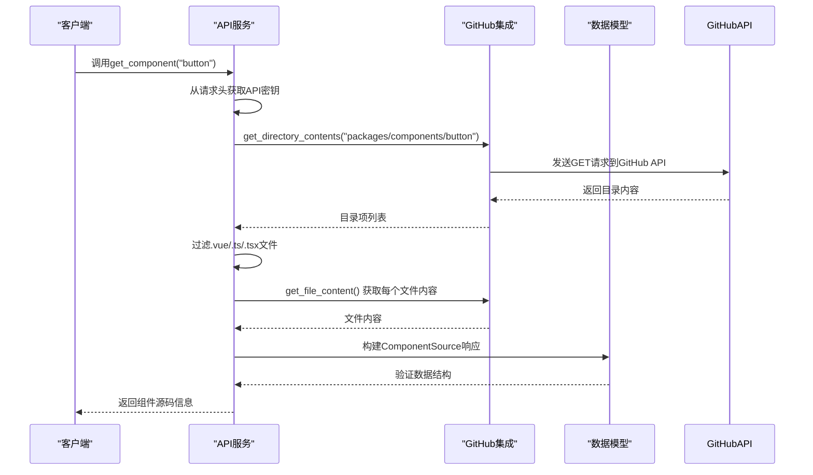
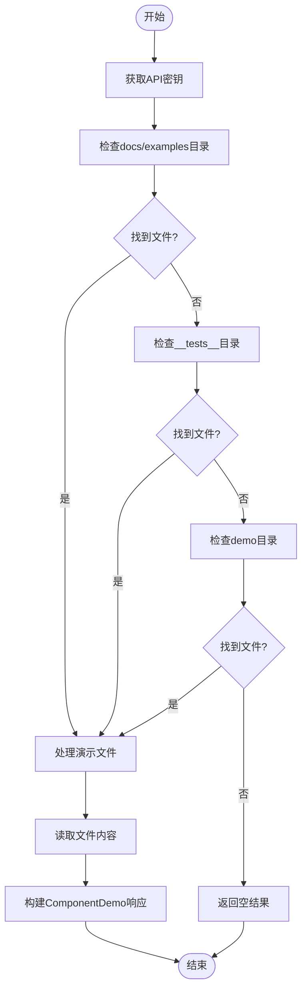
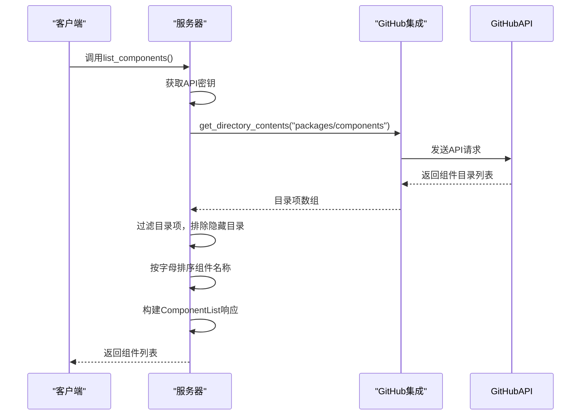
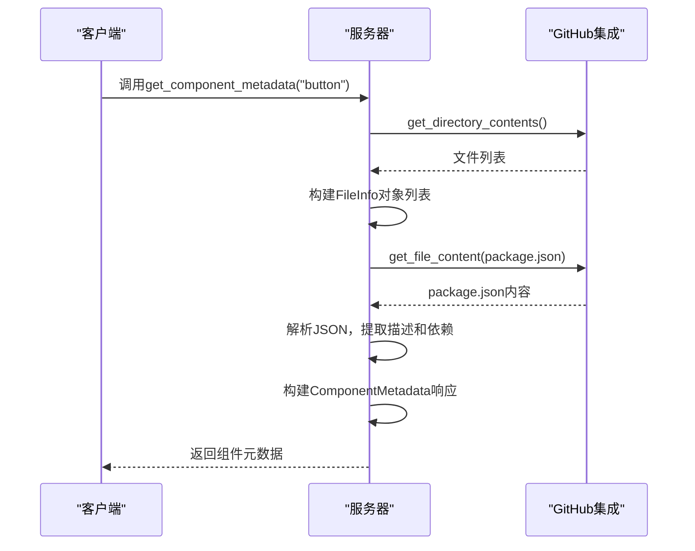
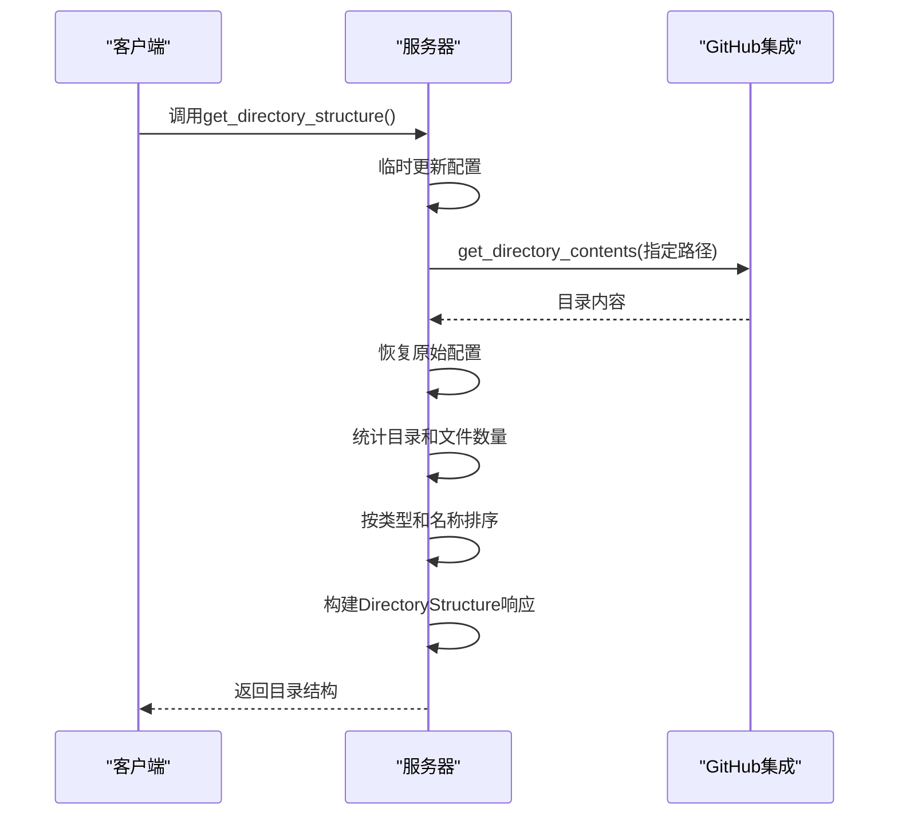
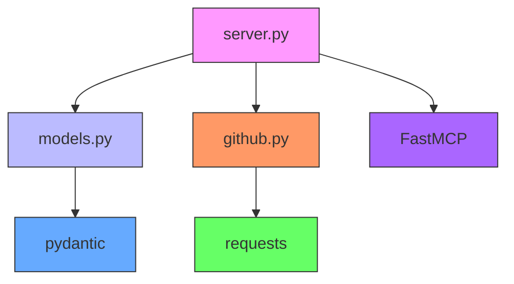

# Element Plus组件查询API

<cite>
**本文档引用的文件**  
- [server.py](file://src/element_plus_mcp/server.py)
- [models.py](file://src/element_plus_mcp/models.py)
- [github.py](file://src/element_plus_mcp/github.py)
- [README.md](file://src/element_plus_mcp/README.md)
</cite>

## 目录
1. [简介](#简介)
2. [项目结构](#项目结构)
3. [核心组件](#核心组件)
4. [架构概览](#架构概览)
5. [详细组件分析](#详细组件分析)
6. [依赖分析](#依赖分析)
7. [性能考虑](#性能考虑)
8. [故障排除指南](#故障排除指南)
9. [结论](#结论)

## 简介
Element Plus组件查询API是一个基于Model Context Protocol (MCP) 构建的服务，旨在为AI助手提供对Element Plus Vue.js组件库的访问能力。该服务允许用户通过API查询组件源码、演示代码、元数据和目录结构等信息。系统通过GitHub API与Element Plus官方仓库集成，支持从远程仓库动态获取最新组件信息。

本API特别适用于需要深入了解Element Plus组件实现细节的开发者、技术文档编写者以及AI辅助开发工具。服务默认连接到Element Plus仓库的`dev`分支，确保获取最新的开发版本信息。为了提高请求速率限制，建议配置GitHub API密钥。

**Section sources**
- [README.md](file://src/element_plus_mcp/README.md#L1-L20)

## 项目结构
Element Plus MCP服务的项目结构清晰，采用模块化设计，主要包含以下几个核心模块：

- `src/element_plus_mcp/`：主服务目录，包含API端点、数据模型和GitHub集成逻辑
- `src/embedding/`：嵌入式文档生成模块
- `src/fs_mcp/`、`src/knowledge_mcp/`、`src/mysql_mcp/`、`src/template_mcp/`：其他MCP服务模块
- 根目录包含`pyproject.toml`作为项目依赖管理文件

核心功能集中在`element_plus_mcp`目录下，由三个主要Python文件构成：`server.py`负责API端点定义和请求处理，`models.py`定义了所有数据传输对象（DTO），`github.py`封装了与GitHub API的交互逻辑。

```mermaid
graph TB
subgraph "Element Plus MCP模块"
server[server.py<br/>API端点]
models[models.py<br/>数据模型]
github[github.py<br/>GitHub集成]
end
subgraph "其他MCP服务"
fs_mcp[fs_mcp]
knowledge_mcp[knowledge_mcp]
mysql_mcp[mysql_mcp]
template_mcp[template_mcp]
end
server --> models
server --> github
github -.-> "GitHub API"
models -.-> "数据验证"
style server fill:#f9f,stroke:#333
style models fill:#bbf,stroke:#333
style github fill:#f96,stroke:#333
```

**Diagram sources**
- [server.py](file://src/element_plus_mcp/server.py#L1-L10)
- [models.py](file://src/element_plus_mcp/models.py#L1-L5)
- [github.py](file://src/element_plus_mcp/github.py#L1-L5)

**Section sources**
- [server.py](file://src/element_plus_mcp/server.py#L1-L50)
- [models.py](file://src/element_plus_mcp/models.py#L1-L10)
- [github.py](file://src/element_plus_mcp/github.py#L1-L10)

## 核心组件
Element Plus MCP服务的核心功能由三个主要组件构成：API服务层、数据模型层和GitHub集成层。API服务层通过`server.py`中的装饰器定义了多个工具函数，这些函数作为MCP工具暴露给客户端。数据模型层使用Pydantic定义了严格的数据结构，确保类型安全和数据验证。GitHub集成层封装了与GitHub REST API的通信细节，包括认证、请求和响应处理。

服务采用FastMCP框架作为基础，监听3003端口，支持streamable-http传输协议。日志系统配置为输出到标准输出，便于监控和调试。所有API端点都要求通过`X-GITHUB-API-KEY`请求头提供GitHub API密钥，以避免速率限制问题。

**Section sources**
- [server.py](file://src/element_plus_mcp/server.py#L1-L100)
- [models.py](file://src/element_plus_mcp/models.py#L1-L15)
- [github.py](file://src/element_plus_mcp/github.py#L1-L15)

## 架构概览
Element Plus MCP服务采用分层架构设计，各组件职责分明，耦合度低。客户端请求首先到达API服务层，经过上下文处理后，调用相应的工具函数。工具函数依赖于GitHub集成层从远程仓库获取数据，然后通过数据模型层进行结构化封装，最终返回给客户端。

整个系统的关键设计决策包括：使用Pydantic进行数据验证以确保API响应的一致性，封装GitHub API调用以简化错误处理，以及采用环境变量配置敏感信息如API密钥。这种架构使得服务易于维护和扩展，同时保证了数据的安全性和可靠性。



**Diagram sources**
- [server.py](file://src/element_plus_mcp/server.py#L1-L20)
- [models.py](file://src/element_plus_mcp/models.py#L1-L10)
- [github.py](file://src/element_plus_mcp/github.py#L1-L10)

## 详细组件分析

### 组件源码查询功能分析
组件源码查询功能允许用户获取指定Element Plus组件的完整源码。该功能通过`get_component`工具函数实现，接收组件名称作为参数，返回包含源码文件列表的结构化响应。



**Diagram sources**
- [server.py](file://src/element_plus_mcp/server.py#L50-L100)
- [github.py](file://src/element_plus_mcp/github.py#L50-L80)
- [models.py](file://src/element_plus_mcp/models.py#L25-L30)

**Section sources**
- [server.py](file://src/element_plus_mcp/server.py#L50-L150)
- [models.py](file://src/element_plus_mcp/models.py#L19-L30)

### 组件演示代码获取功能分析
组件演示代码获取功能通过`get_component_demo`工具函数实现，旨在为用户提供组件的实际使用示例。该函数采用多路径查找策略，首先在`docs/examples`目录查找，然后尝试`__tests__`和`demo`目录，确保能够找到最相关的演示代码。



**Diagram sources**
- [server.py](file://src/element_plus_mcp/server.py#L100-L150)
- [github.py](file://src/element_plus_mcp/github.py#L60-L70)
- [models.py](file://src/element_plus_mcp/models.py#L37-L42)

**Section sources**
- [server.py](file://src/element_plus_mcp/server.py#L100-L200)
- [models.py](file://src/element_plus_mcp/models.py#L32-L42)

### 组件列表获取功能分析
组件列表获取功能通过`list_components`工具函数实现，返回Element Plus仓库中所有可用组件的名称列表。该函数查询`packages/components`目录下的所有子目录，每个子目录对应一个组件。



**Diagram sources**
- [server.py](file://src/element_plus_mcp/server.py#L150-L200)
- [models.py](file://src/element_plus_mcp/models.py#L44-L49)

**Section sources**
- [server.py](file://src/element_plus_mcp/server.py#L150-L200)
- [models.py](file://src/element_plus_mcp/models.py#L44-L49)

### 组件元数据获取功能分析
组件元数据获取功能通过`get_component_metadata`工具函数实现，提供组件的详细信息，包括文件结构和依赖关系。该函数不仅列出组件目录中的所有文件，还尝试读取`package.json`文件以获取组件描述和依赖项。



**Diagram sources**
- [server.py](file://src/element_plus_mcp/server.py#L201-L251)
- [models.py](file://src/element_plus_mcp/models.py#L12-L17)

**Section sources**
- [server.py](file://src/element_plus_mcp/server.py#L201-L251)
- [models.py](file://src/element_plus_mcp/models.py#L6-L17)

### 目录结构查询功能分析
目录结构查询功能通过`get_directory_structure`工具函数实现，允许用户浏览Element Plus仓库的任意目录结构。该函数支持自定义仓库所有者、名称和分支，提供了灵活的目录浏览能力。



**Diagram sources**
- [server.py](file://src/element_plus_mcp/server.py#L255-L331)
- [models.py](file://src/element_plus_mcp/models.py#L51-L67)

**Section sources**
- [server.py](file://src/element_plus_mcp/server.py#L255-L331)
- [models.py](file://src/element_plus_mcp/models.py#L51-L67)

## 依赖分析
Element Plus MCP服务的依赖关系清晰，主要依赖外部库和内部模块。外部依赖包括`requests`用于HTTP请求，`pydantic`用于数据验证，`click`用于命令行接口，以及`mcp.server.fastmcp`作为MCP框架基础。内部依赖关系显示`server.py`是核心模块，依赖于`models.py`和`github.py`，而`github.py`又依赖于`requests`库与GitHub API通信。



**Diagram sources**
- [server.py](file://src/element_plus_mcp/server.py#L1-L20)
- [models.py](file://src/element_plus_mcp/models.py#L1-L5)
- [github.py](file://src/element_plus_mcp/github.py#L1-L5)

**Section sources**
- [server.py](file://src/element_plus_mcp/server.py#L1-L30)
- [models.py](file://src/element_plus_mcp/models.py#L1-L10)
- [github.py](file://src/element_plus_mcp/github.py#L1-L10)

## 性能考虑
Element Plus MCP服务在性能方面有几个关键考虑点。首先，所有GitHub API调用都设置了30秒的超时限制，防止请求无限期挂起。其次，服务依赖于GitHub API的速率限制，未认证请求每小时限60次，而认证请求可提升至每小时5000次，因此强烈建议配置API密钥。

服务当前没有实现缓存机制，每次请求都会触发新的GitHub API调用，这可能导致性能瓶颈。建议在生产环境中添加Redis或内存缓存层，对频繁访问的组件信息进行缓存。此外，文件内容的Base64解码操作可能会消耗较多CPU资源，特别是对于大型文件。

错误处理机制完善，所有外部API调用都被try-catch块包围，确保任何异常都不会导致服务崩溃。日志系统记录了所有关键操作，便于性能监控和问题排查。

**Section sources**
- [github.py](file://src/element_plus_mcp/github.py#L60-L70)
- [server.py](file://src/element_plus_mcp/server.py#L1-L50)

## 故障排除指南
当使用Element Plus组件查询API时，可能会遇到以下常见问题及解决方案：

1. **组件不存在错误**：确保组件名称正确且存在于Element Plus库中。组件名称不区分大小写，但必须是有效的组件名。

2. **API密钥错误**：检查`X-GITHUB-API-KEY`请求头是否正确设置，或通过环境变量`GITHUB_API_KEY`配置。

3. **速率限制错误**：GitHub API对未认证请求有严格限制。配置有效的GitHub API密钥以提高请求限额。

4. **网络连接错误**：确保服务器能够访问`api.github.com`，检查防火墙和网络配置。

5. **JSON解析错误**：当`package.json`文件格式不正确时可能发生。这通常是临时问题，重试请求即可。

服务的日志系统会记录所有错误详情，包括错误类型和堆栈跟踪，便于开发者快速定位问题根源。

**Section sources**
- [server.py](file://src/element_plus_mcp/server.py#L50-L331)
- [github.py](file://src/element_plus_mcp/github.py#L1-L80)

## 结论
Element Plus组件查询API成功实现了对Element Plus组件库的远程访问能力，为开发者和AI助手提供了强大的代码查询功能。通过清晰的分层架构和模块化设计，服务实现了高内聚低耦合，易于维护和扩展。

核心优势包括：完整的组件信息覆盖（源码、演示、元数据）、灵活的目录浏览能力、完善的错误处理机制和详细的日志记录。然而，服务目前缺乏缓存机制，可能影响大规模使用的性能表现。

未来改进方向包括：实现响应缓存以减少GitHub API调用，添加请求批处理功能，支持更多查询过滤选项，以及增强安全性措施。总体而言，该服务为Element Plus生态提供了有价值的基础设施支持。