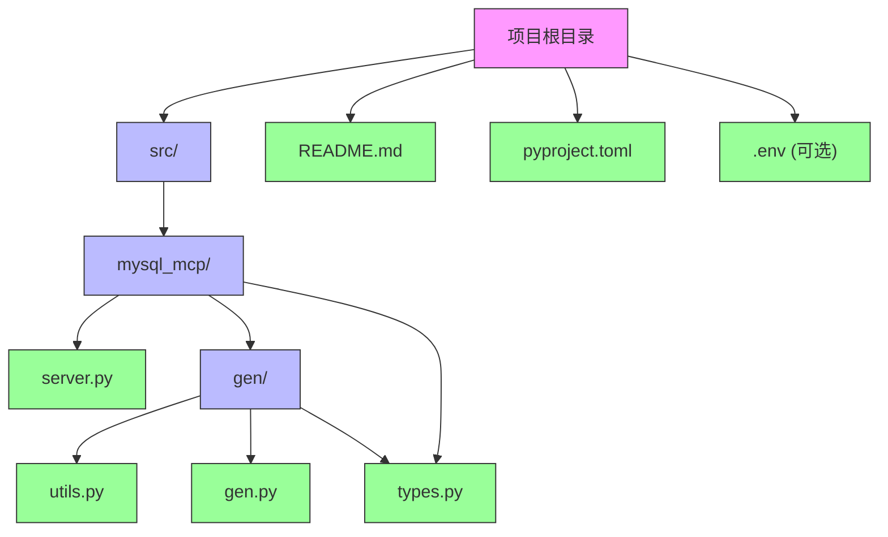
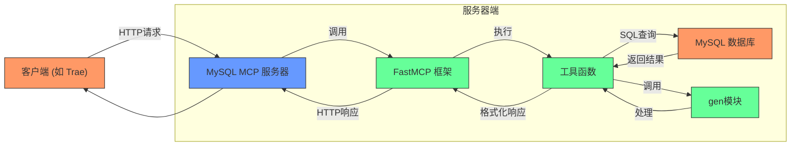
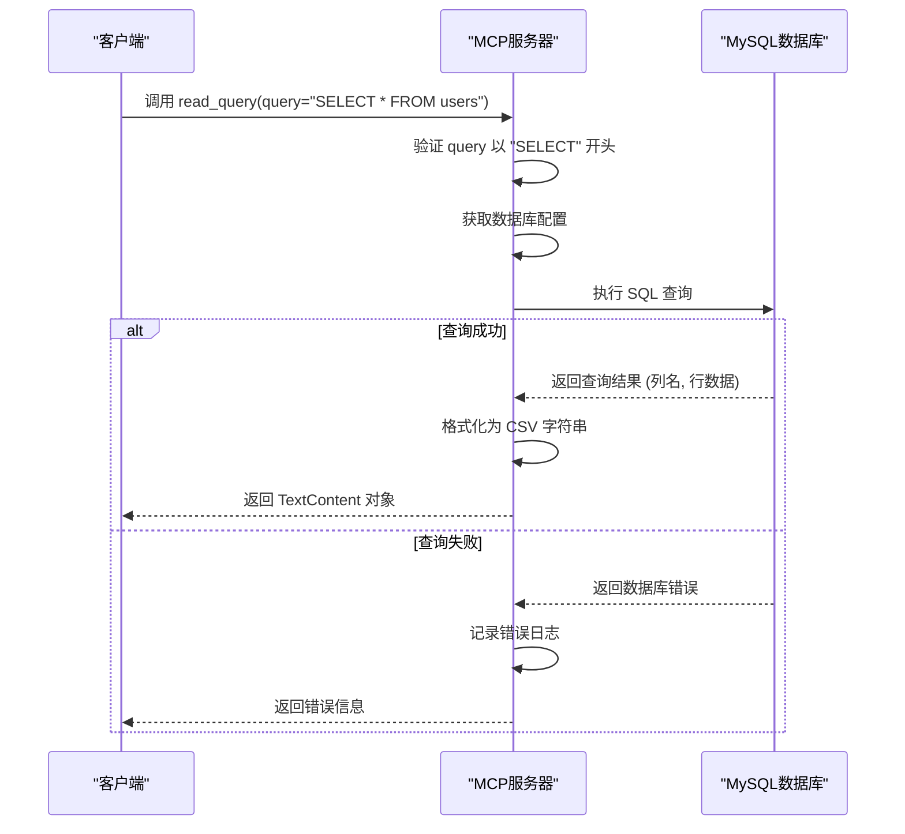
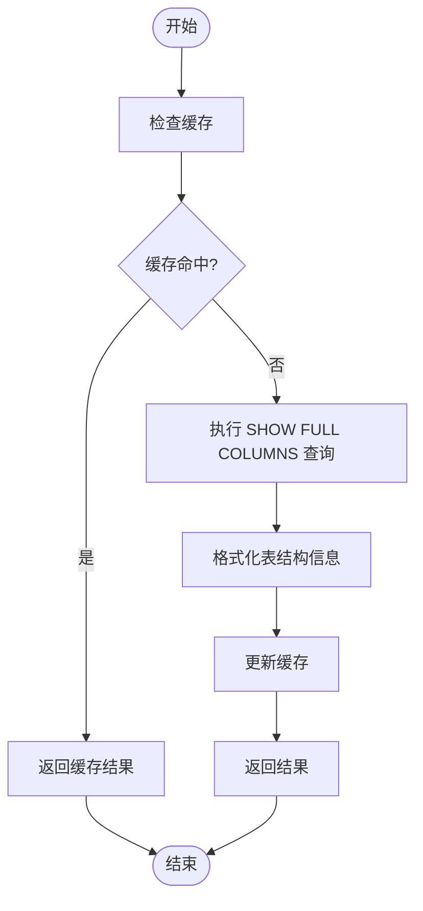
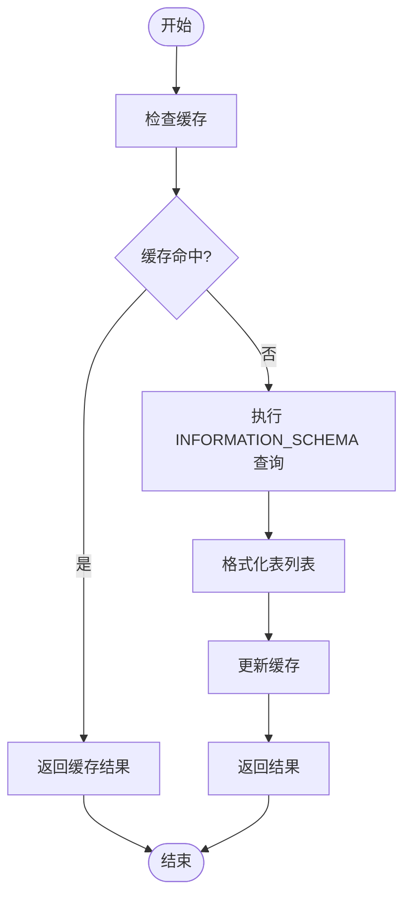
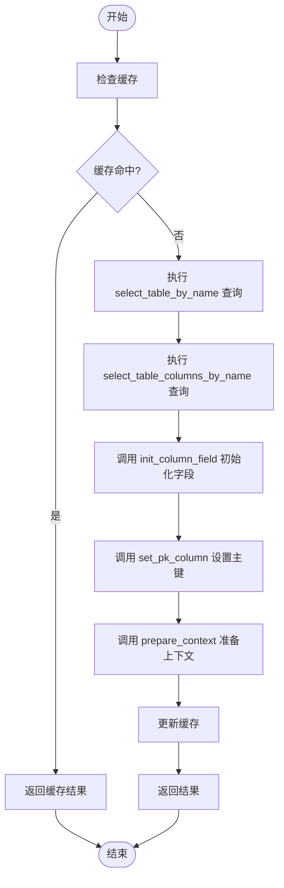
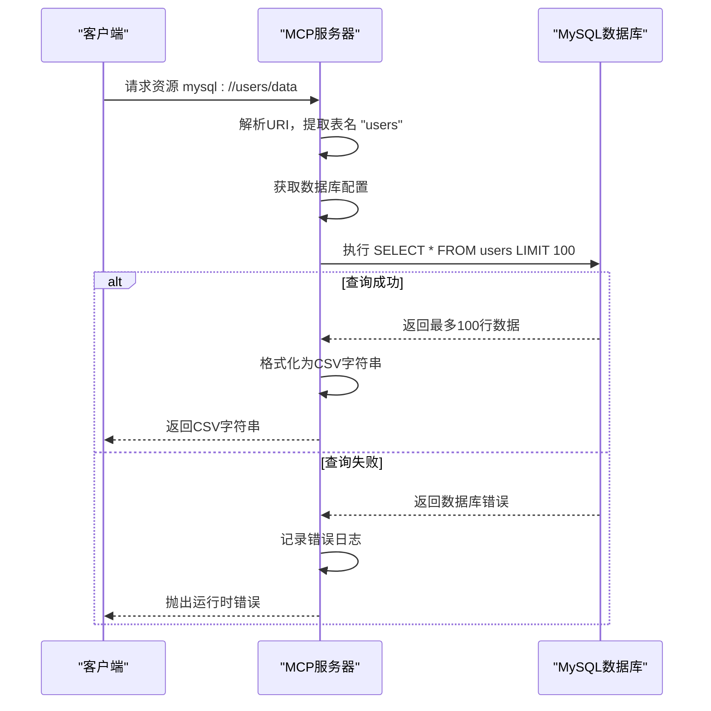

# MySQL数据库操作API

<cite>
**本文档引用的文件**   
- [server.py](file://src/mysql_mcp/server.py#L1-L238) - *新增prepare_template_context工具函数*
- [gen/utils.py](file://src/mysql_mcp/gen/utils.py#L1-L459) - *新增模板上下文准备工具*
- [gen/types.py](file://src/mysql_mcp/gen/types.py#L1-L89) - *定义VelocityContext模型*
- [gen/gen.py](file://src/mysql_mcp/gen/gen.py#L1-L246) - *新增表信息查询函数*
- [types.py](file://src/mysql_mcp/types.py#L1-L11) - *定义数据库配置类型*
- [README.md](file://README.md#L1-L131)
</cite>

## 更新摘要
**变更内容**   
- 新增`prepare_template_context`工具函数文档
- 新增模板上下文生成机制说明
- 更新核心组件分析以包含新功能
- 新增详细组件分析章节
- 更新依赖分析以包含新模块
- 更新性能考量以说明新缓存机制

## 目录
1. [项目概述](#项目概述)
2. [项目结构](#项目结构)
3. [核心组件](#核心组件)
4. [架构概览](#架构概览)
5. [详细组件分析](#详细组件分析)
6. [依赖分析](#依赖分析)
7. [性能考量](#性能考量)
8. [故障排除指南](#故障排除指南)
9. [结论](#结论)

## 项目概述
MySQL MCP服务是一个基于Model Context Protocol (MCP) 的RESTful API服务，旨在为AI助手提供安全的MySQL数据库操作能力。该服务通过定义一系列工具函数和资源端点，实现了对数据库的表结构查询、数据检索等核心功能。服务通过环境变量进行数据库连接配置，并使用FastMCP框架处理HTTP请求。用户可以通过`uv run mysql_mcp`命令启动服务，其默认监听端口为3004。服务支持`stdio`、`streamable`和`sse`三种传输协议，以适应不同的使用场景。最新版本新增了模板上下文生成功能，用于支持代码生成场景。

**Section sources**
- [README.md](file://README.md#L1-L131)
- [server.py](file://src/mysql_mcp/server.py#L1-L238)

## 项目结构
项目采用模块化设计，每个MCP服务（如文件服务、知识库服务、MySQL服务等）都位于`src`目录下的独立子目录中。MySQL MCP服务的核心实现位于`src/mysql_mcp/server.py`文件中。项目使用`uv`作为包管理工具，并通过`pyproject.toml`文件管理项目依赖。配置信息（如数据库连接参数）通过环境变量或`.env`文件进行管理，以确保安全性。新增的代码生成相关功能位于`src/mysql_mcp/gen/`目录下，包含配置、工具函数和类型定义。



**Diagram sources**
- [server.py](file://src/mysql_mcp/server.py#L1-L238)
- [README.md](file://README.md#L1-L131)

**Section sources**
- [README.md](file://README.md#L1-L131)
- [server.py](file://src/mysql_mcp/server.py#L1-L238)

## 核心组件
MySQL MCP服务的核心组件包括：
- **FastMCP服务器实例 (`mcp`)**: 服务的主入口，负责注册工具函数和资源端点，并处理HTTP请求。
- **数据库配置函数 (`get_db_config`)**: 从环境变量中读取数据库连接信息，并进行有效性验证。
- **缓存类 (`Cache`)**: 用于缓存表结构、表列表和模板上下文等查询结果，以提高性能。
- **工具函数 (`read_query`, `describe_table`, `list_tables`, `prepare_template_context`)**: 提供具体的数据库查询和模板上下文生成功能。
- **资源端点 (`read_resource`)**: 提供基于URI的资源访问接口。

**Section sources**
- [server.py](file://src/mysql_mcp/server.py#L1-L238)

## 架构概览
该服务采用典型的客户端-服务器架构。客户端通过HTTP请求调用服务器上注册的工具函数。服务器使用FastMCP框架作为中间件，将MCP协议的请求转换为对后端MySQL数据库的查询。数据库查询结果经过格式化后，通过HTTP响应返回给客户端。服务内置了CORS中间件，以支持跨域请求。整个流程中，`uvicorn`作为ASGI服务器，负责监听网络端口并处理HTTP连接。新增的模板上下文生成功能通过调用`gen`模块中的工具函数，为代码生成提供结构化数据。



**Diagram sources**
- [server.py](file://src/mysql_mcp/server.py#L1-L238)

## 详细组件分析

### 工具函数分析
MySQL MCP服务提供了四个核心工具函数，用于执行不同的数据库操作。

#### `read_query` 工具函数
该函数用于执行任意的`SELECT` SQL查询。



**Diagram sources**
- [server.py](file://src/mysql_mcp/server.py#L117-L139)

**Section sources**
- [server.py](file://src/mysql_mcp/server.py#L117-L139)

#### `describe_table` 工具函数
该函数用于获取指定表的结构信息。



**Diagram sources**
- [server.py](file://src/mysql_mcp/server.py#L140-L168)

**Section sources**
- [server.py](file://src/mysql_mcp/server.py#L140-L168)

#### `list_tables` 工具函数
该函数用于列出数据库中的所有表及其注释。



**Diagram sources**
- [server.py](file://src/mysql_mcp/server.py#L169-L196)

**Section sources**
- [server.py](file://src/mysql_mcp/server.py#L169-L196)

#### `prepare_template_context` 工具函数
该函数用于为指定表准备代码生成所需的模板上下文。



**Diagram sources**
- [server.py](file://src/mysql_mcp/server.py#L197-L227)
- [gen/utils.py](file://src/mysql_mcp/gen/utils.py#L1-L459)
- [gen/gen.py](file://src/mysql_mcp/gen/gen.py#L1-L246)

**Section sources**
- [server.py](file://src/mysql_mcp/server.py#L197-L227)
- [gen/utils.py](file://src/mysql_mcp/gen/utils.py#L1-L459)
- [gen/gen.py](file://src/mysql_mcp/gen/gen.py#L1-L246)

### 资源端点分析
`read_resource` 是一个资源端点，通过特定的URI模式访问数据库表。



**Diagram sources**
- [server.py](file://src/mysql_mcp/server.py#L85-L115)

**Section sources**
- [server.py](file://src/mysql_mcp/server.py#L85-L115)

## 依赖分析
该服务的主要依赖关系如下：

```mermaid
graph TD
server_py["server.py"] --> FastMCP["mcp.server.fastmcp"]
server_py --> TextContent["mcp.types"]
server_py --> mysql_connector["mysql.connector"]
server_py --> dotenv["dotenv"]
server_py --> click["click"]
server_py --> uvicorn["uvicorn"]
server_py --> starlette["starlette.middleware.cors"]
server_py --> gen_utils["gen.utils"]
server_py --> gen_gen["gen.gen"]
server_py --> gen_types["gen.types"]
gen_utils --> gen_types
gen_utils --> gen_gen
gen_gen --> mysql_connector
style server_py fill:#9f9,stroke:#333
style FastMCP fill:#f96,stroke:#333
style TextContent fill:#f96,stroke:#333
style mysql_connector fill:#f96,stroke:#333
style dotenv fill:#f96,stroke:#333
style click fill:#f96,stroke:#333
style uvicorn fill:#f96,stroke:#333
style starlette fill:#f96,stroke:#333
style gen_utils fill:#f96,stroke:#333
style gen_gen fill:#f96,stroke:#333
style gen_types fill:#f96,stroke:#333
```

**Diagram sources**
- [server.py](file://src/mysql_mcp/server.py#L1-L238)
- [gen/utils.py](file://src/mysql_mcp/gen/utils.py#L1-L459)
- [gen/gen.py](file://src/mysql_mcp/gen/gen.py#L1-L246)

**Section sources**
- [server.py](file://src/mysql_mcp/server.py#L1-L238)
- [gen/utils.py](file://src/mysql_mcp/gen/utils.py#L1-L459)
- [gen/gen.py](file://src/mysql_mcp/gen/gen.py#L1-L246)

## 性能考量
- **缓存机制**: `describe_table`、`list_tables` 和 `prepare_template_context` 函数使用了内存缓存，缓存有效期为5分钟（300秒），这可以显著减少对数据库的重复查询，提高响应速度。
- **查询限制**: `read_resource` 端点对查询结果进行了 `LIMIT 100` 的限制，防止一次性返回过多数据导致内存溢出或网络延迟。
- **连接管理**: 使用Python的`with`语句管理数据库连接，确保连接在使用完毕后能被正确关闭，避免连接泄露。
- **批量处理**: `prepare_template_context` 函数通过一次数据库查询获取表信息和列信息，减少了数据库交互次数。

## 故障排除指南
- **连接失败**: 确保环境变量 `MYSQL_USER`, `MYSQL_PASSWORD`, `MYSQL_DATABASE` 已正确设置。服务启动时会检查这些变量。
- **SQL语法错误**: `read_query` 函数只允许以 `SELECT` 开头的查询，任何其他类型的SQL语句（如 `INSERT`, `UPDATE`, `DELETE`）都会被拒绝。
- **跨域问题**: 当使用 `streamable-http` 或 `sse` 传输协议时，如果客户端与服务器不在同一域名下，可能会遇到跨域问题。服务已配置CORS中间件允许所有来源 (`*`)，但在生产环境中应限制为特定来源。
- **服务器无法启动**: 检查端口3004是否被占用，或尝试使用 `--port` 参数指定其他端口。
- **模板上下文生成失败**: 确保表名正确，且表存在于当前数据库中。检查`gen/config.py`中的配置是否正确。

**Section sources**
- [server.py](file://src/mysql_mcp/server.py#L1-L238)
- [README.md](file://README.md#L1-L131)

## 结论
MySQL MCP服务成功地将MySQL数据库的查询能力封装为一个安全、易用的RESTful API。它通过FastMCP框架提供了标准化的接口，并通过环境变量和缓存机制确保了安全性和性能。新增的模板上下文生成功能扩展了服务的应用场景，使其不仅能够支持数据查询，还能为代码生成提供结构化数据。该服务为AI助手提供了一种强大的方式来探索和分析数据库内容，是构建智能数据应用的理想组件。