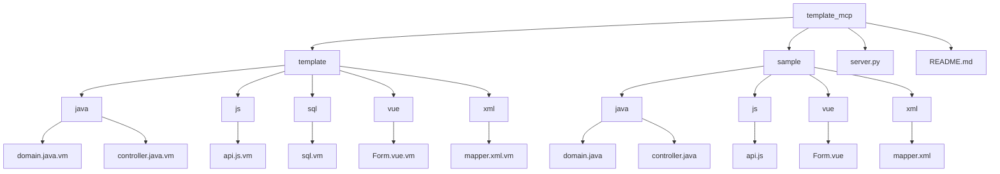
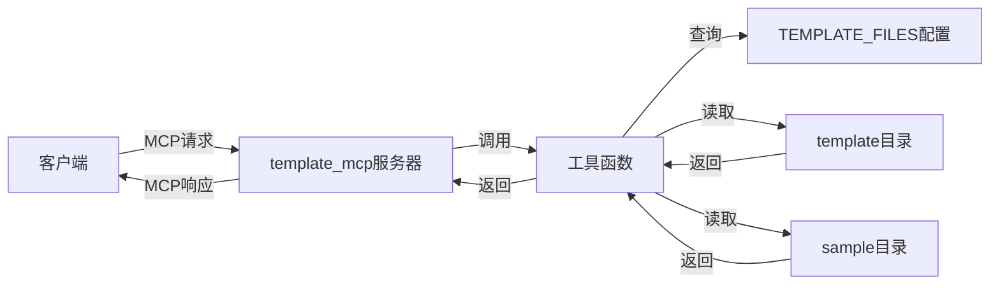
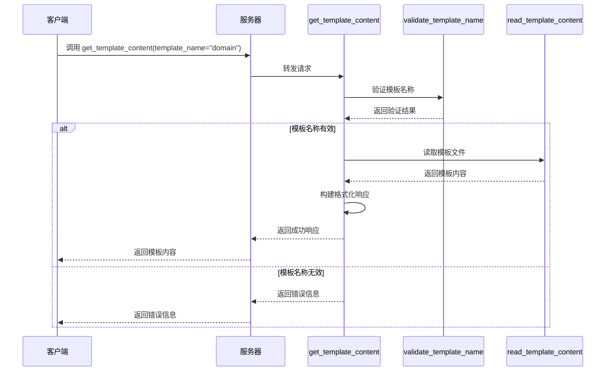
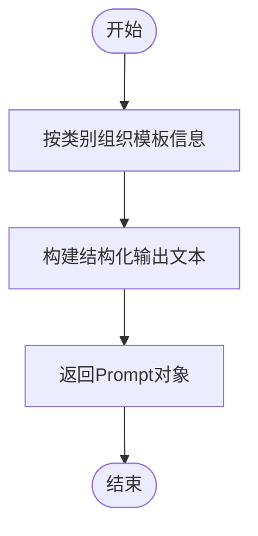
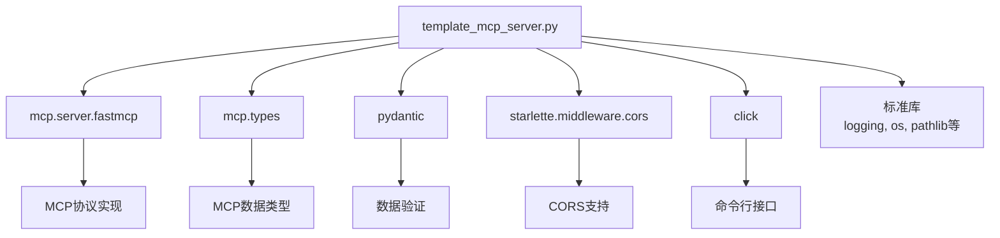

# 代码模板生成API

<cite>
**本文档引用的文件**   
- [server.py](file://src/template_mcp/server.py#L1-L467)
- [domain.java.vm](file://src/template_mcp/template/java/domain.java.vm#L1-L66)
- [Form.vue.vm](file://src/template_mcp/template/vue/v3/Form.vue.vm#L1-L273)
- [sql.vm](file://src/template_mcp/template/sql/sql.vm#L1-L25)
- [README.md](file://src/template_mcp/README.md#L1-L168)
</cite>

## 目录
1. [简介](#简介)
2. [项目结构](#项目结构)
3. [核心组件](#核心组件)
4. [架构概述](#架构概述)
5. [详细组件分析](#详细组件分析)
6. [依赖分析](#依赖分析)
7. [性能考虑](#性能考虑)
8. [故障排除指南](#故障排除指南)
9. [结论](#结论)

## 简介
代码模板生成API是一个基于MCP（Model Context Protocol）协议的模板服务器，旨在为开发者提供高效、标准化的代码生成能力。该服务通过预定义的Velocity模板（.vm文件），支持Java、Vue、JavaScript、SQL等多种技术栈的代码自动生成。用户可以通过简单的API调用，获取各类代码模板（如后端实体类、前端组件、数据库脚本等），并利用变量插值机制，快速生成符合项目规范的代码文件。本API不仅提高了开发效率，还确保了代码风格的一致性，是现代软件开发中不可或缺的自动化工具。

## 项目结构
`template_mcp` 模块是代码模板生成服务的核心，其项目结构清晰地分离了模板定义、示例代码和服务器逻辑。主要包含三个目录：`template` 存放所有用于生成代码的Velocity模板文件（.vm），`sample` 存放与模板对应的示例代码文件，`server.py` 是服务的主入口和逻辑实现。这种结构使得模板的维护和扩展变得非常直观和便捷。



**图示来源**
- [server.py](file://src/template_mcp/server.py#L1-L467)
- [README.md](file://src/template_mcp/README.md#L1-L168)

**中文部分来源**
- [项目结构](#项目结构)

## 核心组件
`template_mcp` 服务的核心功能由 `server.py` 文件中的几个关键函数和数据结构实现。`TEMPLATE_FILES` 字典是服务的配置中心，它定义了所有支持的模板名称、文件路径、描述和类别。`get_template_content`、`get_sample_content` 和 `list_templates` 等函数是暴露给外部调用的API工具，它们负责处理请求、读取文件并返回格式化的响应。`validate_template_name` 和 `get_template_file_path` 等辅助函数则确保了操作的安全性和准确性。整个服务通过 `FastMCP` 框架进行封装，提供了标准化的接口。

**中文部分来源**
- [server.py](file://src/template_mcp/server.py#L1-L467)

## 架构概述
该服务采用轻量级的微服务架构，核心是一个基于FastMCP的服务器。外部客户端通过MCP协议与服务器通信。服务器内部，`server.py` 作为主控制器，接收来自客户端的工具调用请求。根据请求的工具名称（如 `get_template_content`），服务器会调用相应的处理函数。这些函数会查询 `TEMPLATE_FILES` 配置，验证输入参数，然后从 `template` 目录读取对应的Velocity模板文件，最后将文件内容封装成结构化的响应返回给客户端。整个流程简洁高效，专注于单一职责——模板内容的检索与分发。



**图示来源**
- [server.py](file://src/template_mcp/server.py#L1-L467)

## 详细组件分析
### API接口分析
`template_mcp` 服务通过 `@mcp.tool()` 和 `@mcp.prompt()` 装饰器暴露了多个API接口，这些接口是客户端与服务交互的主要方式。

#### `get_template_content` 工具
此工具是核心的代码模板获取接口。它接收一个 `template_name` 参数，用于指定要获取的模板。



**图示来源**
- [server.py](file://src/template_mcp/server.py#L253-L308)

**中文部分来源**
- [server.py](file://src/template_mcp/server.py#L253-L308)

#### `list_templates` Prompt
此Prompt用于列出所有可用的模板，帮助客户端发现服务支持的功能。



**图示来源**
- [server.py](file://src/template_mcp/server.py#L204-L249)

**中文部分来源**
- [server.py](file://src/template_mcp/server.py#L204-L249)

### 模板渲染流程分析
虽然本服务目前主要提供模板文件的原始内容，但其底层的Velocity模板（.vm文件）定义了完整的代码生成逻辑。模板渲染流程发生在客户端或后续的代码生成引擎中，而非本服务内部。

#### 变量插值机制
模板文件使用Velocity语法进行变量插值。服务返回的模板内容中包含以 `${variable}` 和 `#foreach`、`#if` 等指令，这些是待替换的占位符。
- **变量替换**: `${packageName}`, `${ClassName}`, `${functionName}` 等会被实际的项目配置值替换。
- **循环控制**: `#foreach ($column in $columns)` 用于遍历数据库字段列表，动态生成代码。
- **条件判断**: `#if($column.list)` 用于根据字段属性决定是否生成特定的注解或代码块。

```mermaid
flowchart LR
A[模板文件<br>domain.java.vm] --> B["包含占位符:<br>${packageName}<br>${ClassName}<br>#foreach..."]
C[用户输入/配置] --> D[变量值:<br>com.example.demo<br>User<br>[id, name, ...]]
B --> E[代码生成引擎]
D --> E
E --> F[生成的代码<br>domain.java]
```

**图示来源**
- [domain.java.vm](file://src/template_mcp/template/java/domain.java.vm#L1-L66)
- [Form.vue.vm](file://src/template_mcp/template/vue/v3/Form.vue.vm#L1-L273)

**中文部分来源**
- [domain.java.vm](file://src/template_mcp/template/java/domain.java.vm#L1-L66)
- [Form.vue.vm](file://src/template_mcp/template/vue/v3/Form.vue.vm#L1-L273)

## 依赖分析
`template_mcp` 服务的依赖关系相对简单，主要依赖于MCP协议栈和一些标准库。



**图示来源**
- [server.py](file://src/template_mcp/server.py#L1-L467)

## 性能考虑
由于该服务的主要操作是读取和返回文件内容，其性能开销极低。文件读取操作是I/O密集型的，但由于模板文件通常较小且数量有限，对性能的影响可以忽略不计。服务没有复杂的计算或数据库查询，因此响应时间非常快。为了进一步优化，可以考虑在服务启动时将所有模板内容缓存到内存中，从而将后续的请求处理变为纯内存操作，但这对于当前的使用场景并非必要。

## 故障排除指南
当使用此API时，可能会遇到以下常见问题：

**中文部分来源**
- [server.py](file://src/template_mcp/server.py#L253-L308)
- [server.py](file://src/template_mcp/server.py#L312-L387)

### 模板名称错误
**问题**: 调用 `get_template_content` 时返回错误，提示“不支持的模板名称”。
**解决方案**: 使用 `list_templates` 或 `list_template_categories` 工具来获取所有支持的模板名称列表，确保输入的 `template_name` 完全匹配列表中的某个名称。

### 模板文件不存在
**问题**: 调用 `get_template_content` 时返回错误，提示“模板文件不存在”。
**解决方案**: 检查 `src/template_mcp/template/` 目录下是否存在对应的 `.vm` 文件。此错误通常表明服务配置（`TEMPLATE_FILES`）与实际文件系统不一致。

### 示例文件不存在
**问题**: 调用 `get_sample_content` 时返回错误，提示“示例文件不存在”。
**解决方案**: 检查 `src/template_mcp/sample/` 目录下是否存在对应的示例文件。示例文件的存在与否不影响模板的获取。

## 结论
代码模板生成API是一个功能明确、结构清晰的服务。它成功地将代码模板的管理与分发抽象为一个标准化的接口，极大地简化了代码生成工具的集成。通过分析其 `server.py` 实现和 `.vm` 模板文件，我们可以看到一个高效、可维护的自动化解决方案。该服务不仅提供了获取模板内容的核心功能，还通过 `list_templates` 等工具提供了良好的自省能力，方便客户端发现和使用。其基于Velocity的模板机制为未来的扩展（如支持更复杂的代码生成逻辑）奠定了坚实的基础。总体而言，这是一个设计良好、实用性强的开发辅助工具。