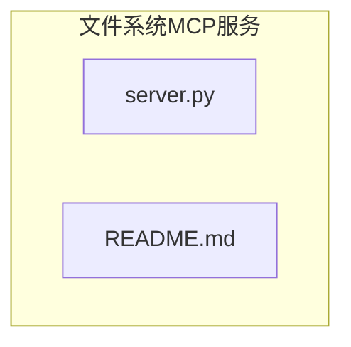
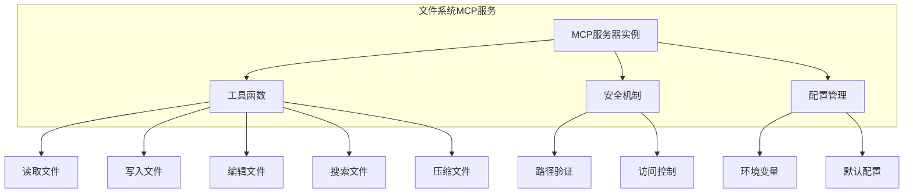
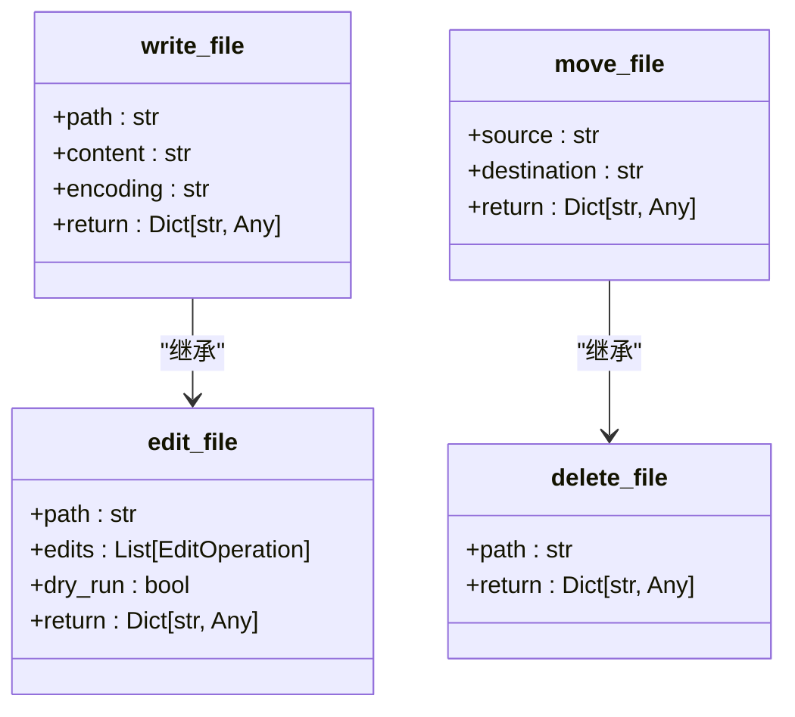
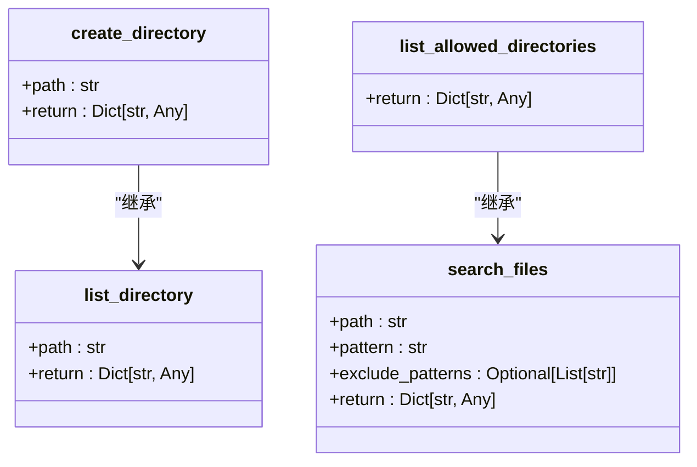
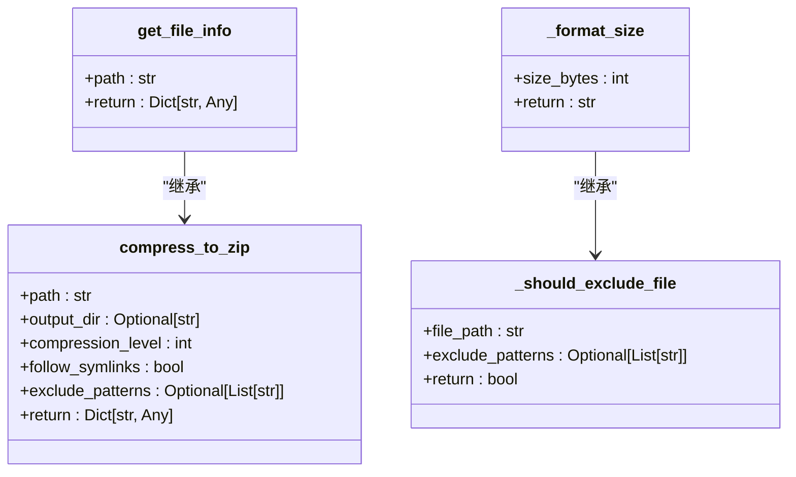
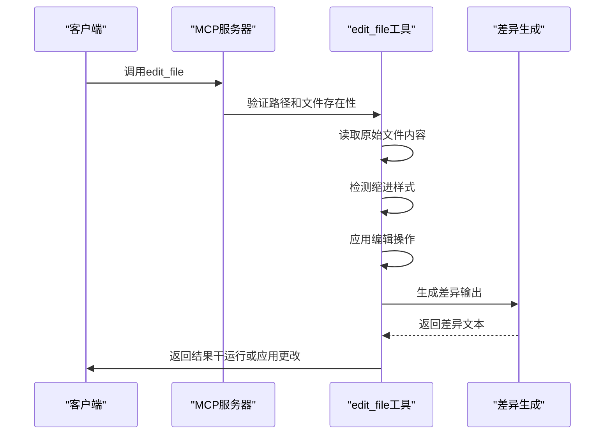
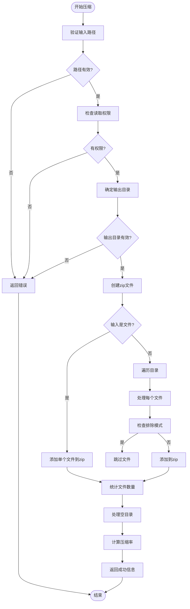
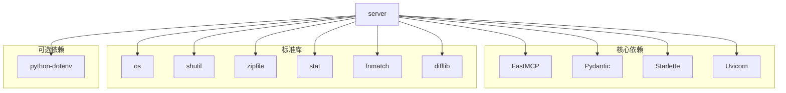

# 文件系统MCP服务API

<cite>
**Referenced Files in This Document**   
- [server.py](file://src/fs_mcp/server.py#L1-L880)
- [README.md](file://src/fs_mcp/README.md#L1-L95)
</cite>

## 目录
1. [简介](#简介)
2. [项目结构](#项目结构)
3. [核心组件](#核心组件)
4. [架构概述](#架构概述)
5. [详细组件分析](#详细组件分析)
6. [依赖分析](#依赖分析)
7. [性能考虑](#性能考虑)
8. [故障排除指南](#故障排除指南)
9. [结论](#结论)

## 简介

文件系统MCP服务是一个基于FastMCP框架实现的Model Context Protocol (MCP) 服务器，提供安全的文件和目录操作功能。该服务允许客户端通过标准化的工具调用接口执行各种文件系统操作，包括文件读写、目录浏览、文件搜索和高级文件编辑等。服务设计注重安全性，通过路径验证和目录访问控制机制防止路径遍历攻击和未经授权的访问。

## 项目结构

文件系统MCP服务位于`src/fs_mcp/`目录下，主要由`server.py`和`README.md`两个文件组成。`server.py`是服务的核心实现文件，定义了所有可用的工具函数和服务器配置。`README.md`提供了服务的使用说明、功能特性和配置指南。

**Diagram sources**
- [server.py](file://src/fs_mcp/server.py#L1-L880)
- [README.md](file://src/fs_mcp/README.md#L1-L95)

**Section sources**
- [server.py](file://src/fs_mcp/server.py#L1-L880)
- [README.md](file://src/fs_mcp/README.md#L1-L95)

## 核心组件

文件系统MCP服务的核心组件是`server.py`文件中定义的一系列工具函数，这些函数通过`@mcp.tool()`装饰器注册为MCP工具，可供客户端调用。每个工具函数都使用Pydantic的`Field`进行参数描述和验证，确保输入的正确性和安全性。

服务的核心功能包括：
- **文件操作**：读取、写入、移动和删除文件
- **目录操作**：创建、列出和搜索目录
- **文件搜索**：递归搜索文件和目录
- **元数据获取**：获取文件和目录的详细信息
- **高级编辑**：支持干运行模式的文件编辑
- **压缩功能**：将文件或目录压缩为zip包

**Section sources**
- [server.py](file://src/fs_mcp/server.py#L1-L880)

## 架构概述

文件系统MCP服务采用模块化架构，基于FastMCP框架构建。服务的核心是一个`FastMCP`实例，通过装饰器将普通Python函数注册为MCP工具。每个工具函数都实现了特定的文件系统操作，并包含完整的错误处理和安全验证机制。

**Diagram sources**
- [server.py](file://src/fs_mcp/server.py#L1-L880)

## 详细组件分析

### 工具函数分析

文件系统MCP服务提供了丰富的工具函数，每个函数都通过`@mcp.tool()`装饰器注册，并使用Pydantic的`Field`进行参数描述。这些工具函数涵盖了文件系统操作的各个方面。

#### 文件读取工具

**Diagram sources**
- [server.py](file://src/fs_mcp/server.py#L120-L180)

#### 文件写入工具

**Diagram sources**
- [server.py](file://src/fs_mcp/server.py#L185-L240)

#### 目录操作工具

**Diagram sources**
- [server.py](file://src/fs_mcp/server.py#L245-L310)

#### 元数据和压缩工具

**Diagram sources**
- [server.py](file://src/fs_mcp/server.py#L315-L650)

### 高级编辑功能分析

`edit_file`工具是文件系统MCP服务中最复杂的功能之一，它支持高级的文件编辑操作，包括模式匹配、缩进保持和干运行模式。

**Diagram sources**
- [server.py](file://src/fs_mcp/server.py#L490-L580)

### 压缩功能分析

`compress_to_zip`工具提供了将文件或目录压缩为zip包的功能，支持自定义压缩级别、符号链接处理和文件排除模式。

**Diagram sources**
- [server.py](file://src/fs_mcp/server.py#L650-L800)

## 依赖分析

文件系统MCP服务依赖于多个Python标准库和第三方库，这些依赖关系构成了服务的功能基础。

**Diagram sources**
- [server.py](file://src/fs_mcp/server.py#L1-L880)

## 性能考虑

文件系统MCP服务在设计时考虑了性能因素，特别是在处理大文件和大量文件时的性能表现。

1. **内存使用**：`read_text_file`工具支持`head`和`tail`参数，允许客户端只读取文件的前N行或后N行，避免加载整个大文件到内存中。
2. **批量操作**：`read_multiple_files`工具允许一次性读取多个文件，减少了网络往返次数。
3. **压缩优化**：`compress_to_zip`工具支持不同的压缩级别，允许在压缩率和处理速度之间进行权衡。
4. **错误处理**：所有工具都包含详细的错误处理机制，避免因单个文件操作失败而影响整个操作流程。

## 故障排除指南

### 常见问题及解决方案

**Section sources**
- [server.py](file://src/fs_mcp/server.py#L1-L880)
- [README.md](file://src/fs_mcp/README.md#L1-L95)

#### 路径访问被拒绝
当调用工具时收到"Access denied"错误，可能是因为：
- 请求的路径不在允许的目录列表中
- 目录权限配置不正确

**解决方案**：
1. 检查`MCP_ALLOWED_DIRECTORIES`环境变量是否正确配置
2. 确保请求的路径在允许的目录范围内
3. 使用`list_allowed_directories`工具查看当前允许访问的目录列表

#### 文件不存在
当调用工具时收到"File not found"错误，可能是因为：
- 文件路径拼写错误
- 文件已被删除或移动

**解决方案**：
1. 使用`list_directory`工具确认目录内容
2. 检查路径是否正确，注意大小写和特殊字符
3. 确认文件是否存在于指定位置

#### 权限不足
当调用工具时收到"Permission denied"错误，可能是因为：
- 操作系统级别的文件权限限制
- 服务运行用户没有足够的权限

**解决方案**：
1. 检查文件和目录的操作系统权限
2. 确保服务以具有足够权限的用户身份运行
3. 在Windows系统上，可能需要以管理员身份运行服务

#### 压缩失败
当调用`compress_to_zip`工具时失败，可能是因为：
- 输出目录没有写入权限
- 磁盘空间不足
- 文件被其他进程锁定

**解决方案**：
1. 检查输出目录的写入权限
2. 确认磁盘有足够的可用空间
3. 确保要压缩的文件没有被其他程序使用

## 结论

文件系统MCP服务提供了一套完整且安全的文件系统操作API，通过标准化的工具调用接口，客户端可以执行各种文件和目录操作。服务设计注重安全性，通过路径验证和目录访问控制机制防止未经授权的访问。同时，服务提供了丰富的功能，包括高级文件编辑、文件搜索和压缩功能，满足了大多数文件系统操作需求。

服务的架构清晰，代码组织良好，每个工具函数都有明确的职责和完整的错误处理。通过环境变量配置允许访问的目录，使得服务既灵活又安全。对于需要与文件系统交互的应用程序，这是一个可靠且功能丰富的解决方案。