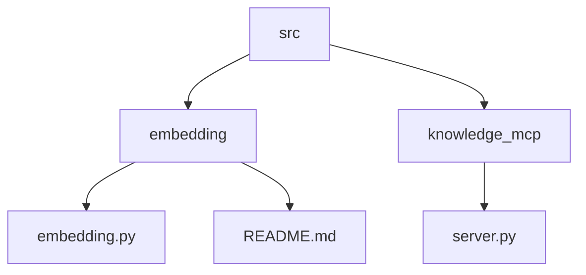
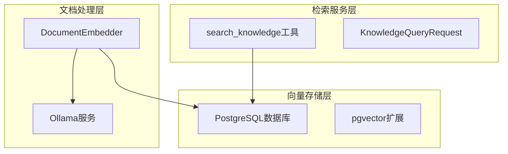
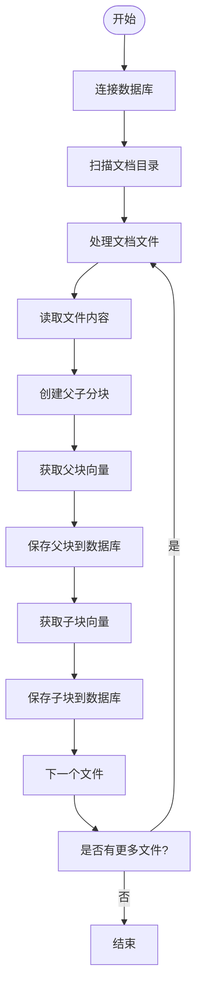
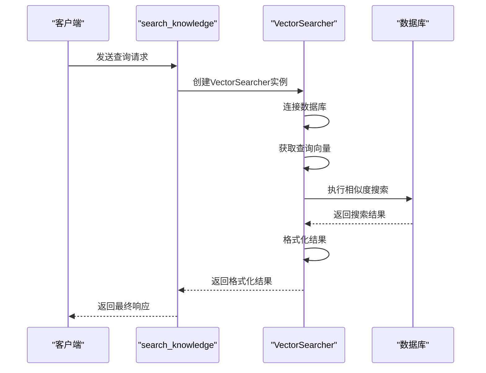
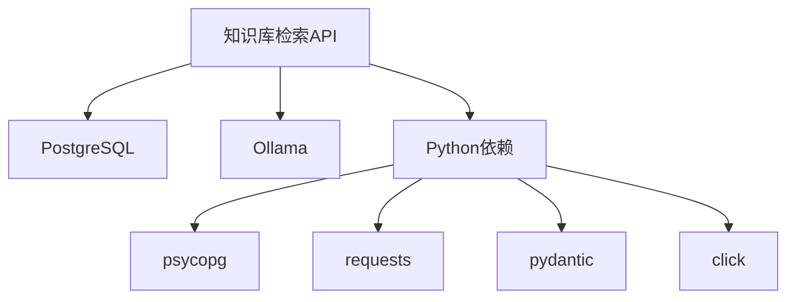

# 知识库检索API

<cite>
**本文档引用的文件**   
- [server.py](file://src/knowledge_mcp/server.py)
- [embedding.py](file://src/embedding/embedding.py)
- [README.md](file://src/embedding/README.md)
</cite>

## 目录
1. [项目结构](#项目结构)
2. [核心组件](#核心组件)
3. [架构概述](#架构概述)
4. [详细组件分析](#详细组件分析)
5. [依赖分析](#依赖分析)
6. [性能考虑](#性能考虑)
7. [故障排除指南](#故障排除指南)

## 项目结构

项目采用模块化设计，主要包含两个核心模块：`embedding` 用于文档向量化处理，`knowledge_mcp` 用于提供知识库检索服务。



**图示来源**
- [project_structure](file://)

**本节来源**
- [project_structure](file://)

## 核心组件

系统由两个主要组件构成：文档向量化处理器（DocumentEmbedder）和向量搜索器（VectorSearcher）。前者负责将文档内容转换为向量并存储到数据库，后者负责执行向量相似度搜索。

**本节来源**
- [server.py](file://src/knowledge_mcp/server.py#L47)
- [embedding.py](file://src/embedding/embedding.py#L65)

## 架构概述

系统采用分层架构，包括文档处理层、向量存储层和检索服务层。文档处理层负责将原始文档分块并向量化；向量存储层使用PostgreSQL配合pgvector扩展存储向量数据；检索服务层提供RESTful API接口供外部调用。



**图示来源**
- [server.py](file://src/knowledge_mcp/server.py#L47)
- [embedding.py](file://src/embedding/embedding.py#L65)

**本节来源**
- [server.py](file://src/knowledge_mcp/server.py#L0-L39)
- [embedding.py](file://src/embedding/embedding.py#L0-L42)

## 详细组件分析

### 文档向量化处理器分析

DocumentEmbedder类负责将文档内容转换为向量并存储到数据库中。

#### 类图
```mermaid
classDiagram
class DocumentEmbedder {
+config : dict
+db_conn : Connection
+__init__(config)
+connect_database() bool
+close_database() void
+get_embedding(text) List[float]
+create_parent_child_chunks(text) List[Tuple]
+process_file(file_path) bool
+run() bool
}
DocumentEmbedder --> "1" "PostgreSQL"
DocumentEmbedder --> "1" "Ollama"
```

**图示来源**
- [embedding.py](file://src/embedding/embedding.py#L65-L71)

#### 处理流程


**图示来源**
- [embedding.py](file://src/embedding/embedding.py#L465-L504)

**本节来源**
- [embedding.py](file://src/embedding/embedding.py#L65-L552)

### 向量搜索器分析

VectorSearcher类负责执行向量相似度搜索，提供知识检索功能。

#### 类图
```mermaid
classDiagram
class VectorSearcher {
+config : dict
+db_conn : Connection
+__init__(config)
+connect_database() bool
+get_embedding(text) List[float]
+search_similar_vectors(query_embedding, top_k) List[Dict]
+format_search_results(results) List[Dict]
+close_connection() void
}
VectorSearcher --> "1" "PostgreSQL"
VectorSearcher --> "1" "Ollama"
```

**图示来源**
- [server.py](file://src/knowledge_mcp/server.py#L47-L53)

#### 搜索流程


**图示来源**
- [server.py](file://src/knowledge_mcp/server.py#L256-L341)

**本节来源**
- [server.py](file://src/knowledge_mcp/server.py#L47-L360)

## 依赖分析

系统依赖于多个外部服务和库，形成完整的知识检索解决方案。



**图示来源**
- [pyproject.toml](file://pyproject.toml#L0-L39)
- [server.py](file://src/knowledge_mcp/server.py#L0-L39)
- [embedding.py](file://src/embedding/embedding.py#L0-L42)

**本节来源**
- [pyproject.toml](file://pyproject.toml#L0-L39)
- [server.py](file://src/knowledge_mcp/server.py#L0-L39)
- [embedding.py](file://src/embedding/embedding.py#L0-L42)

## 性能考虑

为确保系统性能，建议采取以下优化措施：
- 为向量表创建适当的索引以加快查询速度
- 合理设置父子块大小以平衡检索精度和性能
- 使用批量处理方式更新索引
- 配置合理的相似度阈值以过滤低质量结果
- 监控Ollama服务的响应时间，必要时进行模型优化

## 故障排除指南

### 常见问题及解决方案

**数据库连接失败**
- 检查数据库服务是否正常运行
- 验证数据库连接参数（主机、端口、用户名、密码）
- 确认pgvector扩展已正确安装

**向量化失败**
- 确认Ollama服务正在运行
- 检查embedding模型是否已正确下载
- 验证模型名称配置是否正确

**低相关性结果**
- 调整相似度阈值配置
- 优化文档分块策略
- 考虑使用更合适的embedding模型
- 检查查询语句是否清晰明确

**本节来源**
- [server.py](file://src/knowledge_mcp/server.py#L112-L147)
- [embedding.py](file://src/embedding/embedding.py#L140-L175)
- [README.md](file://src/embedding/README.md#L107-L112)