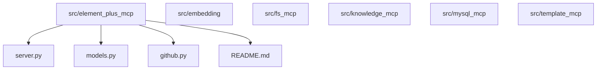
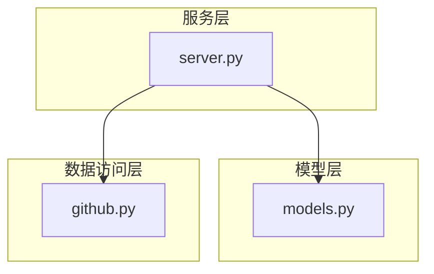
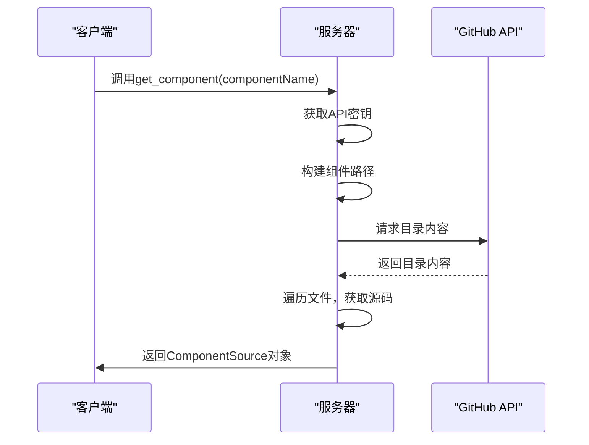
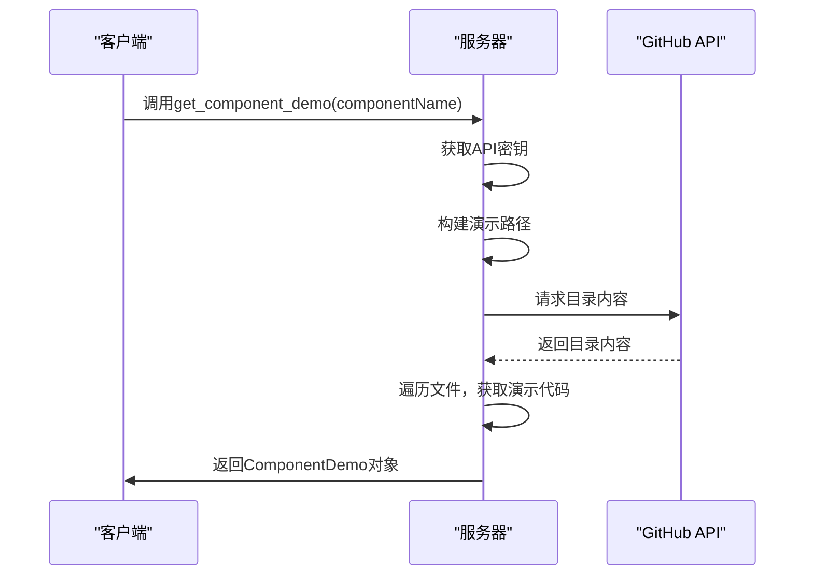
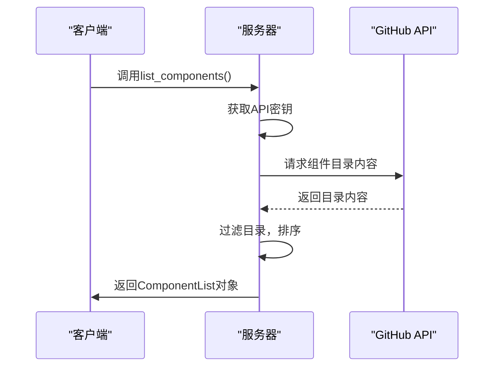
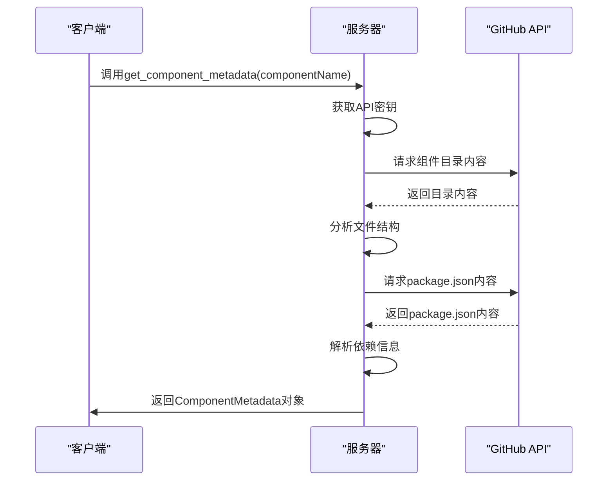
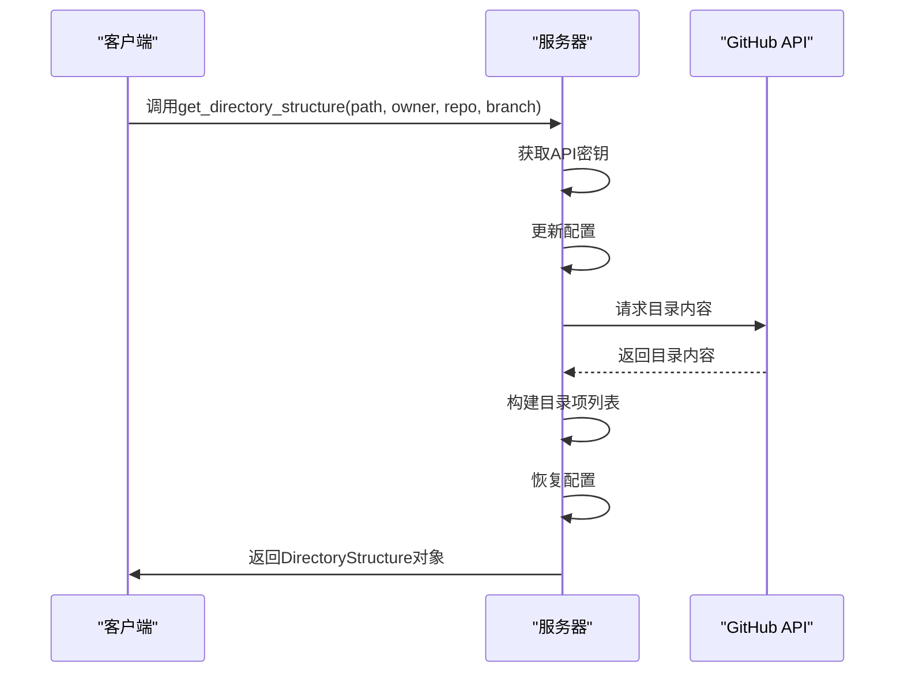
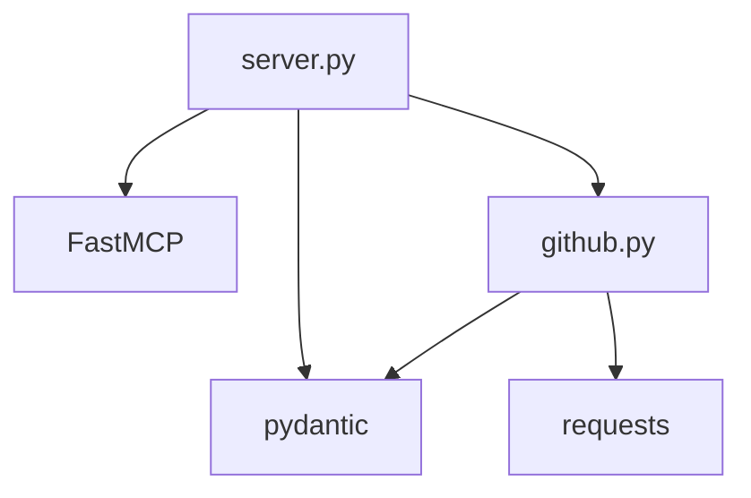

# Element Plus组件服务

<cite>
**本文档中引用的文件**   
- [server.py](file://src/element_plus_mcp/server.py)
- [models.py](file://src/element_plus_mcp/models.py)
- [github.py](file://src/element_plus_mcp/github.py)
- [README.md](file://src/element_plus_mcp/README.md)
</cite>

## 目录
1. [简介](#简介)
2. [项目结构](#项目结构)
3. [核心组件](#核心组件)
4. [架构概述](#架构概述)
5. [详细组件分析](#详细组件分析)
6. [依赖分析](#依赖分析)
7. [性能考虑](#性能考虑)
8. [故障排除指南](#故障排除指南)
9. [结论](#结论)

## 简介
Element Plus组件服务是一个基于Model Context Protocol (MCP) 的服务器，旨在为AI助手提供访问和获取Element Plus Vue.js组件源码、演示代码及元数据信息的能力。该服务通过与GitHub API交互，实现了对Element Plus组件库的远程访问和管理。主要功能包括组件源码获取、演示代码获取、组件列表查询、元数据信息获取以及目录结构浏览等。服务支持通过配置GitHub API Token来提高请求限制，确保稳定性和安全性。

## 项目结构
项目结构清晰，主要由`src`目录下的多个子模块组成，每个子模块负责不同的功能。核心组件服务位于`src/element_plus_mcp`目录下，包含`server.py`、`models.py`和`github.py`三个核心文件。`server.py`定义了服务接口和路由逻辑，`models.py`定义了数据模型，`github.py`实现了与GitHub API的交互逻辑。此外，项目还包括其他辅助模块如`embedding`、`fs_mcp`、`knowledge_mcp`、`mysql_mcp`和`template_mcp`，这些模块提供了额外的功能支持。

**Diagram sources**
- [server.py](file://src/element_plus_mcp/server.py)
- [models.py](file://src/element_plus_mcp/models.py)
- [github.py](file://src/element_plus_mcp/github.py)
- [README.md](file://src/element_plus_mcp/README.md)

**Section sources**
- [server.py](file://src/element_plus_mcp/server.py)
- [models.py](file://src/element_plus_mcp/models.py)
- [github.py](file://src/element_plus_mcp/github.py)
- [README.md](file://src/element_plus_mcp/README.md)

## 核心组件
核心组件主要包括`server.py`中的服务接口定义、`models.py`中的数据模型设计以及`github.py`中的GitHub API交互实现。`server.py`文件定义了五个主要工具函数：`get_component`、`get_component_demo`、`list_components`、`get_component_metadata`和`get_directory_structure`，分别用于获取组件源码、演示代码、组件列表、元数据信息和目录结构。`models.py`文件定义了多个Pydantic模型，用于描述组件源码、演示代码、元数据等信息的结构。`github.py`文件实现了与GitHub API的交互逻辑，包括获取文件内容和目录内容的功能。

**Section sources**
- [server.py](file://src/element_plus_mcp/server.py)
- [models.py](file://src/element_plus_mcp/models.py)
- [github.py](file://src/element_plus_mcp/github.py)

## 架构概述
系统架构采用分层设计，主要包括服务层、模型层和数据访问层。服务层由`server.py`文件实现，负责定义和处理各种API请求。模型层由`models.py`文件实现，定义了数据模型和结构。数据访问层由`github.py`文件实现，负责与GitHub API进行交互，获取所需的数据。整个系统通过FastMCP框架进行集成，支持streamable-http传输协议，确保高效的数据传输和处理。

**Diagram sources**
- [server.py](file://src/element_plus_mcp/server.py)
- [models.py](file://src/element_plus_mcp/models.py)
- [github.py](file://src/element_plus_mcp/github.py)

## 详细组件分析
### get_component函数分析
`get_component`函数用于获取指定Element Plus组件的源码。该函数首先从请求上下文中获取GitHub API密钥，然后构建组件路径并检查组件目录是否存在。如果存在，则遍历目录内容，查找以`.vue`、`.ts`或`.tsx`结尾的文件，并获取其内容。最后，将文件内容封装成`SourceFile`对象，返回包含所有源码文件的`ComponentSource`对象。

**Diagram sources**
- [server.py](file://src/element_plus_mcp/server.py#L47-L100)
- [models.py](file://src/element_plus_mcp/models.py#L25-L30)

### get_component_demo函数分析
`get_component_demo`函数用于获取指定Element Plus组件的演示代码。该函数首先尝试在`docs/examples`目录下查找演示代码，如果未找到，则依次在`__tests__`和`demo`目录下查找。找到相关文件后，获取其内容并封装成`DemoFile`对象，返回包含所有演示文件的`ComponentDemo`对象。

**Diagram sources**
- [server.py](file://src/element_plus_mcp/server.py#L104-L165)
- [models.py](file://src/element_plus_mcp/models.py#L37-L42)

### list_components函数分析
`list_components`函数用于列出所有可用的Element Plus组件。该函数通过获取`packages/components`目录下的所有子目录，过滤出非隐藏目录，并按名称排序，最终返回组件列表。

**Diagram sources**
- [server.py](file://src/element_plus_mcp/server.py#L169-L197)
- [models.py](file://src/element_plus_mcp/models.py#L43-L48)

### get_component_metadata函数分析
`get_component_metadata`函数用于获取指定Element Plus组件的元数据信息。该函数首先获取组件目录内容，分析文件结构，然后尝试读取`package.json`文件获取依赖信息和描述。

**Diagram sources**
- [server.py](file://src/element_plus_mcp/server.py#L201-L251)
- [models.py](file://src/element_plus_mcp/models.py#L11-L20)

### get_directory_structure函数分析
`get_directory_structure`函数用于获取Element Plus仓库的目录结构。该函数支持自定义仓库所有者、名称和分支，通过请求指定路径的目录内容，构建目录项列表并返回。

**Diagram sources**
- [server.py](file://src/element_plus_mcp/server.py#L255-L307)
- [models.py](file://src/element_plus_mcp/models.py#L55-L68)

## 依赖分析
系统依赖于多个外部库和框架，主要包括`requests`用于HTTP请求，`pydantic`用于数据模型定义，`FastMCP`用于MCP协议支持。此外，服务通过GitHub API与Element Plus仓库进行交互，依赖于GitHub的API接口。为了提高请求限制，建议配置GitHub API Token。

**Diagram sources**
- [server.py](file://src/element_plus_mcp/server.py)
- [github.py](file://src/element_plus_mcp/github.py)
- [models.py](file://src/element_plus_mcp/models.py)

**Section sources**
- [server.py](file://src/element_plus_mcp/server.py)
- [github.py](file://src/element_plus_mcp/github.py)
- [models.py](file://src/element_plus_mcp/models.py)

## 性能考虑
服务在设计时考虑了性能和稳定性。通过使用GitHub API Token可以有效避免请求限制，确保高并发下的稳定访问。此外，服务实现了完善的错误处理机制，能够在请求失败时提供详细的错误信息，便于调试和问题定位。日志记录功能也帮助开发者监控服务运行状态，及时发现和解决问题。

## 故障排除指南
### 常见问题
1. **组件不存在**：检查组件名称是否正确，确保大小写匹配。
2. **API请求失败**：确认GitHub API Token是否正确配置，检查网络连接。
3. **文件内容无法获取**：检查文件路径是否正确，确认文件是否存在。

### 调试建议
1. **启用详细日志**：通过设置日志级别为DEBUG，获取更详细的运行信息。
2. **检查请求头**：确保请求中包含正确的`X-GITHUB-API-KEY`头。
3. **验证API密钥**：确认GitHub API Token具有足够的权限。

**Section sources**
- [server.py](file://src/element_plus_mcp/server.py)
- [github.py](file://src/element_plus_mcp/github.py)

## 结论
Element Plus组件服务通过与GitHub API的紧密集成，为AI助手提供了强大的组件访问能力。服务设计合理，功能完善，具备良好的扩展性和稳定性。通过合理的配置和使用，可以有效提升开发效率，简化组件管理和使用过程。