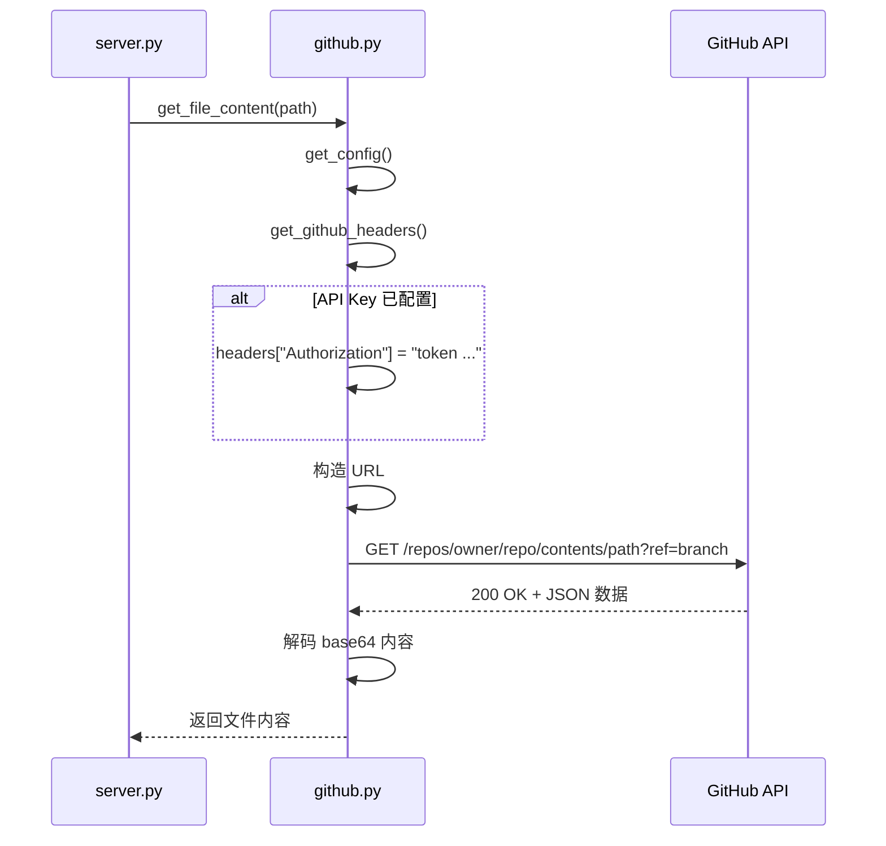
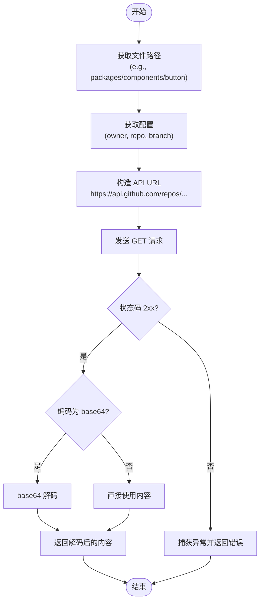
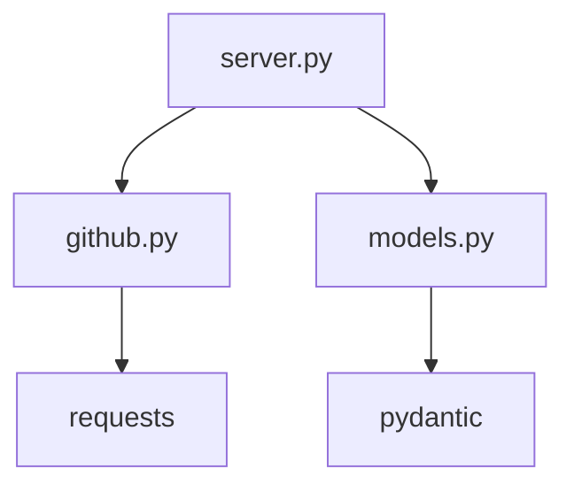

# GitHub API集成

<cite>
**本文档中引用的文件**   
- [github.py](file://src/element_plus_mcp/github.py)
- [server.py](file://src/element_plus_mcp/server.py)
- [models.py](file://src/element_plus_mcp/models.py)
- [README.md](file://src/element_plus_mcp/README.md)
</cite>

## 目录
1. [简介](#简介)
2. [项目结构](#项目结构)
3. [核心组件](#核心组件)
4. [架构概述](#架构概述)
5. [详细组件分析](#详细组件分析)
6. [依赖分析](#依赖分析)
7. [性能考虑](#性能考虑)
8. [故障排除指南](#故障排除指南)
9. [结论](#结论)

## 简介
本文档详细阐述了 `github.py` 文件中实现的 GitHub API 客户端逻辑。该客户端是 Element Plus MCP 服务器的核心组件，负责与 GitHub REST API 交互，以获取 Element Plus 组件库的源码、演示代码和元数据。文档将深入分析其 HTTP 请求封装、认证机制、错误处理策略，并解释如何根据组件名称构造正确的仓库路径以获取源码文件内容。

## 项目结构
`element_plus_mcp` 模块是整个项目的核心，它提供了一个基于 Model Context Protocol (MCP) 的服务器，允许外部系统（如 AI 助手）查询 Element Plus 组件库的信息。该模块主要由三个文件构成：`github.py` 负责与 GitHub API 通信，`models.py` 定义了数据传输的结构，而 `server.py` 则集成了这些功能并暴露为可调用的工具。

```mermaid
graph TD
subgraph "element_plus_mcp 模块"
github[github.py<br/>GitHub API 客户端]
models[models.py<br/>数据模型]
server[server.py<br/>MCP 服务器]
end
server --> github : "调用"
server --> models : "使用"
github --> models : "无直接依赖"
```

**图示来源**
- [github.py](file://src/element_plus_mcp/github.py)
- [models.py](file://src/element_plus_mcp/models.py)
- [server.py](file://src/element_plus_mcp/server.py)

## 核心组件
`github.py` 文件实现了与 GitHub API 交互的核心逻辑。它包含一个自定义异常 `GitHubAPIError`，用于封装所有与 API 通信相关的错误。核心功能由几个关键函数组成：`get_config` 提供了应用的配置信息，`get_github_headers` 负责构建包含认证信息的请求头，`make_github_request` 是发送 HTTP GET 请求的通用封装，而 `get_file_content` 和 `get_directory_contents` 则是直接用于获取文件和目录内容的高层接口。

**组件来源**
- [github.py](file://src/element_plus_mcp/github.py#L1-L80)

## 架构概述
整个系统的架构遵循清晰的分层模式。最底层是 `github.py`，它直接与 GitHub 的 REST API 进行交互。中间层是 `models.py`，它定义了所有数据交换的 Pydantic 模型，确保了数据的类型安全和结构化。最上层是 `server.py`，它利用 FastMCP 框架创建了一个服务器，并将底层的 GitHub 功能包装成一系列可调用的工具（如 `get_component`, `list_components` 等）。当客户端调用这些工具时，服务器会处理请求，调用 `github.py` 中的函数，并将结果以 `models.py` 中定义的结构返回。

```mermaid
graph TB
Client[客户端<br/>如 AI 助手] --> Server[server.py<br/>MCP 服务器]
Server --> |调用| GitHubClient[github.py<br/>GitHub API 客户端]
GitHubClient --> |HTTP GET| GitHubAPI[https://api.github.com]
Server < --> |使用| Models[models.py<br/>Pydantic 数据模型]
```

**图示来源**
- [github.py](file://src/element_plus_mcp/github.py)
- [server.py](file://src/element_plus_mcp/server.py)
- [models.py](file://src/element_plus_mcp/models.py)

## 详细组件分析
### GitHub API 客户端分析
`github.py` 模块的设计简洁而高效，专注于提供与 GitHub API 通信的可靠接口。

#### HTTP 请求封装与认证机制
客户端通过 `get_github_headers` 函数构建请求头。它设置了必要的 `Accept` 头以请求 JSON 格式的数据，并指定了一个自定义的 `User-Agent`。最关键的认证机制在此实现：函数会检查通过 `get_config` 获取的配置中是否存在 `GITHUB_API_KEY` 环境变量。如果存在，它会将该密钥以 `token YOUR_TOKEN_HERE` 的格式添加到 `Authorization` 头中，从而实现对 GitHub API 的身份验证。



**图示来源**
- [github.py](file://src/element_plus_mcp/github.py#L21-L36)
- [server.py](file://src/element_plus_mcp/server.py)

**组件来源**
- [github.py](file://src/element_plus_mcp/github.py#L21-L36)

#### 重试策略与错误处理
在 `make_github_request` 函数中，客户端使用 `requests` 库发送带有超时（30秒）的 GET 请求。它通过 `response.raise_for_status()` 来检查 HTTP 响应状态码，任何非 2xx 的状态码（如 404 未找到、403 禁止访问、429 速率限制等）都会触发 `requests.exceptions.RequestException`。该异常被捕获，并被包装成一个自定义的 `GitHubAPIError` 异常向上抛出。`get_file_content` 和 `get_directory_contents` 等高层函数会捕获这个 `GitHubAPIError`，并返回一个友好的错误消息字符串或空列表，而不是让错误传播到上层，从而实现了优雅的错误降级。

**组件来源**
- [github.py](file://src/element_plus_mcp/github.py#L29-L36)

#### 组件路径构造与源码获取
`get_file_content` 函数是获取源码的核心。它首先使用 `get_config` 获取仓库的拥有者（owner）、仓库名（repo）和分支（branch）。然后，它将传入的 `path` 参数（例如 `packages/components/button/index.vue`）进行 URL 编码，以防止路径中的特殊字符导致请求失败。最后，它构造出完整的 GitHub API URL：`https://api.github.com/repos/{owner}/{repo}/contents/{encoded_path}?ref={branch}`。获取到响应后，它会检查 `encoding` 字段，因为 GitHub API 返回的文件内容通常是 base64 编码的，因此需要进行解码才能得到原始的文本内容。



**图示来源**
- [github.py](file://src/element_plus_mcp/github.py#L39-L58)

**组件来源**
- [github.py](file://src/element_plus_mcp/github.py#L39-L58)

## 依赖分析
`element_plus_mcp` 模块内部的依赖关系清晰。`server.py` 是主要的依赖方，它直接导入并使用了 `github.py` 中的 `get_file_content` 和 `get_directory_contents` 函数，以及 `models.py` 中定义的所有数据模型。`github.py` 模块本身依赖于标准库（`os`, `urllib.parse`, `typing`）和第三方库 `requests`。`models.py` 仅依赖于 `pydantic` 和 `typing`。模块之间没有循环依赖，保证了良好的可维护性。



**图示来源**
- [server.py](file://src/element_plus_mcp/server.py#L7)
- [github.py](file://src/element_plus_mcp/github.py#L4)
- [models.py](file://src/element_plus_mcp/models.py#L2)

## 性能考虑
该实现的性能主要受网络延迟和 GitHub API 速率限制的影响。`make_github_request` 函数设置了 30 秒的超时，可以防止请求无限期挂起。然而，当前实现中没有内置的重试机制（retry logic）。如果遇到临时的网络问题或速率限制（HTTP 429），请求会直接失败。强烈建议用户配置 `GITHUB_API_KEY`，因为认证后的请求拥有更高的速率限制（每小时 5000 次），而未认证的请求限制很低（每小时 60 次），这在频繁查询时会成为主要瓶颈。

## 故障排除指南
以下是一些常见问题及其解决方案：

*   **404 未找到组件**:
    *   **原因**: 组件名称拼写错误，或该组件在指定的分支（默认为 `dev`）中不存在。
    *   **解决方案**: 检查组件名称是否正确（不区分大小写），并确认该组件在 Element Plus 仓库的 `dev` 分支中确实存在。

*   **认证失败或请求被拒绝 (403)**:
    *   **原因**: 提供的 `GITHUB_API_KEY` 无效、已过期，或没有足够的权限。
    *   **解决方案**: 检查 `GITHUB_API_KEY` 环境变量的值是否正确。确保该令牌具有访问公共仓库的权限。可以在服务器启动日志中查看 `GitHub API Token: 已配置` 或 `未配置` 的提示来确认。

*   **速率限制 (429 Too Many Requests)**:
    *   **原因**: 未配置 API 密钥，导致使用了低速率限制的匿名请求。
    *   **解决方案**: **必须配置 `GITHUB_API_KEY`**。这是解决此问题的根本方法。配置后，速率限制将从每小时 60 次提升到 5000 次。

*   **无法获取文件内容**:
    *   **原因**: 网络连接问题、GitHub API 临时故障，或文件路径不正确。
    *   **解决方案**: 检查网络连接。查看服务器日志中的详细错误信息。确认文件路径是否符合 `packages/components/{component_name}/...` 的结构。

**组件来源**
- [github.py](file://src/element_plus_mcp/github.py#L29-L36)
- [server.py](file://src/element_plus_mcp/server.py#L345)
- [README.md](file://src/element_plus_mcp/README.md)

## 结论
`github.py` 实现了一个功能完整且易于使用的 GitHub API 客户端。它通过清晰的函数分离了配置、请求头、HTTP 请求和内容获取等职责。其认证机制简单有效，错误处理策略确保了服务的健壮性。虽然缺少自动重试机制，但通过强制要求配置 API 密钥，可以有效规避最常见的速率限制问题。该客户端与 `server.py` 和 `models.py` 协同工作，为用户提供了一个强大的接口来探索和获取 Element Plus 组件库的内部信息。