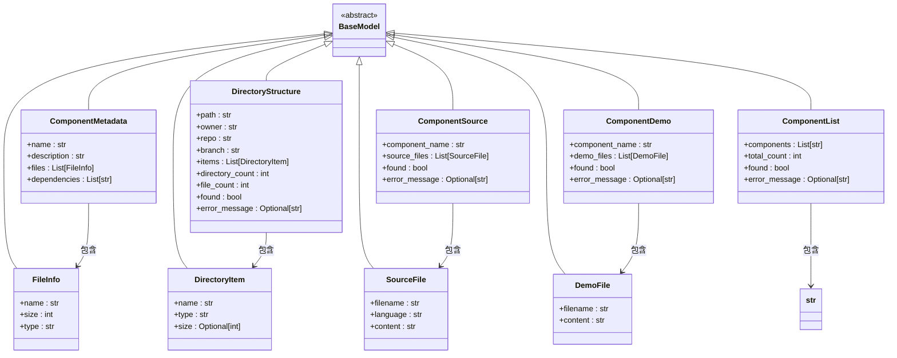

# 数据模型设计

<cite>
**本文档引用的文件**  
- [models.py](file://src/element_plus_mcp/models.py#L1-L68)
- [server.py](file://src/element_plus_mcp/server.py#L1-L374)
</cite>

## 目录

1. [数据模型设计](#数据模型设计)
2. [模型定义与结构分析](#模型定义与结构分析)
3. [API接口与模型绑定机制](#api接口与模型绑定机制)
4. [序列化与反序列化过程](#序列化与反序列化过程)
5. [数据一致性与类型安全保障](#数据一致性与类型安全保障)
6. [自定义验证逻辑扩展](#自定义验证逻辑扩展)

## 模型定义与结构分析

`models.py` 文件中定义了多个基于 Pydantic 的数据模型，用于规范请求和响应的数据结构。这些模型通过继承 `BaseModel` 实现类型安全和自动验证功能。

### 核心模型结构



**图示来源**  
- [models.py](file://src/element_plus_mcp/models.py#L1-L68)

**本节来源**  
- [models.py](file://src/element_plus_mcp/models.py#L1-L68)

#### FileInfo 模型
描述文件基本信息：
- **name**: 文件名（字符串类型）
- **size**: 文件大小（整数类型，单位字节）
- **type**: 文件类型或扩展名（字符串类型）

#### DirectoryItem 模型
表示目录中的一个条目：
- **name**: 项目名称（字符串）
- **type**: 类型（"dir" 表示目录，"file" 表示文件）
- **size**: 文件大小（可选整数，目录为 None）

#### SourceFile 与 DemoFile 模型
分别表示源码文件和演示文件：
- **filename/content**: 文件名与内容
- **language**: 编程语言类型（仅 SourceFile）

#### 组件相关模型
- **ComponentMetadata**: 组件元数据，包含名称、描述、文件列表和依赖项
- **ComponentSource**: 组件源码信息，包含组件名、源文件列表及查找状态
- **ComponentDemo**: 组件演示代码信息
- **ComponentList**: 所有组件的列表信息，包括总数和查找状态

#### DirectoryStructure 模型
描述仓库目录结构：
- **path/owner/repo/branch**: 路径、所有者、仓库名、分支
- **items**: 目录项列表
- **directory_count/file_count**: 目录与文件数量统计
- **found/error_message**: 查找成功标志与错误信息

所有字段均使用 `Field(description="...")` 提供语义化描述，增强 API 文档可读性。

## API接口与模型绑定机制

在 `server.py` 中，通过 `@mcp.tool()` 装饰器将函数暴露为 MCP 工具接口，并直接使用上述 Pydantic 模型作为返回类型，实现接口契约的强类型约束。

### 接口函数与响应模型映射

| 接口函数 | 请求参数 | 响应模型 | 功能说明 |
|--------|--------|--------|--------|
| get_component | component_name | ComponentSource | 获取组件源码 |
| get_component_demo | component_name | ComponentDemo | 获取组件演示代码 |
| list_components | 无 | ComponentList | 列出所有组件 |
| get_component_metadata | component_name | ComponentMetadata | 获取组件元数据 |
| get_directory_structure | path, owner, repo, branch | DirectoryStructure | 获取目录结构 |

这些接口函数均接受 `Context` 类型的上下文参数以获取请求头信息（如 API 密钥），并通过异常处理确保返回符合模型定义的结构化响应。

### get_component 接口实现分析

```python
@mcp.tool()
def get_component(
    component_name: Annotated[str, Field(description="Name of the element-plus component (e.g., 'avatar', 'button')")],
    ctx: Context,
) -> ComponentSource:
    ...
    return ComponentSource(
        component_name=component_name,
        source_files=source_files,
        found=True,
        error_message=None
    )
```

该接口：
1. 接收组件名称作为输入
2. 构造 GitHub API 请求路径 `packages/components/{component_name}`
3. 调用 `get_directory_contents` 和 `get_file_content` 获取文件内容
4. 将 `.vue`, `.ts`, `.tsx` 文件识别为源码文件并封装为 `SourceFile` 对象
5. 返回 `ComponentSource` 模型实例

当发生错误或未找到组件时，仍返回 `ComponentSource` 实例，但 `found=False` 且包含 `error_message`，保证响应结构一致性。

### get_directory_structure 接口实现分析

```python
@mcp.tool()
def get_directory_structure(
    path: Annotated[str, Field(description="Path within the repository (default: packages/components)")],
    owner: Annotated[str, Field(description="Repository owner (default: element-plus)")],
    repo: Annotated[str, Field(description="Repository name (default: element-plus)")],
    branch: Annotated[str, Field(description="Branch name (default: dev)")],
    ctx: Context,
) -> DirectoryStructure:
    ...
    return DirectoryStructure(
        path=path,
        owner=owner,
        repo=repo,
        branch=branch,
        items=items,
        directory_count=directory_count,
        file_count=file_count,
        found=True,
        error_message=None,
    )
```

此接口支持自定义仓库、分支和路径，动态构建 `DirectoryStructure` 响应对象，其中 `items` 字段由 `DirectoryItem` 对象列表构成，实现完整的目录树结构传输。

**本节来源**  
- [server.py](file://src/element_plus_mcp/server.py#L46-L254)
- [models.py](file://src/element_plus_mcp/models.py#L25-L67)

## 序列化与反序列化过程

Pydantic 模型在 FastMCP 框架中自动处理 JSON 序列化与反序列化：

### 响应序列化流程
1. 接口函数返回 Pydantic 模型实例
2. FastMCP 自动调用 `.model_dump()` 方法转换为字典
3. 字典被序列化为 JSON 响应体
4. 发送至客户端

例如，`ComponentSource` 实例会被序列化为：
```json
{
  "component_name": "button",
  "source_files": [
    {
      "filename": "index.vue",
      "language": "vue",
      "content": "..."
    }
  ],
  "found": true,
  "error_message": null
}
```

### 请求反序列化流程
虽然当前接口主要为 GET 类型且参数简单，但 Pydantic 同样支持复杂请求体的反向解析：
1. 接收 JSON 请求体
2. 根据参数注解自动实例化对应模型
3. 进行类型验证和字段校验
4. 传递给函数处理

尽管当前实现中未使用嵌套请求模型，但框架已具备此能力。

**本节来源**  
- [server.py](file://src/element_plus_mcp/server.py#L46-L254)
- [models.py](file://src/element_plus_mcp/models.py#L1-L68)

## 数据一致性与类型安全保障

Pydantic 模型通过以下机制保障数据一致性与类型安全：

### 类型注解强制约束
所有字段均声明明确类型（如 `str`, `int`, `List[...]`, `Optional[...]`），确保：
- 赋值时进行类型检查
- 序列化前自动转换（如字符串转整数）
- 防止运行时类型错误

### 自动验证规则
- `Optional[str]` 字段允许 `None` 值
- 容器类型（`List`）自动验证元素类型
- 内置类型转换（如字符串转数字）

### API契约约束
通过将模型作为函数返回类型，形成严格的接口契约：
- 所有响应必须符合模型结构
- 必填字段不可省略
- 字段名称与类型固定
- 错误信息统一通过 `error_message` 字段传递

这使得客户端可以依赖稳定的响应格式进行解析，无需处理不一致的数据结构。

**本节来源**  
- [models.py](file://src/element_plus_mcp/models.py#L1-L68)
- [server.py](file://src/element_plus_mcp/server.py#L46-L254)

## 自定义验证逻辑扩展

当前模型主要依赖 Pydantic 默认验证机制，但可通过以下方式扩展自定义验证逻辑：

### 字段级验证器
可在模型中添加 `@field_validator` 装饰器实现字段校验：

```python
from pydantic import field_validator

class ComponentSource(BaseModel):
    component_name: str = Field(description="组件名称")
    
    @field_validator("component_name")
    def validate_component_name(cls, v):
        if not v.islower():
            raise ValueError("组件名称必须为小写字母")
        return v
```

### 模型级验证器
使用 `@model_validator` 对多个字段进行联合校验：

```python
from pydantic import model_validator

class DirectoryStructure(BaseModel):
    path: str
    items: List[DirectoryItem]
    
    @model_validator(mode="after")
    def check_item_paths(cls, instance):
        for item in instance.items:
            if ".." in item.name:
                raise ValueError("目录项名称不能包含路径遍历")
        return instance
```

### 自定义数据转换
可通过重写 `model_dump` 或定义 `model_serializer` 实现特殊序列化逻辑。

### 扩展建议
1. 在 `FileInfo.size` 上添加非负数验证
2. 对 `DirectoryItem.type` 限制为枚举值 `"dir"` 或 `"file"`
3. 在 `ComponentMetadata.dependencies` 中去重并排序
4. 添加 `SourceFile.content` 的长度限制

这些扩展将进一步增强数据完整性与安全性。

**本节来源**  
- [models.py](file://src/element_plus_mcp/models.py#L1-L68)