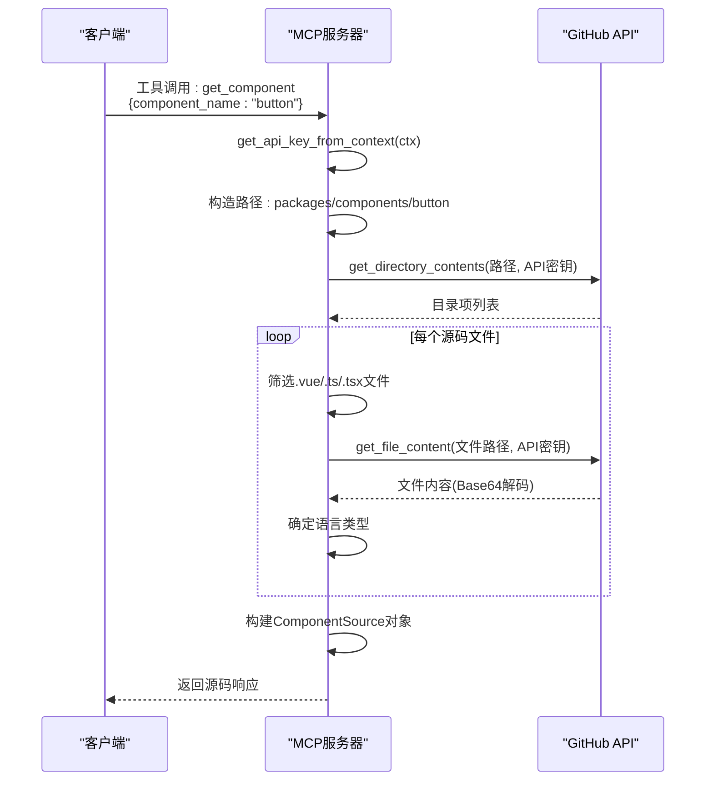
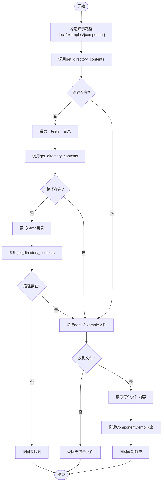
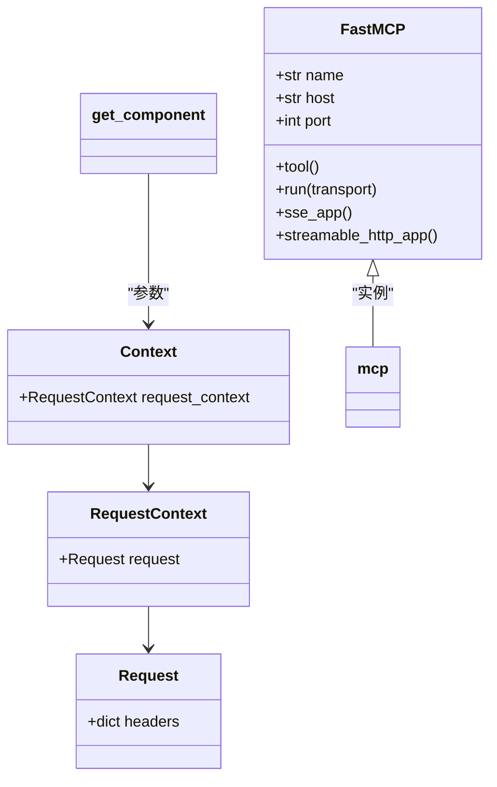
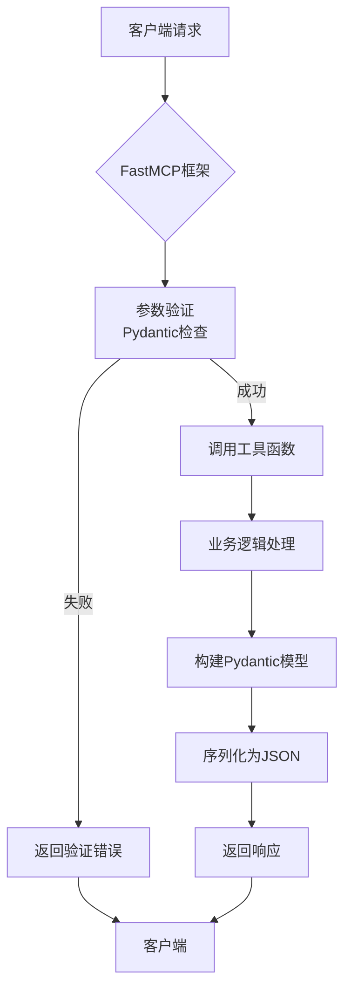

# 服务接口定义

<cite>
**本文档中引用的文件**   
- [server.py](file://src/element_plus_mcp/server.py)
- [models.py](file://src/element_plus_mcp/models.py)
- [github.py](file://src/element_plus_mcp/github.py)
- [README.md](file://src/element_plus_mcp/README.md)
- [pyproject.toml](file://pyproject.toml)
</cite>

## 目录

1. [项目结构](#项目结构)
2. [核心组件](#核心组件)
3. [架构概述](#架构概述)
4. [详细组件分析](#详细组件分析)
5. [依赖分析](#依赖分析)
6. [性能考虑](#性能考虑)
7. [故障排除指南](#故障排除指南)
8. [结论](#结论)

## 项目结构

`element_plus_mcp` 模块是基于 Model Context Protocol (MCP) 构建的 Element Plus 组件库服务器，允许 AI 助手访问和获取 Element Plus Vue.js 组件的源码、演示代码和元数据信息。该模块由四个主要文件组成，每个文件都有明确的职责：

- **server.py**: 主服务文件，定义了所有MCP工具接口、服务器初始化和启动逻辑
- **models.py**: 定义了所有数据传输对象（DTO）的Pydantic模型，用于请求和响应的数据验证
- **github.py**: 封装了与GitHub API交互的核心功能，包括获取文件内容和目录结构
- **README.md**: 提供了模块的高层次描述、功能特性和使用说明

该模块通过 `pyproject.toml` 中的脚本配置 `element_plus_mcp = "element_plus_mcp.server:main"` 暴露为一个可执行命令，允许通过 `uv run element_plus_mcp` 启动服务。

```mermaid
graph TD
subgraph "element_plus_mcp 模块"
server[server.py<br/>- MCP服务定义<br/>- 工具接口<br/>- 服务器启动]
models[models.py<br/>- Pydantic数据模型<br/>- 请求/响应结构]
github[github.py<br/>- GitHub API客户端<br/>- 文件/目录操作]
readme[README.md<br/>- 使用文档<br/>- 功能说明]
end
server --> models : "使用"
server --> github : "调用"
server --> readme : "参考"
```

**图源**
- [server.py](file://src/element_plus_mcp/server.py)
- [models.py](file://src/element_plus_mcp/models.py)
- [github.py](file://src/element_plus_mcp/github.py)
- [README.md](file://src/element_plus_mcp/README.md)

**本节来源**
- [server.py](file://src/element_plus_mcp/server.py)
- [models.py](file://src/element_plus_mcp/models.py)
- [github.py](file://src/element_plus_mcp/github.py)
- [README.md](file://src/element_plus_mcp/README.md)
- [pyproject.toml](file://pyproject.toml)

## 核心组件

`element_plus_mcp` 模块的核心组件围绕 FastMCP 框架构建，实现了五个主要的MCP工具接口，每个接口都针对Element Plus组件库的特定信息进行查询。这些接口通过 `@mcp.tool()` 装饰器注册到MCP服务器，并利用Pydantic模型进行严格的数据验证。

核心组件包括：
- **MCP服务器实例**: 通过 `FastMCP` 类创建，负责注册工具、处理请求和管理传输协议
- **工具接口**: 五个 `@mcp.tool()` 装饰的函数，分别处理组件源码、演示代码、组件列表、元数据和目录结构的请求
- **数据模型**: 在 `models.py` 中定义的多个Pydantic模型，确保请求和响应数据的结构化和类型安全
- **GitHub客户端**: 在 `github.py` 中实现的函数，用于与GitHub API通信，获取远程仓库的文件和目录信息
- **上下文处理器**: `get_api_key_from_context` 函数，从请求上下文中提取GitHub API密钥，实现安全认证

这些组件协同工作，形成了一个完整的MCP服务，能够响应客户端的工具调用请求，从Element Plus的GitHub仓库中获取所需信息，并以结构化的JSON格式返回。

**本节来源**
- [server.py](file://src/element_plus_mcp/server.py#L1-L50)
- [models.py](file://src/element_plus_mcp/models.py#L1-L10)
- [github.py](file://src/element_plus_mcp/github.py#L1-L10)

## 架构概述

`element_plus_mcp` 服务的架构遵循清晰的分层设计，将服务逻辑、数据模型和外部集成分离。整体架构可以分为四层：

1. **接口层**: 由 `@mcp.tool()` 装饰的函数构成，作为MCP协议的工具端点，接收来自客户端的请求。
2. **服务层**: 包含工具函数的业务逻辑，负责协调数据模型和外部服务的调用。
3. **数据模型层**: 由Pydantic模型组成，定义了所有输入参数和输出响应的数据结构，确保类型安全和数据验证。
4. **集成层**: `github.py` 文件中的函数，作为与外部GitHub API的适配器，处理HTTP请求和响应。

当客户端发起一个工具调用时，请求首先到达接口层，FastMCP框架根据工具名称路由到相应的处理函数。服务层函数使用从请求中提取的参数，调用集成层的GitHub API函数获取数据。获取到的原始数据被转换为预定义的Pydantic模型实例，最后通过MCP协议返回给客户端。

```mermaid
graph TD
Client[客户端] --> |MCP工具调用| Interface[接口层<br/>@mcp.tool函数]
Interface --> |调用| Service[服务层<br/>业务逻辑]
Service --> |使用| Models[数据模型层<br/>Pydantic模型]
Service --> |调用| Integration[集成层<br/>github.py]
Integration --> |HTTP请求| GitHub[GitHub API]
GitHub --> |JSON响应| Integration
Integration --> |原始数据| Service
Service --> |构建| Models
Models --> |序列化| Interface
Interface --> |MCP响应| Client
style Interface fill:#f9f,stroke:#333
style Service fill:#bbf,stroke:#333
style Models fill:#f96,stroke:#333
style Integration fill:#6f9,stroke:#333
```

**图源**
- [server.py](file://src/element_plus_mcp/server.py)
- [models.py](file://src/element_plus_mcp/models.py)
- [github.py](file://src/element_plus_mcp/github.py)

## 详细组件分析

### 接口定义与路由分析

`element_plus_mcp` 服务通过 `@mcp.tool()` 装饰器定义了五个MCP工具接口，每个接口对应一个特定的功能。这些接口的路由和参数定义如下：

#### get_component 接口
此接口用于获取指定Element Plus组件的源码。

**路由**: `get_component`

**请求参数**:
- `component_name`: 字符串，必填，表示组件名称（如 'button', 'input'）

**请求上下文**:
- `ctx: Context`: FastMCP上下文对象，用于访问请求头等信息

**响应结构** (`ComponentSource`):
```json
{
  "component_name": "string",
  "source_files": [
    {
      "filename": "string",
      "language": "string",
      "content": "string"
    }
  ],
  "found": "boolean",
  "error_message": "string or null"
}
```

**处理流程**:
1. 从 `ctx` 中提取 `X-GITHUB-API-KEY` 请求头
2. 构造组件路径 `packages/components/{component_name}`
3. 调用 `get_directory_contents` 获取目录内容
4. 遍历目录项，筛选出 `.vue`, `.ts`, `.tsx` 文件
5. 对每个源码文件调用 `get_file_content` 获取内容
6. 根据文件扩展名确定语言类型
7. 构建并返回 `ComponentSource` 响应对象



**图源**
- [server.py](file://src/element_plus_mcp/server.py#L60-L140)
- [models.py](file://src/element_plus_mcp/models.py#L19-L25)
- [github.py](file://src/element_plus_mcp/github.py#L50-L80)

**本节来源**
- [server.py](file://src/element_plus_mcp/server.py#L60-L140)
- [models.py](file://src/element_plus_mcp/models.py#L19-L25)
- [github.py](file://src/element_plus_mcp/github.py#L50-L80)

#### get_component_demo 接口
此接口用于获取指定组件的演示代码。

**路由**: `get_component_demo`

**请求参数**:
- `component_name`: 字符串，必填，表示组件名称

**响应结构** (`ComponentDemo`):
```json
{
  "component_name": "string",
  "demo_files": [
    {
      "filename": "string",
      "content": "string"
    }
  ],
  "found": "boolean",
  "error_message": "string or null"
}
```

**查找策略**:
1. 优先在 `docs/examples/{component_name}` 目录下查找
2. 若未找到，则在 `packages/components/{component_name}/__tests__` 目录下查找
3. 最后在 `packages/components/{component_name}/demo` 目录下查找
4. 筛选文件名包含 "demo" 或 "example" 的 `.vue` 文件



**图源**
- [server.py](file://src/element_plus_mcp/server.py#L145-L209)
- [models.py](file://src/element_plus_mcp/models.py#L32-L37)

**本节来源**
- [server.py](file://src/element_plus_mcp/server.py#L145-L209)
- [models.py](file://src/element_plus_mcp/models.py#L32-L37)

#### list_components 接口
此接口用于列出所有可用的Element Plus组件。

**路由**: `list_components`

**请求参数**: 无

**响应结构** (`ComponentList`):
```json
{
  "components": ["string"],
  "total_count": "number",
  "found": "boolean",
  "error_message": "string or null"
}
```

**处理逻辑**:
1. 调用 `get_directory_contents` 获取 `packages/components` 目录下的所有项
2. 筛选出类型为 "dir" 且不以 "." 开头的目录
3. 将目录名称添加到组件列表中
4. 对列表进行排序并返回

#### get_component_metadata 接口
此接口用于获取组件的元数据信息。

**路由**: `get_component_metadata`

**请求参数**:
- `component_name`: 字符串，必填

**响应结构** (`ComponentMetadata`):
```json
{
  "name": "string",
  "description": "string",
  "files": [
    {
      "name": "string",
      "size": "number",
      "type": "string"
    }
  ],
  "dependencies": ["string"]
}
```

**高级功能**:
- 读取组件目录下的 `package.json` 文件
- 解析JSON内容以获取组件描述和依赖项列表

#### get_directory_structure 接口
此接口用于获取仓库的目录结构。

**路由**: `get_directory_structure`

**请求参数**:
- `path`: 字符串，可选，默认为 "packages/components"
- `owner`: 字符串，可选，默认为 "element-plus"
- `repo`: 字符串，可选，默认为 "element-plus"
- `branch`: 字符串，可选，默认为 "dev"

**动态配置**:
- 函数内部临时修改 `get_config()` 的返回值以支持自定义仓库
- 执行完成后恢复原始配置，确保线程安全

### FastMCP框架集成分析

`FastMCP` 框架是整个服务的核心，负责注册工具、处理请求和管理传输协议。服务通过以下方式与框架集成：

1. **服务器实例化**:
```python
mcp = FastMCP("ElementPlusServer", host="0.0.0.0", port=3003)
```
创建一个名为 "ElementPlusServer" 的MCP服务器实例，监听所有网络接口的3003端口。

2. **工具注册**:
使用 `@mcp.tool()` 装饰器将普通函数注册为MCP工具。框架会自动：
- 解析函数签名以确定参数和类型
- 集成Pydantic模型进行数据验证
- 生成工具描述供客户端发现

3. **上下文访问**:
通过 `ctx: Context` 参数，工具函数可以访问完整的请求上下文，包括：
- `ctx.request_context.request.headers`: HTTP请求头，用于提取API密钥
- 其他请求元数据

4. **传输协议支持**:
服务器支持三种传输协议：
- `stdio`: 标准输入输出，适用于本地进程间通信
- `streamable-http`: 可流式HTTP，支持SSE（Server-Sent Events）
- `sse`: 专门的SSE协议



**图源**
- [server.py](file://src/element_plus_mcp/server.py#L50-L55)
- [server.py](file://src/element_plus_mcp/server.py#L60-L373)

**本节来源**
- [server.py](file://src/element_plus_mcp/server.py#L50-L373)

### Pydantic模型协同工作分析

Pydantic模型在服务中扮演着至关重要的角色，实现了请求参数验证和响应结构定义。所有模型都继承自 `BaseModel`，并使用 `Field` 来提供详细的元数据。

#### 模型定义示例
```python
class SourceFile(BaseModel):
    filename: str = Field(description="文件名")
    language: str = Field(description="编程语言类型")
    content: str = Field(description="文件内容")
```

`Field` 的作用：
- **描述**: 为字段提供人类可读的描述，用于文档生成和客户端理解
- **验证**: 可以添加验证约束（如 `min_length`, `max_length`）
- **默认值**: 可以为字段设置默认值

#### 数据验证流程
1. **请求参数验证**:
   - FastMCP框架接收到JSON请求
   - 根据工具函数的类型注解（如 `Annotated[str, Field(...)]`）进行验证
   - 如果验证失败，框架自动返回错误响应

2. **响应数据构建**:
   - 工具函数返回一个Pydantic模型实例
   - 框架自动将模型序列化为JSON
   - 确保响应结构与模型定义完全一致

3. **错误处理**:
   - 所有响应模型都包含 `found: bool` 和 `error_message: Optional[str]` 字段
   - 这种统一的错误处理模式使客户端能够一致地处理成功和失败情况



**图源**
- [models.py](file://src/element_plus_mcp/models.py#L1-L69)
- [server.py](file://src/element_plus_mcp/server.py#L60-L373)

**本节来源**
- [models.py](file://src/element_plus_mcp/models.py#L1-L69)

## 依赖分析

`element_plus_mcp` 模块的依赖关系清晰且层次分明，主要依赖外部库和内部模块。

```mermaid
graph TD
server[server.py] --> fastmcp["mcp.server.fastmcp<br/>FastMCP, Context"]
server --> pydantic["pydantic<br/>Field, BaseModel"]
server --> starlette["starlette.middleware.cors<br/>CORSMiddleware"]
server --> click["click"]
server --> logging["logging"]
server --> json["json"]
server --> sys["sys"]
server --> pathlib["pathlib.Path"]
server --> dotenv["dotenv.load_dotenv"]
server --> models[models.py]
server --> github[github.py]
models[models.py] --> pydantic
github[github.py] --> requests["requests"]
github[github.py] --> base64["base64"]
github[github.py] --> os["os"]
github[github.py] --> urllib["urllib.parse.quote"]
subgraph "外部依赖"
fastmcp
pydantic
starlette
click
requests
end
style server fill:#f9f,stroke:#333
style models fill:#f96,stroke:#333
style github fill:#6f9,stroke:#333
```

**图源**
- [server.py](file://src/element_plus_mcp/server.py#L1-L50)
- [models.py](file://src/element_plus_mcp/models.py#L1-L10)
- [github.py](file://src/element_plus_mcp/github.py#L1-L10)

**本节来源**
- [server.py](file://src/element_plus_mcp/server.py#L1-L50)
- [models.py](file://src/element_plus_mcp/models.py#L1-L10)
- [github.py](file://src/element_plus_mcp/github.py#L1-L10)

## 性能考虑

`element_plus_mcp` 服务的性能主要受以下因素影响：

1. **网络延迟**: 由于服务需要频繁调用GitHub API，网络延迟是主要性能瓶颈。建议配置 `GITHUB_API_KEY` 以提高请求速率限制。

2. **并发处理**: 服务基于Uvicorn运行，支持异步处理。但在 `github.py` 中使用的 `requests` 库是同步的，可能阻塞事件循环。未来可考虑使用 `httpx` 等异步HTTP客户端进行优化。

3. **缓存机制**: 当前服务没有实现缓存，每次请求都会重新调用GitHub API。对于频繁访问的组件，可以引入内存缓存（如 `functools.lru_cache`）来提高性能。

4. **错误处理**: 服务包含完善的错误处理机制，但异常捕获和日志记录会带来轻微的性能开销。这是为了确保服务的稳定性和可调试性。

5. **数据传输**: 响应数据包含完整的文件内容，可能导致较大的响应体。对于大型组件，建议实现分页或部分内容获取功能。

## 故障排除指南

### 常见调用错误及处理

1. **API密钥缺失**
   - **错误现象**: 日志显示 "请求头中未找到API密钥"，响应中 `error_message` 包含 "未找到API密钥"
   - **解决方案**: 在请求头中添加 `X-GITHUB-API-KEY`，或设置环境变量 `GITHUB_API_KEY`

2. **组件不存在**
   - **错误现象**: `get_component` 返回 `found: false`，`error_message` 为 "组件 'xxx' 不存在"
   - **解决方案**: 检查组件名称是否正确，可通过 `list_components` 获取所有可用组件列表

3. **GitHub API请求失败**
   - **错误现象**: 日志显示 "GitHub API请求失败"，响应中包含具体的请求异常信息
   - **解决方案**: 检查网络连接，确认GitHub API是否可用，验证API密钥权限

4. **JSON解析错误**
   - **错误现象**: 在 `get_component_metadata` 中，读取 `package.json` 时出现 `JSONDecodeError`
   - **解决方案**: 服务已捕获此异常并返回空依赖列表，属于正常处理流程

5. **跨域问题**
   - **错误现象**: 使用 `streamable-http` 协议时，浏览器出现CORS错误
   - **解决方案**: 服务已配置 `CORSMiddleware` 允许所有来源，通常不会出现此问题

### 服务启动问题

1. **端口占用**
   - **现象**: 启动时出现 `OSError: [Errno 98] Address already in use`
   - **解决方案**: 修改 `server.py` 中的端口号，或终止占用3003端口的进程

2. **依赖缺失**
   - **现象**: 启动时出现 `ModuleNotFoundError`
   - **解决方案**: 确保已安装所有依赖 `pip install -r requirements.txt` 或通过 `uv sync`

3. **环境变量未加载**
   - **现象**: 服务启动时显示 "GitHub API Token: 未配置"
   - **解决方案**: 确认项目根目录存在 `.env` 文件，且包含 `GITHUB_API_KEY` 变量

**本节来源**
- [server.py](file://src/element_plus_mcp/server.py#L348-L373)
- [github.py](file://src/element_plus_mcp/github.py#L20-L80)
- [README.md](file://src/element_plus_mcp/README.md)

## 结论

`element_plus_mcp` 服务是一个功能完整、结构清晰的MCP服务器实现，成功地将Element Plus组件库的丰富信息暴露给AI助手。通过深入分析，我们可以得出以下结论：

1. **设计优良**: 服务采用了清晰的分层架构，将接口、业务逻辑、数据模型和外部集成分离，提高了代码的可维护性和可测试性。

2. **技术栈合理**: 使用FastMCP框架简化了MCP协议的实现，Pydantic模型确保了数据的类型安全和一致性，`requests` 库提供了可靠的HTTP客户端功能。

3. **功能全面**: 五个工具接口覆盖了组件源码、演示、元数据、列表和目录结构等核心需求，为AI助手提供了全面的上下文信息。

4. **健壮性强**: 服务包含了完善的错误处理和日志记录机制，能够优雅地处理各种异常情况，便于调试和维护。

5. **易于使用**: 通过 `pyproject.toml` 的脚本配置，服务可以轻松地通过 `uv run element_plus_mcp` 启动，降低了使用门槛。

未来优化方向包括：
- 引入异步HTTP客户端以提高并发性能
- 实现响应缓存以减少对GitHub API的重复调用
- 增加更精细的错误分类和客户端友好的错误码
- 提供更详细的API文档和交互式测试界面

总体而言，`element_plus_mcp` 是一个高质量的MCP服务实现，为AI助手与前端组件库的交互提供了强大的支持。