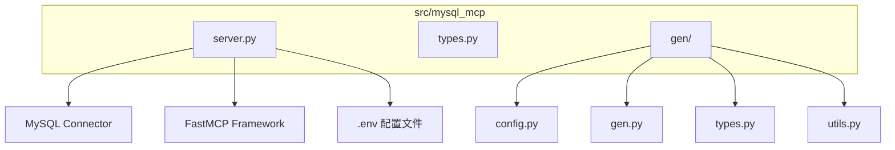
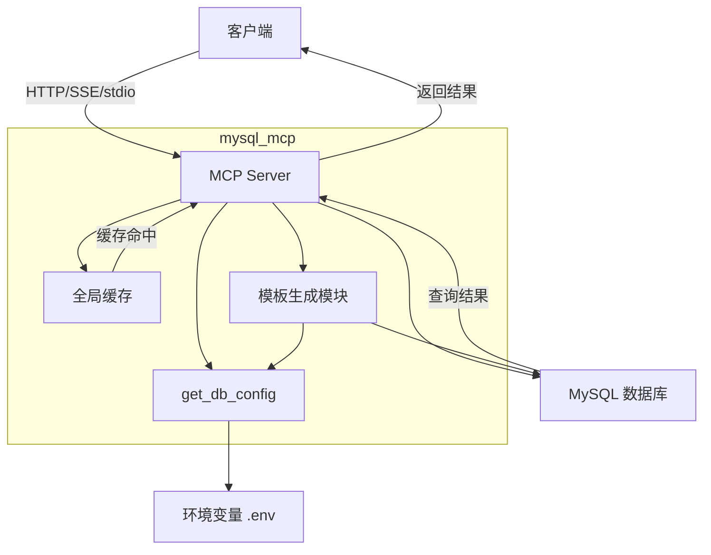
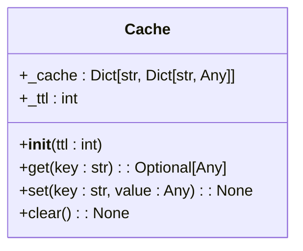
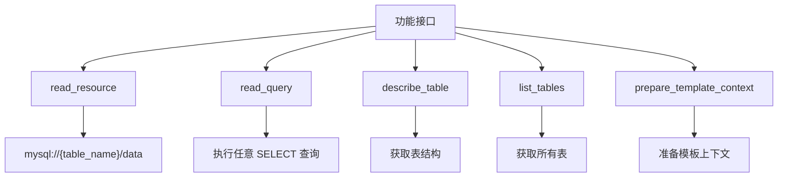
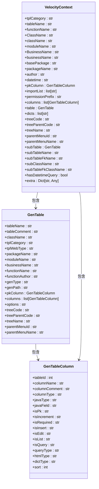
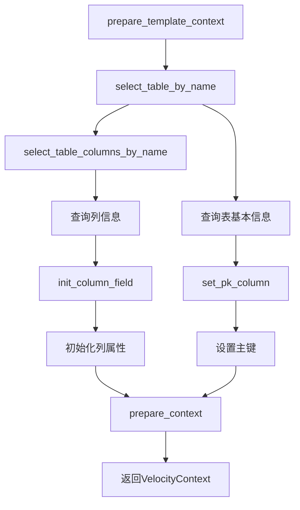
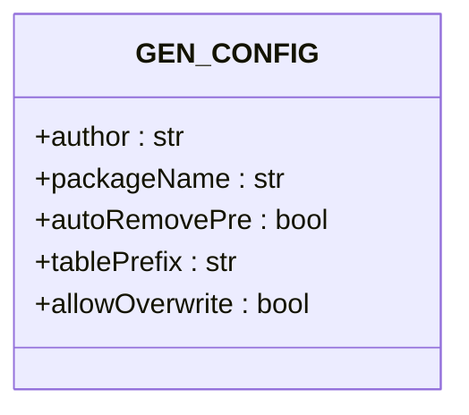
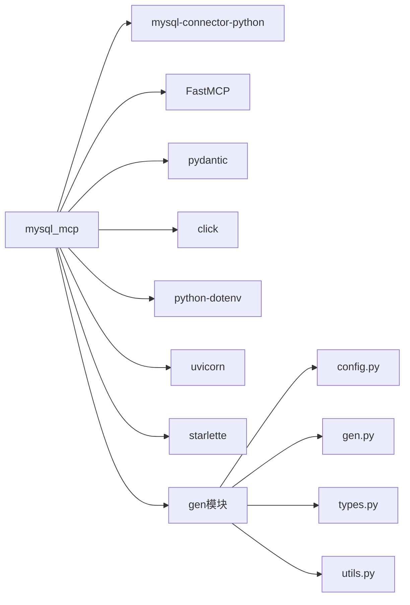

# MySQL数据库服务

<cite>
**本文档引用的文件**  
- [server.py](file://src/mysql_mcp/server.py) - *已更新，包含缓存支持和工具名称修改*
- [gen/gen.py](file://src/mysql_mcp/gen/gen.py) - *已更新，追加缺失上下文字段*
- [gen/types.py](file://src/mysql_mcp/gen/types.py) - *已更新，增强模板数据结构*
- [gen/utils.py](file://src/mysql_mcp/gen/utils.py) - *新增模板上下文工具功能*
- [types.py](file://src/mysql_mcp/types.py) - *数据库配置类型定义*
</cite>

## 更新摘要
**变更内容**  
- 为 `prepare_template_context` 工具添加缓存支持，提升性能
- 在模板生成过程中追加缺失的上下文字段，增强代码生成能力
- 修改工具名称 `prepare_template_context` 以统一命名规范
- 新增模板上下文处理工具，完善代码生成上下文准备逻辑
- 更新 mcp-sdk 版本并调整服务器初始化方式
- 移除冗余日志输出，优化代码可读性

## 目录
1. [简介](#简介)
2. [项目结构](#项目结构)
3. [核心组件](#核心组件)
4. [架构概述](#架构概述)
5. [详细组件分析](#详细组件分析)
6. [依赖分析](#依赖分析)
7. [性能考虑](#性能考虑)
8. [故障排除指南](#故障排除指南)
9. [结论](#结论)

## 简介
本项目 `mysql_mcp` 是一个基于 Model Context Protocol (MCP) 的 MySQL 数据库服务，旨在为 AI 助手提供安全、便捷的数据库交互能力。该服务通过定义标准化的工具（Tool）和资源（Resource）接口，允许外部系统查询表结构、执行 SELECT 查询、读取表数据等操作。服务通过环境变量进行数据库连接配置，实现了连接管理、结果缓存和错误处理等关键功能，确保了与 MySQL 数据库交互的安全性和可靠性。最新版本增强了模板上下文生成功能，支持缓存机制，并补充了缺失的上下文字段，提升了代码生成的完整性和性能。

**本节来源**  
- [server.py](file://src/mysql_mcp/server.py)

## 项目结构
`mysql_mcp` 模块是项目中的一个独立组件，其结构在原有基础上进行了优化，强化了 `gen` 目录下的模板上下文生成能力。该模块位于 `src/mysql_mcp/` 目录下，核心实现分布在多个文件中。

**图示来源**  
- [server.py](file://src/mysql_mcp/server.py)
- [gen/gen.py](file://src/mysql_mcp/gen/gen.py)

## 核心组件
`mysql_mcp` 的核心功能由 `server.py` 文件中的几个关键部分构成：数据库配置管理、全局缓存实例、MCP 服务实例以及一系列通过装饰器暴露的工具和资源。这些组件协同工作，实现了对 MySQL 数据库的安全查询和元数据访问。新增的 `gen` 模块提供了增强的模板上下文生成功能，通过 `select_table_by_name` 和 `select_table_columns_by_name` 等函数从数据库获取结构信息，并转换为代码生成所需的 `GenTable` 和 `GenTableColumn` 对象。`utils.py` 中的 `prepare_context` 函数负责将这些对象组装成完整的 `VelocityContext` 上下文。

**本节来源**  
- [server.py](file://src/mysql_mcp/server.py)
- [gen/gen.py](file://src/mysql_mcp/gen/gen.py)
- [gen/utils.py](file://src/mysql_mcp/gen/utils.py)

## 架构概述
该服务采用轻量级的微服务架构，基于 FastMCP 框架构建。其核心架构围绕 MCP 协议展开，通过定义 `tool` 和 `resource` 来暴露功能。服务启动时，会读取环境变量以获取数据库连接信息，并创建一个全局的 `FastMCP` 实例。所有数据库操作都通过这个实例提供的接口进行，确保了调用的统一性和安全性。当客户端请求到达时，服务会解析请求，执行相应的数据库查询，并将格式化后的结果返回。增强的模板上下文生成功能通过 `prepare_template_context` 工具暴露，能够根据表名查询完整的表结构和列信息，并转换为代码生成所需的 `VelocityContext` 对象，且结果会被缓存以提升性能。

**图示来源**  
- [server.py](file://src/mysql_mcp/server.py)
- [gen/gen.py](file://src/mysql_mcp/gen/gen.py)

## 详细组件分析
本节将深入分析 `mysql_mcp` 服务中的各个关键组件，包括其数据结构、方法实现和交互逻辑。

### 缓存机制分析
服务实现了一个简单的内存缓存机制，用于存储频繁访问的元数据（如表结构、表列表和模板上下文），以减少对数据库的重复查询，提高响应速度。

#### 缓存类结构

**图示来源**  
- [common/cache.py](file://src/common/cache.py)

**本节来源**  
- [common/cache.py](file://src/common/cache.py)

**分析**：
- **`_cache`**: 一个字典，键为缓存键（`str`），值为包含 `value`（实际数据）和 `timestamp`（存入时间）的字典。
- **`_ttl`**: 缓存的生存时间（Time To Live），默认为 300 秒（5分钟）。
- **`get(key)`**: 检查键是否存在，若存在则检查是否过期。未过期则返回值，否则从缓存中删除并返回 `None`。
- **`set(key, value)`**: 将值和当前时间戳存入缓存。
- **`clear()`**: 清空整个缓存。

### 数据库连接与配置
服务通过 `get_db_config()` 函数从环境变量中读取数据库连接参数，确保了配置的灵活性和安全性。

**本节来源**  
- [server.py](file://src/mysql_mcp/server.py)

**分析**：
- **配置项**:
  - `MYSQL_HOST`: 数据库主机地址，默认为 `localhost`。
  - `MYSQL_PORT`: 数据库端口，默认为 `3306`。
  - `MYSQL_USER`: 数据库用户名，**必填**。
  - `MYSQL_PASSWORD`: 数据库密码，**必填**。
  - `MYSQL_DATABASE`: 要连接的数据库名，**必填**。
- **错误处理**: 如果 `MYSQL_USER`、`MYSQL_PASSWORD` 或 `MYSQL_DATABASE` 任一为空，函数将记录错误日志并抛出 `ValueError`，阻止服务启动。

### 功能接口分析
服务通过 `@mcp.tool()` 和 `@mcp.resource()` 装饰器暴露了五个核心功能接口。

#### 接口设计原则
- **安全性**: 所有数据库操作都使用 `with` 语句，确保连接在使用后自动关闭。
- **输入验证**: 对输入参数进行基本验证（如检查 SQL 是否为 SELECT）。
- **错误处理**: 捕获数据库异常（`Error`）和通用异常（`Exception`），记录日志并返回用户友好的错误信息。
- **结果格式化**: 返回结果为 CSV 格式的字符串，便于解析。

#### 接口列表

**本节来源**  
- [server.py](file://src/mysql_mcp/server.py)

#### 接口详细说明
- **`read_resource(table_name)`**:
  - **类型**: `resource`
  - **功能**: 读取指定表的前 100 行数据。
  - **URI**: `mysql://{table_name}/data`
  - **返回**: CSV 格式字符串，第一行为列名。

- **`read_query(query)`**:
  - **类型**: `tool`
  - **功能**: 执行任意 SELECT 查询。
  - **限制**: 仅允许以 `SELECT` 开头的查询，防止执行写操作。
  - **返回**: `TextContent` 对象列表，包含 CSV 格式的结果。

- **`describe_table(table_name)`**:
  - **类型**: `tool`
  - **功能**: 获取指定表的完整结构信息，包括字段名、类型、是否为空、主键、默认值、额外信息和注释。
  - **缓存**: 结果会被缓存，键为 `table_structure_{database}_{table_name}`。
  - **返回**: 格式化的文本，使用 `|` 分隔符。

- **`list_tables()`**:
  - **类型**: `tool`
  - **功能**: 列出当前数据库中的所有表及其注释。
  - **缓存**: 结果会被缓存，键为 `tables_{database}`。
  - **返回**: 表名与注释的列表。

- **`prepare_template_context(table_name)`**:
  - **类型**: `tool`
  - **功能**: 为指定表准备模板生成所需的上下文信息。
  - **实现**: 调用 `gen` 模块中的 `select_table_by_name` 和 `select_table_columns_by_name` 函数，从数据库获取表结构和列信息，通过 `init_column_field` 和 `set_pk_column` 初始化列属性，最后由 `prepare_context` 组装成 `VelocityContext` 对象。
  - **缓存**: 结果会被缓存，键为 `table_name`。
  - **返回**: `VelocityContext` 对象，包含所有代码生成所需的上下文信息。

### 模板生成模块分析
`gen` 模块负责从数据库表结构生成代码模板所需的上下文信息。

#### 数据模型

**图示来源**  
- [gen/types.py](file://src/mysql_mcp/gen/types.py)

**本节来源**  
- [gen/types.py](file://src/mysql_mcp/gen/types.py)

**分析**：
- **`GenTable`**: 表示数据库表的完整信息，包括表名、注释、类名、包名、模块名等代码生成所需的所有元数据。
- **`GenTableColumn`**: 表示表中单个列的信息，包括列名、类型、Java类型、是否为主键、是否必填等属性。
- **`VelocityContext`**: 表示最终传递给模板引擎的完整上下文，包含了 `GenTable` 及其所有列，并补充了权限前缀、导入列表、字典列表等额外信息。

#### 生成逻辑

**图示来源**  
- [gen/gen.py](file://src/mysql_mcp/gen/gen.py)
- [gen/utils.py](file://src/mysql_mcp/gen/utils.py)

**本节来源**  
- [gen/gen.py](file://src/mysql_mcp/gen/gen.py)
- [gen/utils.py](file://src/mysql_mcp/gen/utils.py)

**分析**：
- **`select_table_by_name`**: 根据表名查询数据库，获取表的基本信息，并转换为 `GenTable` 对象。
- **`select_table_columns_by_name`**: 根据表名查询数据库，获取所有列的详细信息，并转换为 `GenTableColumn` 对象列表。
- **`init_column_field`**: 根据列名、类型等信息，初始化列的 Java 字段名、HTML 控件类型、是否为插入/编辑/列表/查询字段等属性。
- **`set_pk_column`**: 从列列表中找出主键列，并设置到 `GenTable` 的 `pkColumn` 字段。
- **`prepare_context`**: 将 `GenTable` 对象转换为 `VelocityContext` 对象，补充权限前缀、导入列表、字典列表等信息。

#### 配置管理

**图示来源**  
- [gen/config.py](file://src/mysql_mcp/gen/config.py)

**本节来源**  
- [gen/config.py](file://src/mysql_mcp/gen/config.py)

**分析**：
- **`author`**: 生成代码的作者信息。
- **`packageName`**: 生成代码的默认包路径。
- **`autoRemovePre`**: 是否自动移除表前缀。
- **`tablePrefix`**: 表前缀，用于类名生成时的前缀移除。
- **`allowOverwrite`**: 是否允许生成文件覆盖本地文件。

### 服务启动流程
服务的启动由 `main()` 函数控制，它是一个通过 `click` 库定义的命令行接口。

**本节来源**  
- [server.py](file://src/mysql_mcp/server.py)

**分析**：
- **参数**:
  - `--port`: 服务监听的端口，默认为 `3004`。
  - `--transport`: 通信协议，支持 `stdio`、`streamable` 和 `sse`（默认）。
- **流程**:
  1. 初始化日志。
  2. 读取并验证数据库配置。
  3. 根据 `transport` 参数选择运行模式：
     - `sse`: 通过 `uvicorn` 启动一个支持 Server-Sent Events 的 HTTP 服务器。
     - `streamable`: 启动一个支持流式 HTTP 的服务器。
     - `stdio`: 以标准输入/输出模式运行（适用于本地调试）。
  4. 服务器启动后，会监听请求并调用相应的工具或资源。

## 依赖分析
`mysql_mcp` 服务依赖于几个关键的外部库和框架。

**图示来源**  
- [server.py](file://src/mysql_mcp/server.py)
- [gen/gen.py](file://src/mysql_mcp/gen/gen.py)

**本节来源**  
- [server.py](file://src/mysql_mcp/server.py)
- [gen/gen.py](file://src/mysql_mcp/gen/gen.py)

**分析**：
- **`mysql-connector-python`**: 官方 MySQL 连接器，用于建立和管理与 MySQL 数据库的连接。
- **`FastMCP`**: 核心框架，提供了 `mcp` 实例、`tool`、`resource` 装饰器以及 `sse_app()` 等方法，是服务的基础。
- **`pydantic`**: 用于数据验证和设置，`Annotated` 和 `Field` 用于为工具参数提供描述。
- **`click`**: 用于创建命令行界面，处理 `--port` 和 `--transport` 参数。
- **`python-dotenv`**: 用于从 `.env` 文件加载环境变量。
- **`uvicorn` 和 `starlette`**: 用于在 `sse` 或 `streamable` 模式下运行 HTTP 服务器，`CORSMiddleware` 提供了跨域支持。
- **`gen` 模块**: 模板上下文生成模块，包含配置、数据模型、生成逻辑和工具函数。

## 性能考虑
- **缓存**: `describe_table`、`list_tables` 和 `prepare_template_context` 工具均使用了内存缓存，显著减少了对 `information_schema` 的查询次数，这是提升性能的关键。
- **查询限制**: `read_resource` 对返回行数进行了 `LIMIT 100` 的限制，防止一次性加载过多数据导致内存溢出或响应过慢。
- **连接管理**: 使用上下文管理器（`with connect(...) as conn`）确保了数据库连接的及时释放，避免了连接泄漏。
- **建议**: 对于 `read_query`，建议用户在查询中加入 `LIMIT` 子句以控制结果集大小。可以考虑为 `read_query` 也增加一个可选的 `limit` 参数。

## 故障排除指南
- **服务无法启动**:
  - **检查点**: 确认 `.env` 文件存在且路径正确（与 `pyproject.toml` 同级）。
  - **检查点**: 确认 `MYSQL_USER`、`MYSQL_PASSWORD`、`MYSQL_DATABASE` 环境变量已正确设置。
  - **检查点**: 检查数据库服务是否正在运行，且主机和端口可达。

- **查询返回错误**:
  - **"Database error"**: 检查 SQL 语法是否正确，表名和字段名是否存在。
  - **"执行错误"**: 检查网络连接或数据库权限。
  - **"read_query 只允许 SELECT 查询"**: 确保查询以 `SELECT` 开头，该服务不支持 `INSERT`、`UPDATE`、`DELETE` 等写操作。

- **返回结果为空**:
  - **`list_tables` 返回空**: 确认 `MYSQL_DATABASE` 指向的数据库中确实存在表。
  - **`read_resource` 返回空**: 该表可能没有数据。

## 结论
`mysql_mcp` 服务成功地为 AI 助手提供了一个安全、高效且易于使用的 MySQL 数据库查询接口。其设计简洁，通过 MCP 协议清晰地定义了功能边界。服务通过环境变量配置、输入验证、结果缓存和详尽的错误处理，确保了生产环境下的稳定性和安全性。增强的模板上下文生成功能扩展了服务的能力，使其不仅能够查询数据，还能为代码生成提供结构化、完整的上下文信息。该服务是构建数据驱动型 AI 应用的理想组件，能够帮助 AI 模型理解数据库结构并获取所需的数据信息。