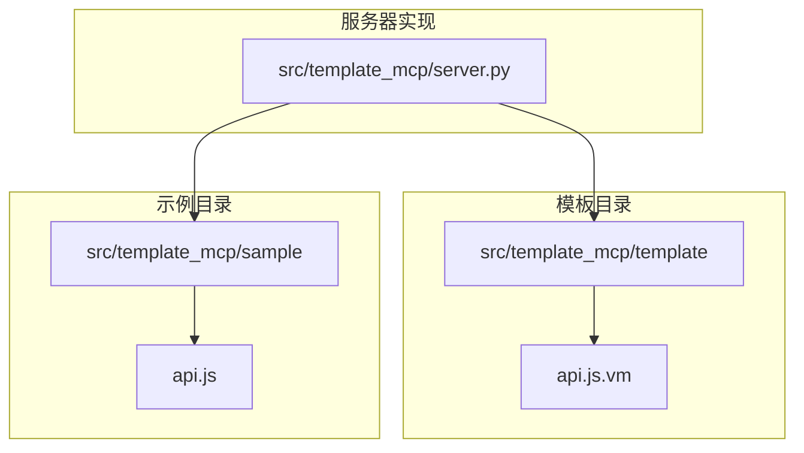
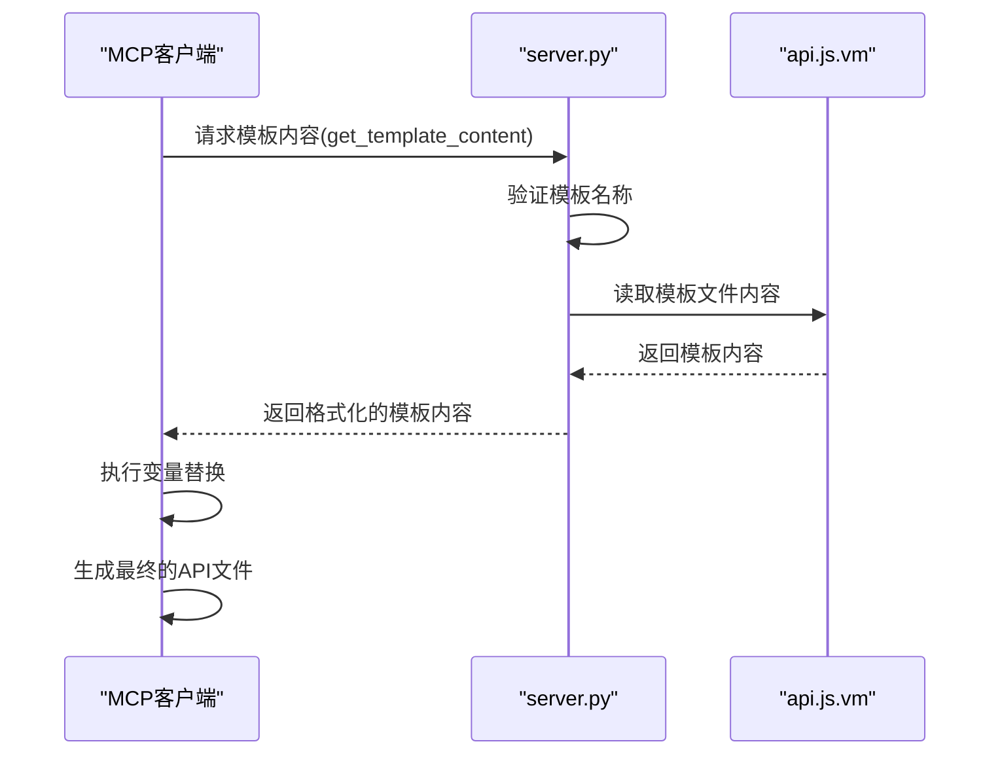
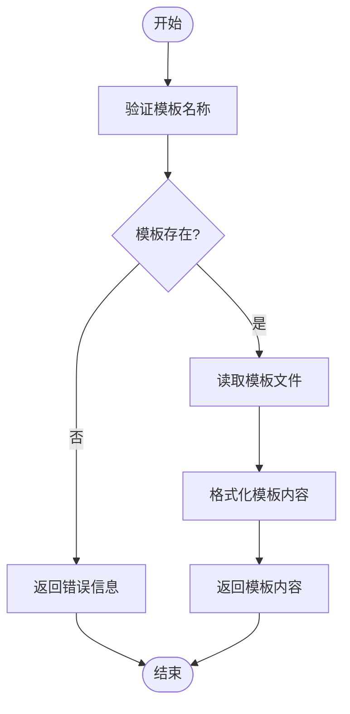

# JavaScript API模板

<cite>
**本文档引用的文件**   
- [api.js.vm](file://src/template_mcp/template/js/api.js.vm)
- [server.py](file://src/template_mcp/server.py)
- [api.js](file://src/template_mcp/sample/js/api.js)
- [api.js.vm.md](file://src/embedding/docs/js/api.js.vm.md)
</cite>

## 目录
1. [JavaScript API模板](#javascript-api模板)
2. [项目结构](#项目结构)
3. [核心组件](#核心组件)
4. [架构概述](#架构概述)
5. [详细组件分析](#详细组件分析)
6. [依赖分析](#依赖分析)
7. [性能考虑](#性能考虑)
8. [故障排除指南](#故障排除指南)
9. [结论](#结论)

## 项目结构

项目结构展示了模板系统中前端API模板的组织方式。`api.js.vm`模板文件位于`src/template_mcp/template/js/`目录下，其对应的示例文件位于`src/template_mcp/sample/js/`目录中。`server.py`文件作为模板引擎的服务器端实现，负责提供模板内容和示例代码。



**图示来源**
- [server.py](file://src/template_mcp/server.py#L1-L50)
- [api.js.vm](file://src/template_mcp/template/js/api.js.vm#L1-L5)

**本节来源**
- [server.py](file://src/template_mcp/server.py#L1-L100)
- [api.js.vm](file://src/template_mcp/template/js/api.js.vm#L1-L5)

## 核心组件

JavaScript API模板（api.js.vm）是前端代码生成系统的核心组件之一，它通过Velocity模板引擎语法生成基于axios的前端API调用代码。该模板支持RESTful接口的CRUD操作，包括列表查询、详情查询、新增、修改、单条删除和批量删除。

模板中的变量如`${functionName}`、`${BusinessName}`、`${moduleName}`、`${businessName}`和`${pkColumn.javaField}`会在生成过程中被动态替换，从而生成针对特定业务模块的API调用代码。生成的代码使用统一的`request`工具模块进行HTTP请求，确保了请求处理的一致性和可维护性。

**本节来源**
- [api.js.vm](file://src/template_mcp/template/js/api.js.vm#L1-L54)
- [api.js.vm.md](file://src/embedding/docs/js/api.js.vm.md#L1-L50)

## 架构概述

该模板系统的架构基于MCP（Model-Controller-Presenter）模式，`server.py`作为控制器，负责处理模板内容的请求和响应。当客户端请求特定模板时，`server.py`会读取相应的`.vm`模板文件，并将其内容返回给客户端。客户端（如MCP客户端）则负责将模板中的变量替换为实际值，生成最终的代码文件。



**图示来源**
- [server.py](file://src/template_mcp/server.py#L260-L300)
- [api.js.vm](file://src/template_mcp/template/js/api.js.vm#L1-L5)

**本节来源**
- [server.py](file://src/template_mcp/server.py#L260-L300)
- [api.js.vm](file://src/template_mcp/template/js/api.js.vm#L1-L5)

## 详细组件分析

### JavaScript API模板分析

JavaScript API模板（api.js.vm）的设计旨在为Vue.js应用提供与后端REST API通信的标准化接口方法。模板使用Velocity语法进行变量替换，生成的代码包含完整的CRUD操作方法。

#### 模板变量说明

| 变量名 | 说明 | 示例 |
|--------|------|------|
| `${functionName}` | 功能名称（中文） | `用户信息` |
| `${BusinessName}` | 业务名称（首字母大写） | `SysUser` |
| `${moduleName}` | 模块名称（小写） | `system` |
| `${businessName}` | 业务名称（小写） | `user` |
| `${pkColumn.javaField}` | 主键字段名 | `userId` |

#### API接口设计规范

- **URL路径规范**:
  ```javascript
  // 基础路径格式
  /${moduleName}/${businessName}/action

  // 具体示例
  /system/user/list          // 列表查询
  /system/user/info/{id}     // 详情查询
  /system/user/add           // 新增数据
  /system/user/edit          // 修改数据
  /system/user/remove/{id}   // 单条删除
  /system/user/batchRemove   // 批量删除
  ```

- **请求方法规范**:
  - **查询操作**: 使用GET方法，参数通过query string传递
  - **数据操作**: 使用POST方法，数据通过request body传递
  - **路径参数**: 直接拼接在URL路径中
  - **批量操作**: 数据通过request body以数组形式传递

- **参数传递规范**:
  ```javascript
  // 查询参数（GET请求）
  params: {
      pageNum: 1,
      pageSize: 10,
      userName: 'admin'
  }

  // 数据参数（POST请求）
  data: {
      userName: 'newuser',
      email: 'user@example.com',
      status: '0'
  }

  // 批量删除参数
  data: [1, 2, 3, 4, 5]  // 主键ID数组
  ```

**本节来源**
- [api.js.vm](file://src/template_mcp/template/js/api.js.vm#L1-L54)
- [api.js.vm.md](file://src/embedding/docs/js/api.js.vm.md#L1-L100)

### 模板引擎分析

`server.py`文件中的`get_template_content`工具函数负责处理模板内容的请求。该函数首先验证模板名称的有效性，然后读取相应的模板文件内容，并将其格式化后返回给客户端。



**图示来源**
- [server.py](file://src/template_mcp/server.py#L260-L300)

**本节来源**
- [server.py](file://src/template_mcp/server.py#L260-L300)

## 依赖分析

该模板系统的主要依赖包括Velocity模板引擎和axios HTTP客户端。`api.js.vm`模板依赖于`@/utils/request`模块，该模块封装了axios的配置和请求拦截器，提供了统一的API调用接口。

```mermaid
graph LR
A[api.js.vm] --> B[@/utils/request]
B --> C[axios]
D[server.py] --> E[Velocity模板引擎]
A --> E
```

**图示来源**
- [api.js.vm](file://src/template_mcp/template/js/api.js.vm#L1)
- [server.py](file://src/template_mcp/server.py#L1-L10)

**本节来源**
- [api.js.vm](file://src/template_mcp/template/js/api.js.vm#L1)
- [server.py](file://src/template_mcp/server.py#L1-L10)

## 性能考虑

在使用该模板系统时，应注意以下性能优化建议：

- **请求缓存**: 对不经常变化的数据进行缓存，减少重复请求。
- **并发控制**: 避免重复请求和并发冲突。
- **分页加载**: 大数据量使用分页加载，避免一次性加载过多数据。
- **懒加载**: 按需加载API模块，减少初始加载时间。

## 故障排除指南

### 常见问题

- **模板文件不存在**: 确保模板名称正确，并检查文件路径。
- **变量替换失败**: 确保所有模板变量都有对应的值。
- **请求失败**: 检查网络连接和后端服务状态。

### 调试技巧

- 使用浏览器开发者工具查看网络请求。
- 在`server.py`中添加日志输出，跟踪请求处理过程。
- 检查生成的API文件是否符合预期。

**本节来源**
- [server.py](file://src/template_mcp/server.py#L260-L300)
- [api.js.vm](file://src/template_mcp/template/js/api.js.vm#L1-L5)

## 结论

JavaScript API模板（api.js.vm）通过Velocity模板引擎实现了前端API调用代码的自动化生成。结合`server.py`中的模板引擎变量替换流程，可以动态注入baseURL、endpoint、请求参数和响应结构，生成适配不同后端接口的JavaScript调用代码。该系统支持扩展到其他前端框架（如React），只需调整模板内容和生成逻辑即可。