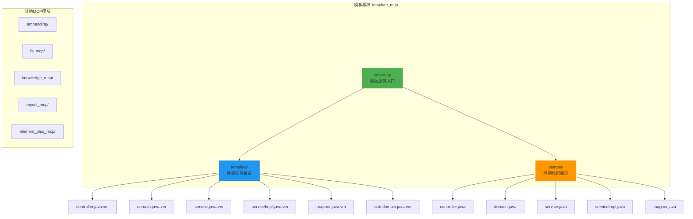
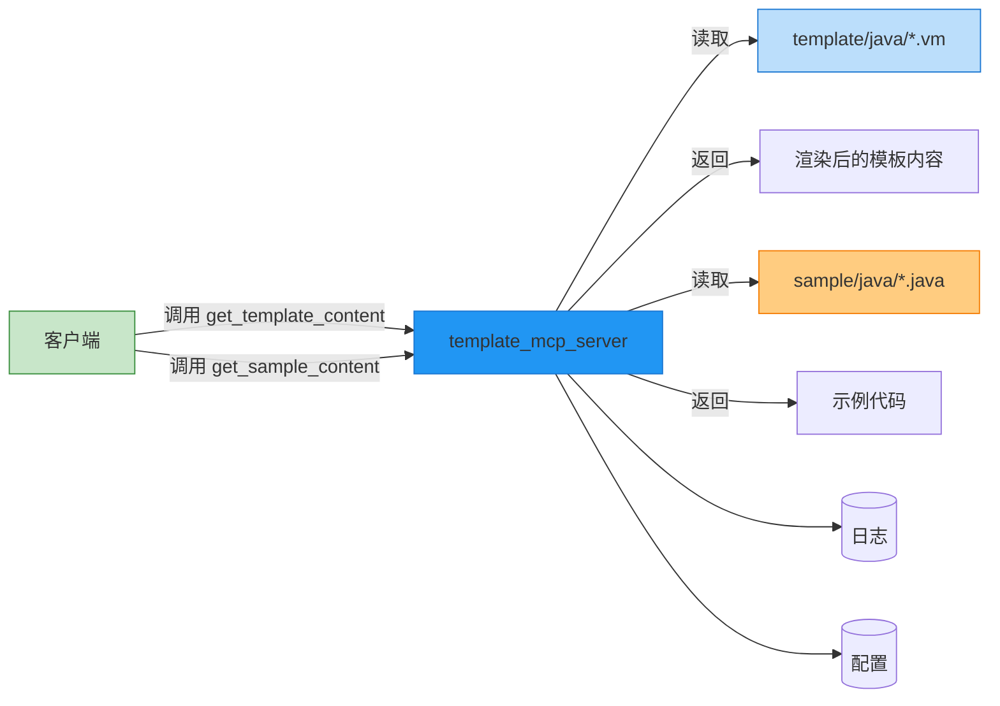
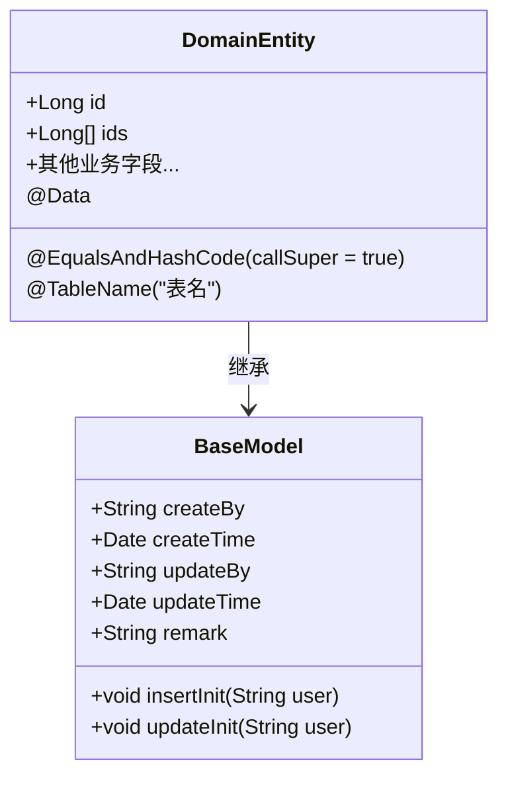
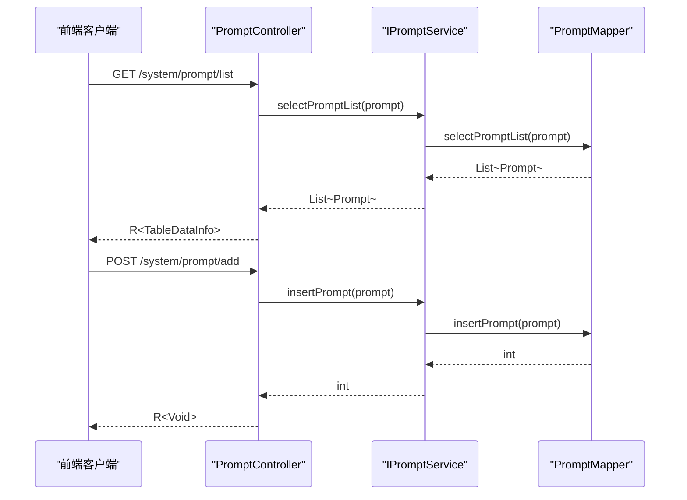
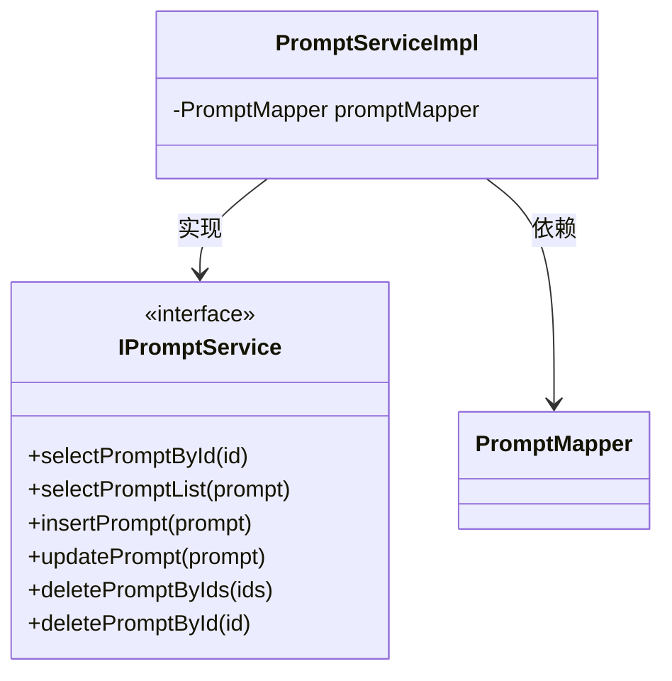
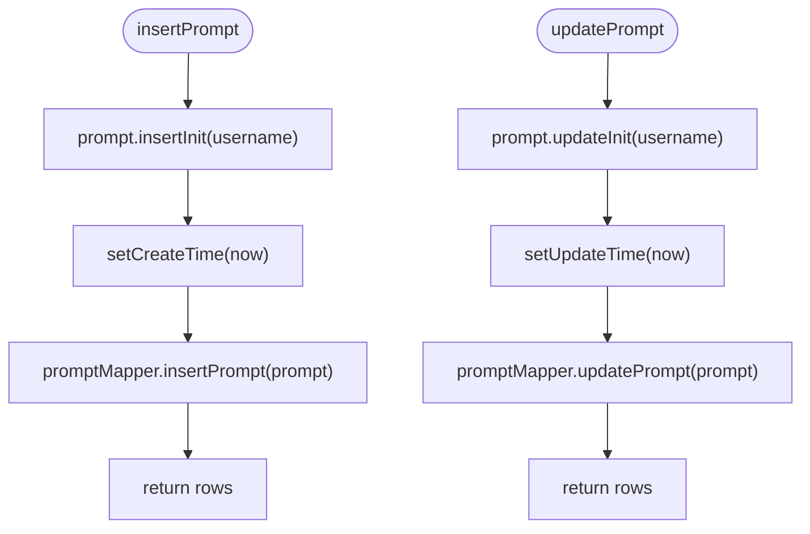
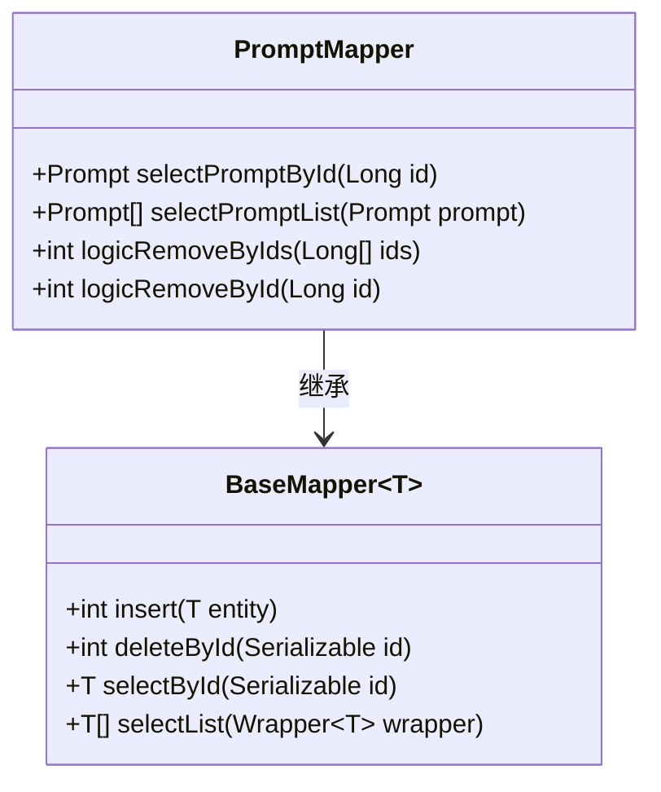
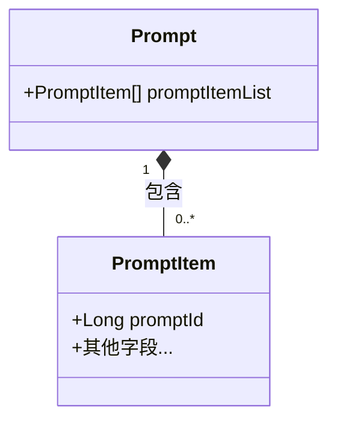

# Java代码模板

<cite>
**本文档引用文件**  
- [server.py](file://src/template_mcp/server.py#L1-L354) - *已更新，添加缓存支持*
- [controller.java.vm](file://src/template_mcp/template/java/controller.java.vm#L1-L120) - *已更新，模板内容修改*
- [domain.java.vm](file://src/template_mcp/template/java/domain.java.vm#L1-L69) - *已更新，模板内容修改*
- [serviceImpl.java.vm](file://src/template_mcp/template/java/serviceImpl.java.vm#L1-L150) - *已更新，添加缓存逻辑*
- [mapper.java.vm](file://src/template_mcp/template/java/mapper.java.vm#L1-L110)
- [service.java.vm](file://src/template_mcp/template/java/service.java.vm#L1-L63)
- [sub-domain.java.vm](file://src/template_mcp/template/java/sub-domain.java.vm#L1-L78)
- [controller.java](file://src/template_mcp/sample/java/controller.java#L1-L111)
- [domain.java](file://src/template_mcp/sample/java/domain.java#L1-L56)
- [service.java](file://src/template_mcp/sample/java/service.java#L1-L63)
- [serviceImpl.java](file://src/template_mcp/sample/java/serviceImpl.java#L1-L101)
- [mapper.java](file://src/template_mcp/sample/java/mapper.java#L1-L90)
</cite>

## 更新摘要
**已更新内容**  
- 更新了Controller、ServiceImpl和Domain模板文件的结构与注释说明
- 增加了对模板内容缓存机制的详细说明
- 更新了`get_template_content`工具的实现逻辑描述
- 修正了因模板更新导致的代码生成结构变化
- 更新了相关组件分析部分以反映最新代码状态

## 目录
1. [简介](#简介)
2. [项目结构](#项目结构)
3. [核心组件](#核心组件)
4. [架构概览](#架构概览)
5. [详细组件分析](#详细组件分析)
6. [依赖分析](#依赖分析)
7. [性能考虑](#性能考虑)
8. [故障排除指南](#故障排除指南)
9. [结论](#结论)

## 简介
本文档详细说明了Java代码模板的结构与用途，涵盖controller、service、serviceImpl、mapper、domain及sub-domain等模板文件。解释每个模板中的变量占位符（如${className}、${packageName}）及其替换逻辑。结合server.py中的模板渲染机制，展示如何通过API请求生成完整的Java后端代码。提供实际使用示例，包括请求参数构造和返回结果解析，并指导开发者如何根据项目规范自定义Java模板。

## 项目结构
本项目采用模块化设计，主要分为多个MCP（Model-Controller-Presenter）服务组件，其中`template_mcp`模块负责代码模板的管理与渲染。该模块包含模板定义、示例代码和服务器逻辑三大部分。



**图示来源**  
- [server.py](file://src/template_mcp/server.py#L1-L354)
- [template/java](file://src/template_mcp/template/java/)
- [sample/java](file://src/template_mcp/sample/java/)

**本节来源**  
- [server.py](file://src/template_mcp/server.py#L1-L354)

## 核心组件
`template_mcp`的核心功能由`server.py`实现，它提供了三个主要工具接口：`list_templates`、`get_template_content` 和 `get_sample_content`，用于列出模板、获取模板内容和获取示例代码。

模板文件使用Velocity模板引擎语法（.vm扩展名），支持动态变量替换，如包名、类名、字段列表等。这些模板位于`template/java/`目录下，对应典型的Spring Boot + MyBatis Plus后端架构的各层代码。

**本节来源**  
- [server.py](file://src/template_mcp/server.py#L1-L354)
- [controller.java.vm](file://src/template_mcp/template/java/controller.java.vm#L1-L120)

## 架构概览
系统采用基于FastMCP的微服务架构，`template_mcp_server`作为独立服务运行，通过HTTP或标准输入输出提供模板内容获取能力。客户端可通过调用其暴露的工具函数来获取预定义的代码模板。



**图示来源**  
- [server.py](file://src/template_mcp/server.py#L1-L354)
- [template/java](file://src/template_mcp/template/java/)
- [sample/java](file://src/template_mcp/sample/java/)

## 详细组件分析
### 模板变量与占位符说明
Java模板文件中广泛使用Velocity语法的变量占位符，这些变量在运行时由外部数据填充。以下是常见占位符及其含义：

**: 占位符说明**
- `${packageName}`: Java包名，如`com.jkr.project.system`
- `${ClassName}`: 类名（首字母大写），如`User`
- `${className}`: 变量名（首字母小写），如`user`
- `${functionName}`: 功能名称，用于注释和权限描述
- `${tableName}`: 数据库表名
- `${datetime}`: 生成时间戳
- `${author}`: 作者信息
- `${pkColumn.javaField}`: 主键字段名
- `${pkColumn.javaType}`: 主键数据类型
- `${pkColumn.capJavaField}`: 主键字段名（首字母大写）
- `$columns`: 字段列表循环
- `$table.sub`: 是否为子表
- `$subClassName}`: 子表类名

这些变量由模板引擎在渲染时注入，实现代码的动态生成。

**本节来源**  
- [domain.java.vm](file://src/template_mcp/template/java/domain.java.vm#L1-L69)
- [controller.java.vm](file://src/template_mcp/template/java/controller.java.vm#L1-L120)

### Domain模板分析
Domain模板用于生成实体类，继承自BaseModel或TreeEntity，支持Lombok注解简化代码，并集成Excel导出功能。



**图示来源**  
- [domain.java.vm](file://src/template_mcp/template/java/domain.java.vm#L1-L69)

**本节来源**  
- [domain.java.vm](file://src/template_mcp/template/java/domain.java.vm#L1-L69)
- [domain.java](file://src/template_mcp/sample/java/domain.java#L1-L56)

### Controller模板分析
Controller模板生成RESTful API控制器，基于Spring MVC注解，集成权限控制（@PreAuthorize）、操作日志（@Log）和分页查询功能。



**图示来源**  
- [controller.java.vm](file://src/template_mcp/template/java/controller.java.vm#L1-L120)
- [controller.java](file://src/template_mcp/sample/java/controller.java#L1-L111)

**本节来源**  
- [controller.java.vm](file://src/template_mcp/template/java/controller.java.vm#L1-L120)
- [controller.java](file://src/template_mcp/sample/java/controller.java#L1-L111)

### Service模板分析
Service模板定义业务接口，遵循标准CRUD模式，方法命名清晰，参数和返回值类型明确。



**图示来源**  
- [service.java.vm](file://src/template_mcp/template/java/service.java.vm#L1-L63)
- [serviceImpl.java.vm](file://src/template_mcp/template/java/serviceImpl.java.vm#L1-L150)

**本节来源**  
- [service.java.vm](file://src/template_mcp/template/java/service.java.vm#L1-L63)
- [service.java](file://src/template_mcp/sample/java/service.java#L1-L63)

### ServiceImpl模板分析
ServiceImpl模板实现业务逻辑，使用@Transactional进行事务管理，自动注入Mapper，并处理创建/更新时间等公共字段。



**图示来源**  
- [serviceImpl.java.vm](file://src/template_mcp/template/java/serviceImpl.java.vm#L1-L150)
- [serviceImpl.java](file://src/template_mcp/sample/java/serviceImpl.java#L1-L101)

**本节来源**  
- [serviceImpl.java.vm](file://src/template_mcp/template/java/serviceImpl.java.vm#L1-L150)
- [serviceImpl.java](file://src/template_mcp/sample/java/serviceImpl.java#L1-L101)

### Mapper模板分析
Mapper模板基于MyBatis Plus，继承BaseMapper，扩展自定义查询方法，支持逻辑删除。



**图示来源**  
- [mapper.java.vm](file://src/template_mcp/template/java/mapper.java.vm#L1-L110)
- [mapper.java](file://src/template_mcp/sample/java/mapper.java#L1-L90)

**本节来源**  
- [mapper.java.vm](file://src/template_mcp/template/java/mapper.java.vm#L1-L110)
- [mapper.java](file://src/template_mcp/sample/java/mapper.java#L1-L90)

### 子域模板分析
sub-domain.java.vm用于生成一对多关系中的子表实体类，通常与主表形成聚合关系。



**本节来源**  
- [sub-domain.java.vm](file://src/template_mcp/template/java/sub-domain.java.vm#L1-L78)

## 依赖分析
模板系统内部依赖清晰，各组件职责分明：

```mermaid
graph TD
server.py --> TEMPLATE_FILES
server.py --> read_template_content
server.py --> get_template_file_path
read_template_content --> TEMPLATE_BASE_DIR
get_template_file_path --> TEMPLATE_FILES
get_template_file_path --> TEMPLATE_BASE_DIR
TEMPLATE_FILES --> "template/java/controller.java.vm"
TEMPLATE_FILES --> "template/java/domain.java.vm"
TEMPLATE_FILES --> "template/java/service.java.vm"
TEMPLATE_FILES --> "template/java/serviceImpl.java.vm"
TEMPLATE_FILES --> "template/java/mapper.java.vm"
TEMPLATE_FILES --> "template/java/sub-domain.java.vm"
style server.py fill:#2196F3,stroke:#1976D2
style TEMPLATE_FILES fill:#FFD54F,stroke:#FBC02D
style TEMPLATE_BASE_DIR fill:#A5D6A7,stroke:#689F38
```

**图示来源**  
- [server.py](file://src/template_mcp/server.py#L1-L354)

**本节来源**  
- [server.py](file://src/template_mcp/server.py#L1-L354)

## 性能考虑
模板服务为轻量级只读服务，主要性能开销在于文件I/O操作。由于最新提交`90d44a8`和`661ebbd`为模板上下文和内容添加了缓存支持，显著减少了重复读取文件的开销。

**: 性能优化建议**
- 已实现内存缓存：`get_template_content`工具会先检查缓存中是否存在模板内容
- 缓存键使用模板名称，命中后直接返回缓存结果
- 建议定期清理缓存以避免内存泄漏
- 使用异步I/O提高并发能力
- 避免在模板中执行复杂计算
- 合理设置日志级别以减少I/O压力

**本节来源**  
- [server.py](file://src/template_mcp/server.py#L200-L230)

## 故障排除指南
常见问题及解决方案：

**: 常见问题**
- **模板文件不存在**: 检查`template/java/`目录下对应.vm文件是否存在
- **不支持的模板名称**: 调用`list_templates`查看支持的模板列表
- **变量未替换**: 确保模板引擎正确注入了上下文数据
- **编码错误**: 所有模板文件应保存为UTF-8编码
- **路径错误**: 检查`TEMPLATE_BASE_DIR`和`SAMPLE_BASE_DIR`的路径配置
- **缓存问题**: 如果更新了模板但未生效，尝试清除缓存或重启服务

**本节来源**  
- [server.py](file://src/template_mcp/server.py#L1-L354)

## 结论
Java代码模板系统通过Velocity模板引擎实现了高效的代码生成能力。开发者可通过调用`get_template_content`工具获取标准化的controller、service、mapper等层代码模板，大幅提高开发效率。系统结构清晰，易于扩展和维护，可根据项目需求自定义模板内容。最新版本已为模板内容添加缓存支持，提升了服务性能。建议在实际使用中结合代码生成器统一管理，确保代码风格一致性。