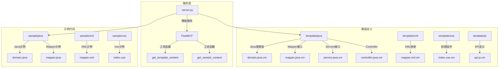
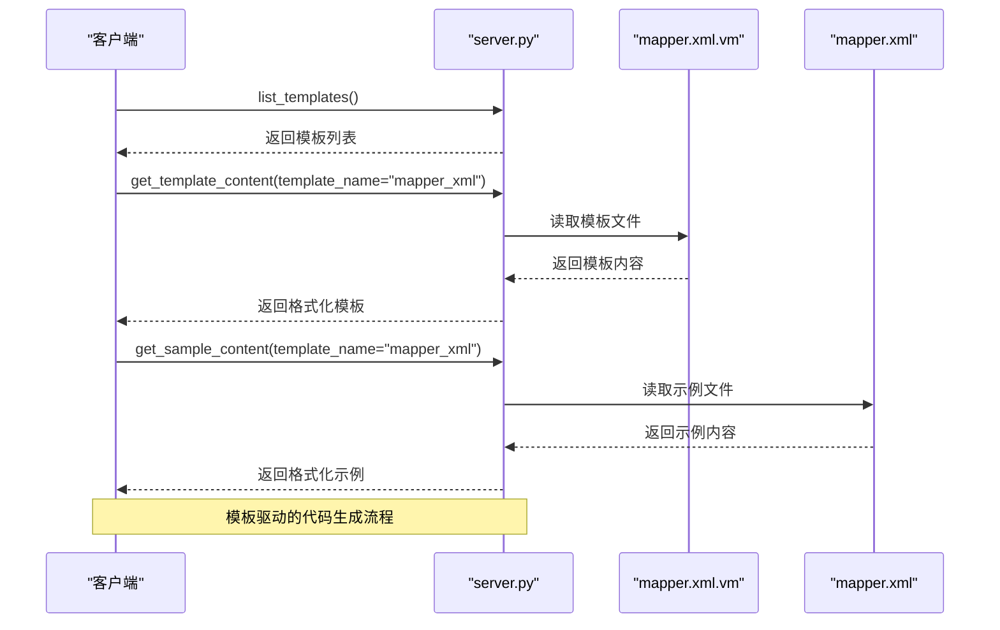
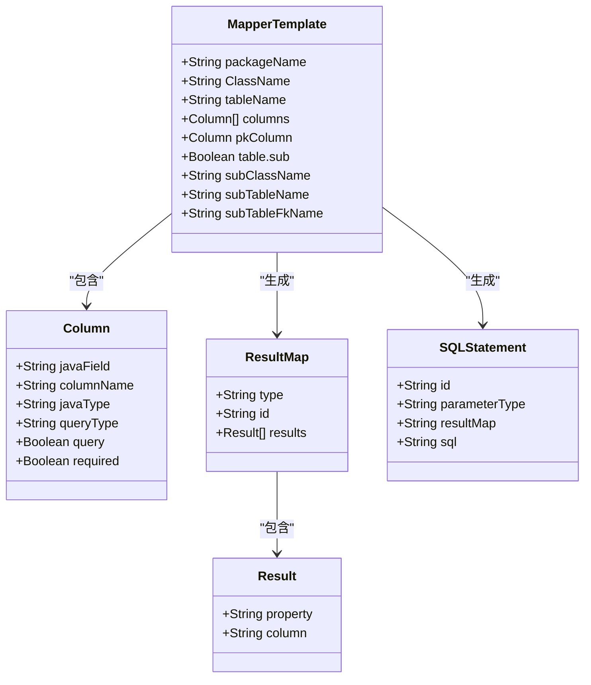
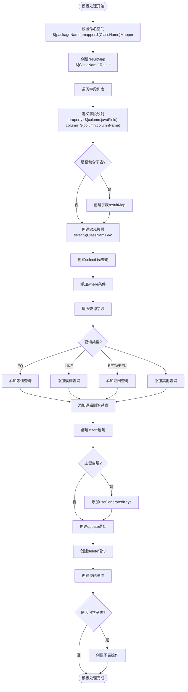
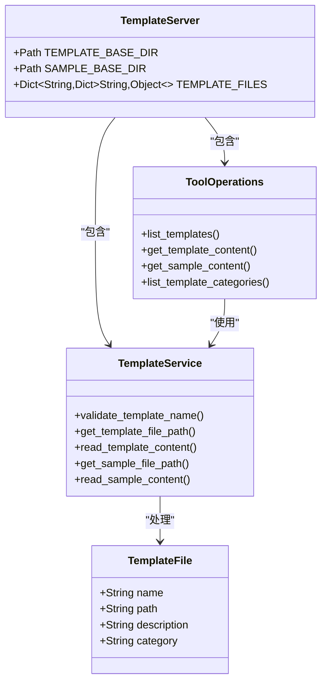
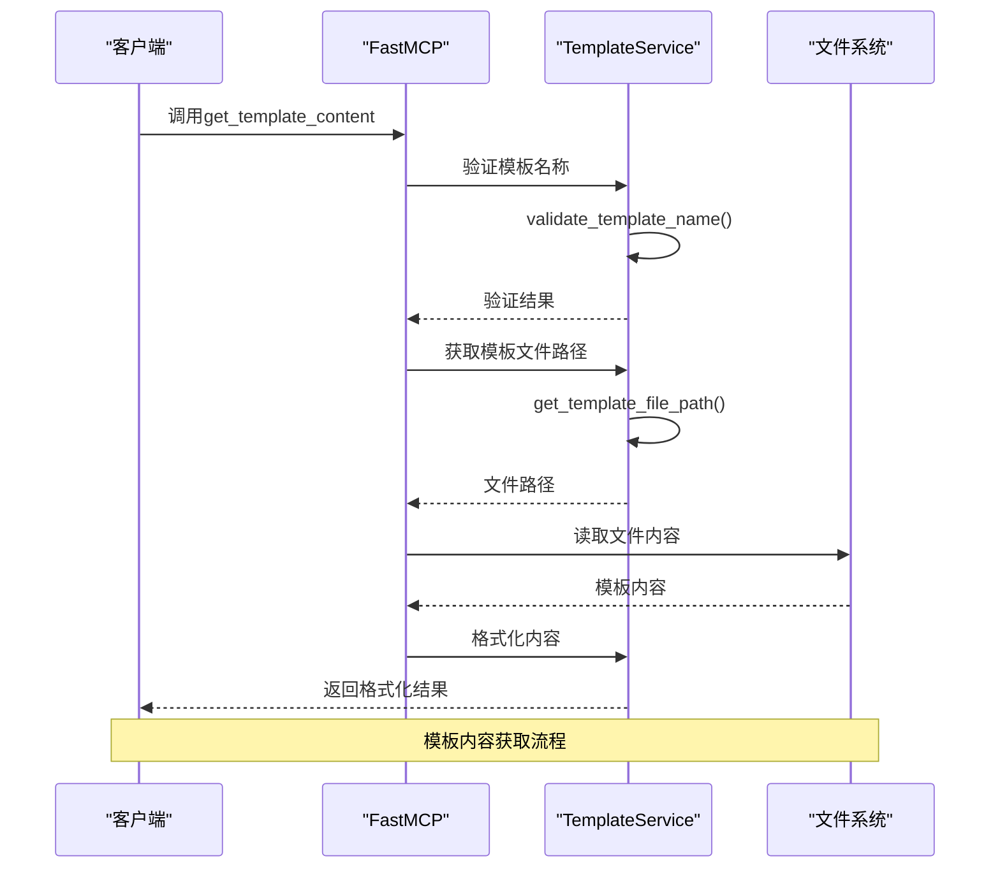

# MyBatis XML映射模板

<cite>
**本文档引用的文件**   
- [mapper.xml.vm](file://src/template_mcp/template/xml/mapper.xml.vm)
- [server.py](file://src/template_mcp/server.py)
- [mapper.xml.vm.md](file://src/embedding/docs/xml/mapper.xml.vm.md)
- [mapper.xml](file://src/template_mcp/sample/xml/mapper.xml)
- [mapper.java.vm.md](file://src/embedding/docs/java/mapper.java.vm.md)
</cite>

## 目录
1. [简介](#简介)
2. [项目结构](#项目结构)
3. [核心组件](#核心组件)
4. [架构概述](#架构概述)
5. [详细组件分析](#详细组件分析)
6. [依赖分析](#依赖分析)
7. [性能考虑](#性能考虑)
8. [故障排除指南](#故障排除指南)
9. [结论](#结论)

## 简介
`mapper.xml.vm` 是一个基于Velocity模板引擎的MyBatis映射文件生成模板，用于自动化生成数据访问层的SQL映射配置。该模板支持完整的CRUD操作、动态SQL、主子表关联、逻辑删除等高级功能，能够根据实体类字段自动生成resultMap、insert、update、delete和select语句。通过server.py中的模板引擎处理流程，实现了命名空间配置、SQL片段复用和参数类型映射的完整机制。

## 项目结构
本项目采用分层架构设计，主要包含模板定义、模板引擎服务和示例代码三个核心部分。模板文件存放在`template`目录下，示例文件存放在`sample`目录下，服务逻辑由`server.py`实现。



**Diagram sources**
- [server.py](file://src/template_mcp/server.py#L1-L467)
- [mapper.xml.vm](file://src/template_mcp/template/xml/mapper.xml.vm#L1-L147)

**Section sources**
- [server.py](file://src/template_mcp/server.py#L1-L467)
- [mapper.xml.vm](file://src/template_mcp/template/xml/mapper.xml.vm#L1-L147)

## 核心组件
MyBatis XML映射模板的核心组件包括Velocity模板引擎、动态SQL生成机制、结果映射配置和主子表关联处理。模板通过变量替换和条件判断生成完整的MyBatis Mapper XML配置文件，支持动态查询条件、主子表关联、逻辑删除等高级功能。

**Section sources**
- [mapper.xml.vm](file://src/template_mcp/template/xml/mapper.xml.vm#L1-L147)
- [mapper.xml.vm.md](file://src/embedding/docs/xml/mapper.xml.vm.md#L1-L393)

## 架构概述
系统架构采用模板驱动的代码生成模式，通过Velocity模板引擎将预定义的模板与运行时数据结合，生成目标代码文件。server.py作为MCP服务器，提供模板内容获取和示例代码查看的工具接口。



**Diagram sources**
- [server.py](file://src/template_mcp/server.py#L1-L467)
- [mapper.xml.vm](file://src/template_mcp/template/xml/mapper.xml.vm#L1-L147)

## 详细组件分析

### MyBatis XML模板分析
`mapper.xml.vm`模板实现了完整的CRUD操作生成机制，通过Velocity语法动态生成SQL语句。

#### 模板结构分析


**Diagram sources**
- [mapper.xml.vm](file://src/template_mcp/template/xml/mapper.xml.vm#L1-L147)

#### 动态SQL生成流程


**Diagram sources**
- [mapper.xml.vm](file://src/template_mcp/template/xml/mapper.xml.vm#L1-L147)

### 模板引擎服务分析
`server.py`实现了模板服务的核心逻辑，提供模板内容获取和示例代码查看功能。

#### 服务架构分析


**Diagram sources**
- [server.py](file://src/template_mcp/server.py#L1-L467)

#### 请求处理流程


**Diagram sources**
- [server.py](file://src/template_mcp/server.py#L1-L467)

## 依赖分析
系统依赖关系清晰，主要包含模板定义、服务实现和示例代码三个部分的相互依赖。

```mermaid
graph TD
A[server.py] --> B[mapper.xml.vm]
A --> C[controller.java.vm]
A --> D[domain.java.vm]
A --> E[mapper.java.vm]
A --> F[service.java.vm]
A --> G[serviceImpl.java.vm]
A --> H[api.js.vm]
A --> I[index.vue.vm]
A --> J[Form.vue.vm]
A --> K[sql.vm]
A --> L[mapper.xml]
A --> M[controller.java]
A --> N[domain.java]
A --> O[mapper.java]
A --> P[service.java]
A --> Q[serviceImpl.java]
A --> R[api.js]
A --> S[index.vue]
A --> T[Form.vue]
B --> U[Velocity引擎]
C --> U
D --> U
E --> U
F --> U
G --> U
H --> U
I --> U
J --> U
K --> U
style A fill:#f9f,stroke:#333
style B fill:#bbf,stroke:#333
style L fill:#f96,stroke:#333
Note over A: 核心服务
Note over B: 模板文件
Note over L: 示例文件
```

**Diagram sources**
- [server.py](file://src/template_mcp/server.py#L1-L467)
- [mapper.xml.vm](file://src/template_mcp/template/xml/mapper.xml.vm#L1-L147)

**Section sources**
- [server.py](file://src/template_mcp/server.py#L1-L467)
- [mapper.xml.vm](file://src/template_mcp/template/xml/mapper.xml.vm#L1-L147)

## 性能考虑
模板生成系统在性能方面有以下考虑：

1. **内存效率**：模板文件在服务启动时不会全部加载到内存，而是按需读取，减少内存占用。
2. **文件I/O优化**：通过路径缓存和文件存在性检查，减少不必要的文件系统调用。
3. **响应速度**：模板内容获取操作简单直接，主要开销在文件读取，通常在毫秒级完成。
4. **并发处理**：基于FastMCP框架，支持并发请求处理，适合多用户同时使用。
5. **错误处理**：完善的异常捕获和日志记录，确保服务稳定性。

## 故障排除指南
### 常见问题及解决方案

**Section sources**
- [server.py](file://src/template_mcp/server.py#L1-L467)
- [mapper.xml.vm.md](file://src/embedding/docs/xml/mapper.xml.vm.md#L1-L393)

#### 模板文件不存在
**问题描述**：调用`get_template_content`时返回"模板文件不存在"错误。
**解决方案**：
1. 检查模板名称是否正确，参考`list_templates`返回的可用模板列表
2. 确认模板文件路径是否正确，模板文件应位于`template`目录下对应位置
3. 检查文件权限，确保服务有读取文件的权限

#### 变量替换失败
**问题描述**：生成的XML文件中仍包含`${variable}`格式的占位符。
**解决方案**：
1. 确保所有必需的模板变量都已正确设置
2. 检查变量名称拼写是否正确
3. 验证数据模型是否包含模板所需的全部字段

#### 动态SQL条件不生效
**问题描述**：生成的SQL语句中动态条件（如`<if>`标签）未按预期工作。
**解决方案**：
1. 检查字段的`query`属性是否设置为`true`
2. 验证`queryType`是否正确配置（EQ、LIKE、BETWEEN等）
3. 确认参数对象结构是否符合预期，特别是范围查询的`params`对象

#### 主子表关联配置错误
**问题描述**：主子表关联查询或操作未正确生成。
**解决方案**：
1. 确认`$table.sub`变量已设置为`true`
2. 检查子表相关变量（`$subClassName`、`$subTableName`、`$subTableFkName`）是否正确配置
3. 验证主表和子表的外键关系是否正确

## 结论
MyBatis XML映射模板系统通过Velocity模板引擎实现了高效的代码自动生成。`mapper.xml.vm`模板能够根据实体类字段自动生成完整的CRUD操作SQL语句，支持动态SQL标签（如`<if>`、`<where>`）、结果映射、SQL片段复用等功能。server.py中的模板引擎处理流程实现了模板内容的动态获取和示例代码的展示，支持命名空间配置、参数类型映射等关键特性。

该系统具有以下优势：
1. **自动化程度高**：减少手动编写重复代码的工作量
2. **一致性好**：生成的代码遵循统一的规范和风格
3. **可扩展性强**：通过模板变量支持复杂关联查询的SQL片段扩展
4. **维护性佳**：集中管理模板，便于统一修改和升级

通过合理配置模板变量，可以生成与Java实体类完全匹配的mapper.xml文件，大大提高开发效率和代码质量。建议在实际使用中遵循最佳实践，如为常用查询字段创建索引、避免使用SELECT *、合理使用分页查询等，以确保生成的SQL语句具有良好的性能表现。