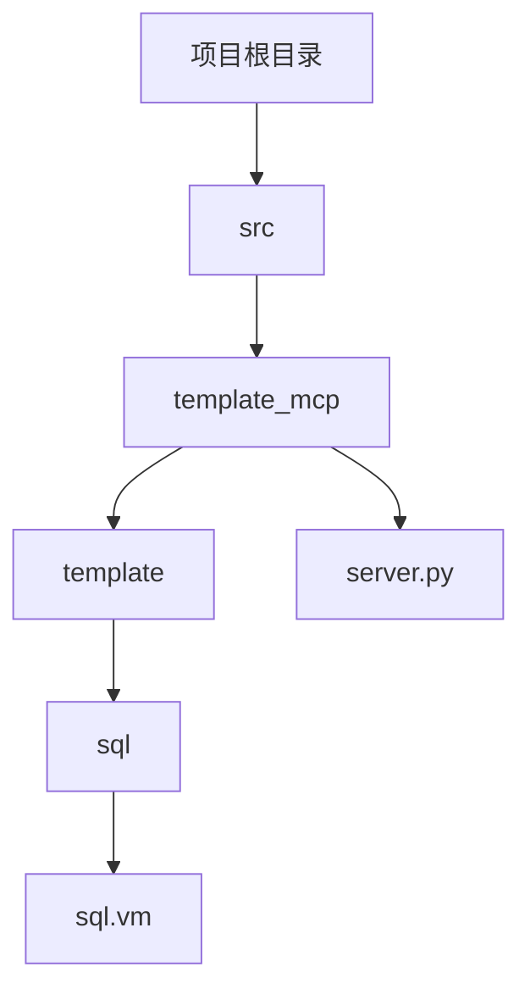
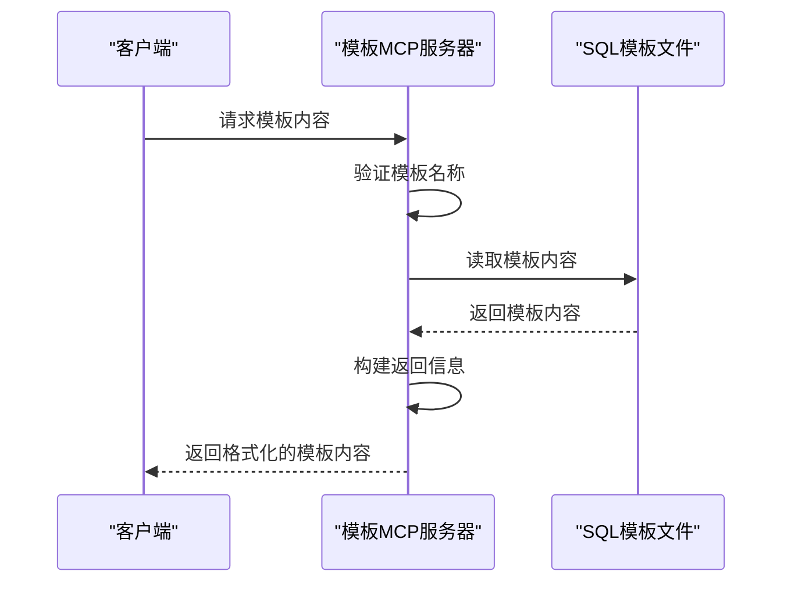

# SQL脚本模板

<cite>
**本文档引用的文件**   
- [sql.vm](file://src/template_mcp/template/sql/sql.vm)
- [server.py](file://src/template_mcp/server.py)
- [sql.vm.md](file://src/embedding/docs/sql/sql.vm.md)
</cite>

## 目录
1. [简介](#简介)
2. [项目结构](#项目结构)
3. [核心组件](#核心组件)
4. [架构概述](#架构概述)
5. [详细组件分析](#详细组件分析)
6. [依赖分析](#依赖分析)
7. [性能考虑](#性能考虑)
8. [故障排除指南](#故障排除指南)
9. [结论](#结论)

## 简介
本文档全面介绍SQL脚本模板（sql.vm）的功能与使用方式。该模板用于根据输入的表结构信息自动生成建表语句、索引定义、初始数据插入等SQL代码。文档分析了server.py中SQL模板的加载与渲染逻辑，包括字段类型映射、默认值处理和约束生成规则。通过实际调用示例，展示如何通过MCP协议生成兼容MySQL的DDL语句，并指导用户如何扩展模板以支持其他数据库方言。

## 项目结构
项目结构清晰地组织了各种模板文件，包括后端代码、前端代码和数据库脚本。SQL模板文件位于`src/template_mcp/template/sql/`目录下，具体为`sql.vm`文件。该文件是Velocity模板引擎的一部分，用于生成系统菜单和权限按钮的SQL插入语句。



**图示来源**
- [server.py](file://src/template_mcp/server.py#L88-L140)
- [sql.vm](file://src/template_mcp/template/sql/sql.vm)

**本节来源**
- [server.py](file://src/template_mcp/server.py#L88-L140)
- [sql.vm](file://src/template_mcp/template/sql/sql.vm)

## 核心组件
SQL脚本模板（sql.vm）的核心功能是生成系统菜单和权限按钮的SQL插入语句。它通过变量替换和条件判断生成完整的SQL代码，确保新生成的业务模块能够正确集成到系统的权限管理体系中。

**本节来源**
- [sql.vm.md](file://src/embedding/docs/sql/sql.vm.md#L0-L305)

## 架构概述
SQL模板的加载与渲染逻辑由`server.py`中的`get_template_content`函数实现。该函数首先验证模板名称的有效性，然后读取模板内容，并构建返回信息。模板内容使用Velocity模板引擎语法，通过变量替换和条件判断生成完整的SQL代码。



**图示来源**
- [server.py](file://src/template_mcp/server.py#L260-L298)

**本节来源**
- [server.py](file://src/template_mcp/server.py#L260-L298)

## 详细组件分析
### SQL模板分析
SQL模板（sql.vm）的主要功能是生成系统菜单和权限按钮的SQL插入语句。模板通过变量替换和条件判断生成完整的SQL代码，确保新生成的业务模块能够正确集成到系统的权限管理体系中。

#### 模板变量说明
| 变量名 | 说明 | 示例 |
|--------|------|------|
| `${functionName}` | 功能名称（中文） | `用户管理` |
| `${parentMenuId}` | 父菜单ID | `1` |
| `${businessName}` | 业务名称（小写） | `user` |
| `${moduleName}` | 模块名称（小写） | `system` |
| `${permissionPrefix}` | 权限前缀 | `system:user` |

#### 生成示例
```sql
-- 菜单 SQL
insert into sys_menu (menu_name, parent_id, order_num, path, component, is_frame, is_cache, menu_type, visible, status, perms, icon, create_by, create_time, update_by, update_time, remark)
values