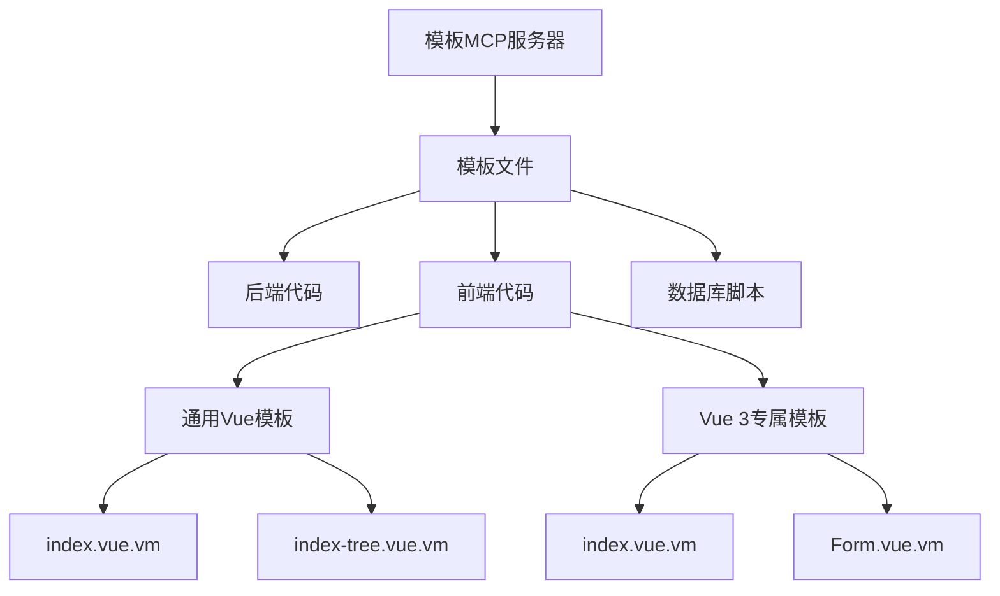
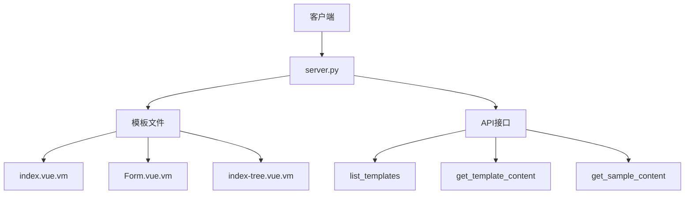
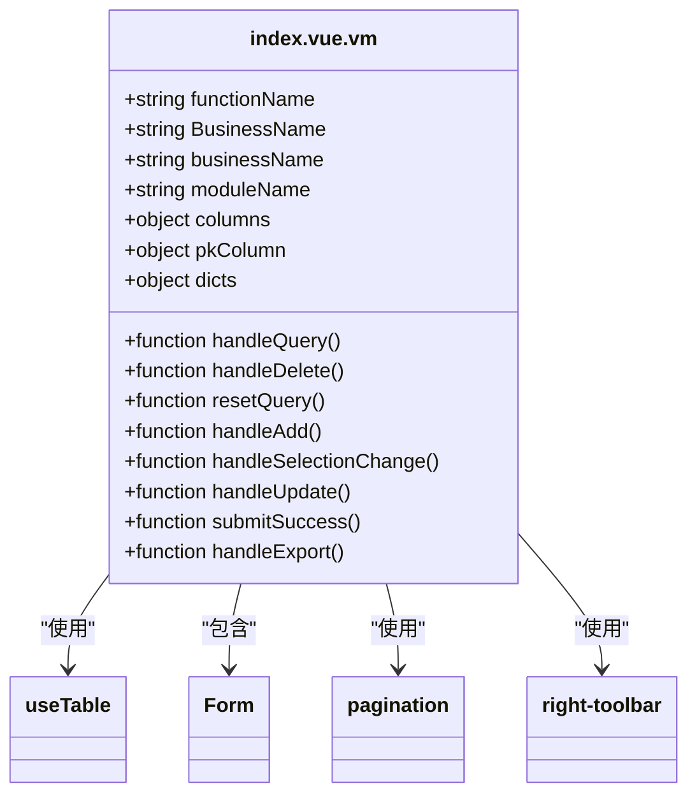
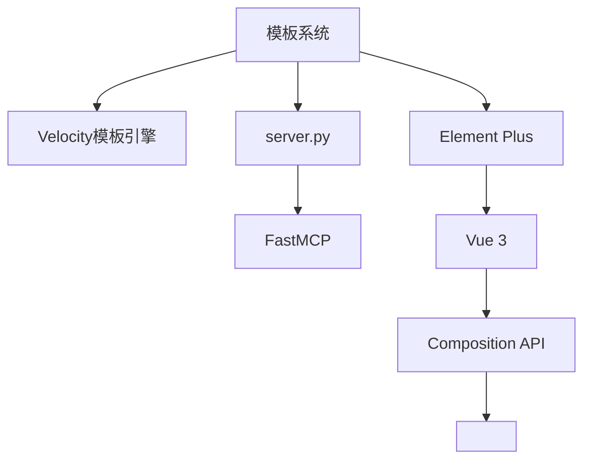

# Vue组件模板

<cite>
**本文档引用的文件**   
- [index.vue.vm](file://src/template_mcp/template/vue/v3/index.vue.vm)
- [Form.vue.vm](file://src/template_mcp/template/vue/v3/Form.vue.vm)
- [index-tree.vue.vm](file://src/template_mcp/template/vue/index-tree.vue.vm)
- [server.py](file://src/template_mcp/server.py)
</cite>

## 目录
1. [简介](#简介)
2. [项目结构](#项目结构)
3. [核心组件](#核心组件)
4. [架构概述](#架构概述)
5. [详细组件分析](#详细组件分析)
6. [依赖分析](#依赖分析)
7. [性能考虑](#性能考虑)
8. [故障排除指南](#故障排除指南)
9. [结论](#结论)

## 简介
本文档系统阐述了Vue组件模板的组织结构与生成逻辑，重点区分了通用模板与Vue 3专属模板。文档详细说明了`index.vue.vm`、`index-tree.vue.vm`和`Form.vue.vm`三种模板的应用场景及变量注入机制（如`${componentName}`、`${fields}`）。结合`server.py`中的模板路由逻辑，解释了如何根据请求参数选择合适的Vue版本和组件类型。提供了完整示例，展示如何生成包含`el-table`、`el-form`的Element Plus页面代码，并指导用户如何添加自定义UI组件模板。

## 项目结构
项目结构清晰地组织了模板文件，主要分为后端代码、前端代码和数据库脚本三大类别。前端代码模板进一步细分为通用Vue模板和Vue 3专属模板，存放在`src/template_mcp/template/vue`和`src/template_mcp/template/vue/v3`目录下。这种分层结构便于管理和维护不同版本的模板。



**图示来源**
- [server.py](file://src/template_mcp/server.py#L88-L140)

**本节来源**
- [server.py](file://src/template_mcp/server.py#L88-L140)

## 核心组件
核心组件包括`index.vue.vm`、`Form.vue.vm`和`index-tree.vue.vm`，它们分别用于生成列表页面、表单页面和树形结构页面。这些模板利用Velocity模板引擎语法，通过变量替换和条件判断生成完整的Vue.js页面代码，支持完整的CRUD功能实现，多种字段类型和主子表关联。

**本节来源**
- [index.vue.vm](file://src/template_mcp/template/vue/v3/index.vue.vm)
- [Form.vue.vm](file://src/template_mcp/template/vue/v3/Form.vue.vm)
- [index-tree.vue.vm](file://src/template_mcp/template/vue/index-tree.vue.vm)

## 架构概述
系统架构采用MCP（Model Context Protocol）模式，通过`server.py`提供RESTful API接口，支持根据模板名称输出模板文件内容。前端代码模板分为通用模板和Vue 3专属模板，通过不同的模板名称进行区分和调用。这种架构设计使得模板管理更加灵活和可扩展。



**图示来源**
- [server.py](file://src/template_mcp/server.py)

## 详细组件分析

### index.vue.vm模板分析
`index.vue.vm`是Vue 3专属的列表页面模板，采用Composition API和`<script setup>`语法。模板生成包含搜索表单、操作按钮、数据表格和分页组件的完整页面。通过`useTable` Hook管理表格状态和操作，支持动态生成查询条件和表格列。



**图示来源**
- [index.vue.vm](file://src/template_mcp/template/vue/v3/index.vue.vm#L1-L279)

**本节来源**
- [index.vue.vm](file://src/template_mcp/template/vue/v3/index.vue.vm#L1-L279)

### Form.vue.vm模板分析
`Form.vue.vm`是Vue 3专属的表单组件模板，封装为可复用的对话框组件。支持新增和修改两种模式，通过`open`方法调用。模板根据字段配置动态生成表单项，支持多种输入控件类型，自动处理表单验证和字典数据绑定。

```mermaid
classDiagram
class Form.vue.vm {
+string BusinessName
+string businessName
+string moduleName
+string functionName
+object columns
+object dicts
+object subTable
+object subclassName
+object subClassName
+object subTableFkclassName
+function open()
+function submitForm()
+function resetForm()
}
Form.vue.vm --> Dialog : "使用"
Form.vue.vm --> get${BusinessName} : "调用"
Form.vue.vm --> add${BusinessName} : "调用"
Form.vue.vm --> update${BusinessName} : "调用"
```

**图示来源**
- [Form.vue.vm](file://src/template_mcp/template/vue/v3/Form.vue.vm#L1-L273)

**本节来源**
- [Form.vue.vm](file://src/template_mcp/template/vue/v3/Form.vue.vm#L1-L273)

### index-tree.vue.vm模板分析
`index-tree.vue.vm`是通用的树形页面模板，采用Vue 2的Options API。模板生成包含搜索表单、操作按钮、树形表格和对话框的完整页面。支持展开/折叠操作，通过`Treeselect`组件实现树形下拉选择。

```mermaid
classDiagram
class index-tree.vue.vm {
+string BusinessName
+string businessName
+string moduleName
+string functionName
+object columns
+object pkColumn
+object dicts
+object treeCode
+object treeParentCode
+object treeName
+function getList()
+function normalizer()
+function getTreeselect()
+function cancel()
+function reset()
+function handleQuery()
+function resetQuery()
+function handleAdd()
+function toggleExpandAll()
+function handleUpdate()
+function submitForm()
+function handleDelete()
}
index-tree.vue.vm --> Treeselect : "使用"
index-tree.vue.vm --> list${BusinessName} : "调用"
index-tree.vue.vm --> get${BusinessName} : "调用"
index-tree.vue.vm --> del${BusinessName} : "调用"
index-tree.vue.vm --> add${BusinessName} : "调用"
index-tree.vue.vm --> update${BusinessName} : "调用"
```

**图示来源**
- [index-tree.vue.vm](file://src/template_mcp/template/vue/index-tree.vue.vm#L1-L506)

**本节来源**
- [index-tree.vue.vm](file://src/template_mcp/template/vue/index-tree.vue.vm#L1-L506)

## 依赖分析
模板系统依赖于Velocity模板引擎进行变量替换和条件判断，生成最终的Vue组件代码。`server.py`作为MCP服务器，提供API接口供客户端调用。前端代码依赖Element Plus组件库，通过`<script setup>`语法和Composition API实现现代化的Vue 3开发。



**图示来源**
- [server.py](file://src/template_mcp/server.py)
- [index.vue.vm](file://src/template_mcp/template/vue/v3/index.vue.vm)
- [Form.vue.vm](file://src/template_mcp/template/vue/v3/Form.vue.vm)

**本节来源**
- [server.py](file://src/template_mcp/server.py)
- [index.vue.vm](file://src/template_mcp/template/vue/v3/index.vue.vm)
- [Form.vue.vm](file://src/template_mcp/template/vue/v3/Form.vue.vm)

## 性能考虑
模板系统在生成代码时，通过条件判断和循环优化，减少不必要的DOM操作和数据绑定。使用`v-show`和`v-if`合理控制元素的显示和隐藏，避免频繁的DOM重建。在处理大数据量时，采用分页加载和懒加载策略，提高页面响应速度。

## 故障排除指南
常见问题包括模板文件路径错误、变量注入失败和API调用异常。检查`server.py`中的`TEMPLATE_FILES`配置，确保模板名称和路径正确。验证变量注入的上下文信息，确保所有必需的变量都已提供。检查API接口的URL和参数，确保请求格式正确。

**本节来源**
- [server.py](file://src/template_mcp/server.py)
- [index.vue.vm](file://src/template_mcp/template/vue/v3/index.vue.vm)
- [Form.vue.vm](file://src/template_mcp/template/vue/v3/Form.vue.vm)

## 结论
本文档详细阐述了Vue组件模板的组织结构与生成逻辑，区分了通用模板与Vue 3专属模板。通过分析`index.vue.vm`、`index-tree.vue.vm`和`Form.vue.vm`三种模板的应用场景及变量注入机制，结合`server.py`中的模板路由逻辑，提供了完整的解决方案。用户可以根据需求生成包含`el-table`、`el-form`的Element Plus页面代码，并可扩展自定义UI组件模板。