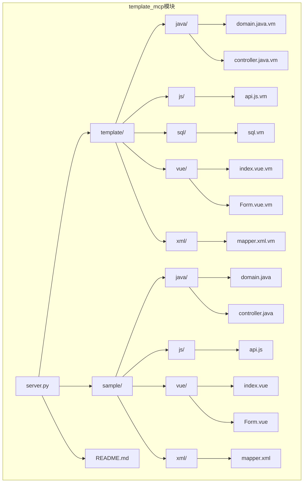
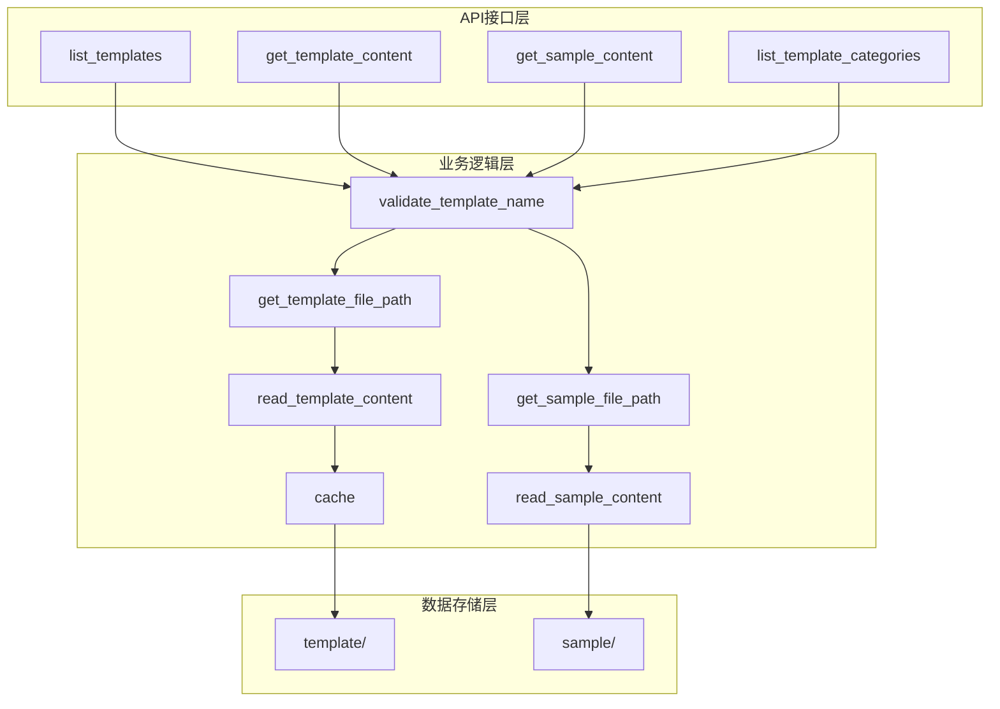
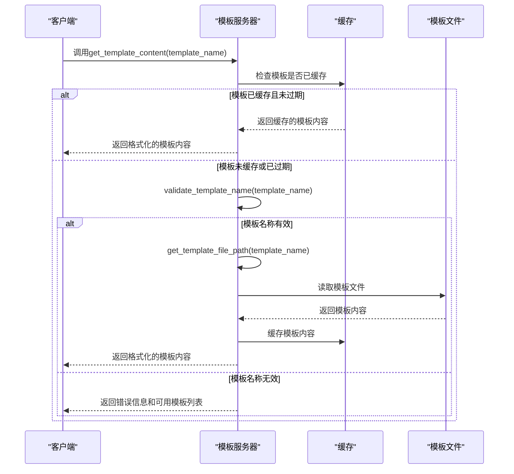
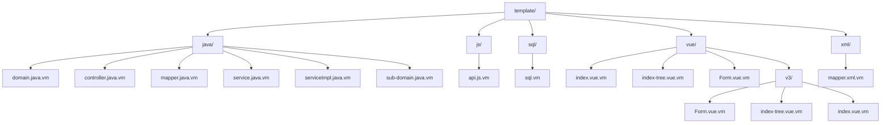
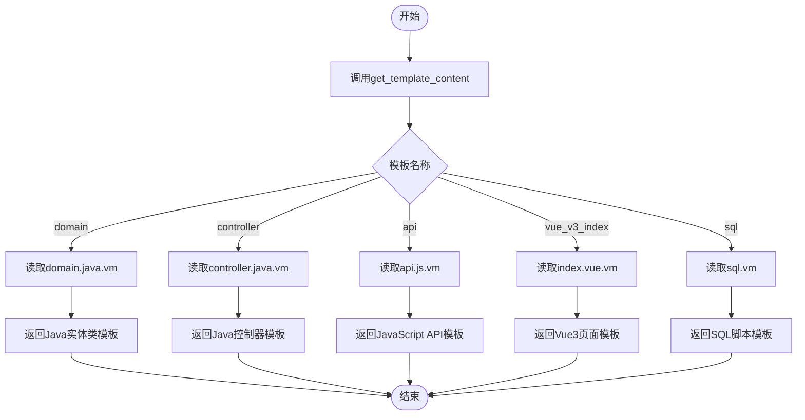
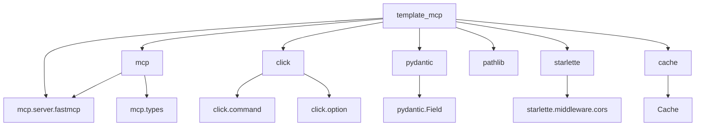

# 代码模板生成服务

<cite>
**本文档中引用的文件**   
- [server.py](file://src\template_mcp\server.py) - *更新了模板服务功能，添加了缓存机制*
- [README.md](file://src\template_mcp\README.md) - *项目基本介绍和使用说明*
- [domain.java.vm](file://src\template_mcp\template\java\domain.java.vm) - *Java实体类模板*
- [controller.java.vm](file://src\template_mcp\template\java\controller.java.vm) - *Java控制器模板，已更新内容*
- [serviceImpl.java.vm](file://src\template_mcp\template\java\serviceImpl.java.vm) - *Java服务实现类模板，已更新内容*
- [index.vue.vm](file://src\template_mcp\template\vue\v3\index.vue.vm) - *Vue3页面组件模板*
- [sql.vm](file://src\template_mcp\template\sql\sql.vm) - *SQL脚本模板*
- [template/](file://src\template_mcp\template/) - *模板文件目录*
- [sample/](file://src\template_mcp\sample/) - *示例文件目录*
- [cache.py](file://src\common\cache.py) - *缓存功能实现*
</cite>

## 更新摘要
**变更内容**   
- 新增了模板内容获取的缓存机制，提升性能
- 更新了Java后端模板文件内容，包括Controller、Domain和ServiceImpl模板
- 补充了缓存机制的实现细节和配置说明
- 更新了模板加载、变量替换和代码生成的核心逻辑说明
- 增加了如何扩展自定义模板的指导
- 更新了API请求实例
- 优化了模板目录结构分析

## 目录
1. [项目结构](#项目结构)
2. [核心组件](#核心组件)
3. [架构概述](#架构概述)
4. [详细组件分析](#详细组件分析)
5. [依赖分析](#依赖分析)
6. [性能考虑](#性能考虑)
7. [故障排除指南](#故障排除指南)
8. [结论](#结论)

## 项目结构
代码模板生成服务（template_mcp）是一个基于MCP（Model Context Protocol）协议的模板服务器，用于管理和提供代码生成模板文件。项目结构清晰，主要包含模板文件、示例文件和服务器逻辑三大部分。

**图示来源**
- [server.py](file://src\template_mcp\server.py)
- [template/](file://src\template_mcp\template/)
- [sample/](file://src\template_mcp\sample/)

**本节来源**
- [server.py](file://src\template_mcp\server.py)
- [README.md](file://src\template_mcp\README.md)

## 核心组件
代码模板生成服务的核心组件包括模板加载、变量替换和代码生成三大功能。服务通过`server.py`文件中的API端点提供这些功能，支持多种编程语言和框架的模板生成。最新版本中，服务已添加缓存机制以提高模板内容获取的性能。

**本节来源**
- [server.py](file://src\template_mcp\server.py)

## 架构概述
代码模板生成服务采用模块化架构，主要由API接口层、业务逻辑层和数据存储层组成。API接口层提供MCP协议支持，业务逻辑层处理模板加载和变量替换，数据存储层管理模板文件和示例文件。与之前版本相比，最新架构在业务逻辑层增加了缓存层，用于缓存已读取的模板内容，避免重复的文件I/O操作。

**图示来源**
- [server.py](file://src\template_mcp\server.py)
- [cache.py](file://src\common\cache.py)

**本节来源**
- [server.py](file://src\template_mcp\server.py)

## 详细组件分析
### 模板加载与变量替换分析
代码模板生成服务的核心功能是模板加载和变量替换。服务使用Velocity模板引擎（.vm文件）来定义模板，通过API请求中的参数替换模板中的变量，生成最终的代码文件。在最新版本中，服务为模板内容获取添加了缓存机制，当首次获取模板内容后，会将其缓存5分钟，后续请求直接从缓存中读取，显著提升了性能。

**图示来源**
- [server.py](file://src\template_mcp\server.py#L252-L308)
- [server.py](file://src\template_mcp\server.py#L109-L118)
- [server.py](file://src\template_mcp\server.py#L121-L134)
- [server.py](file://src\template_mcp\server.py#L137-L156)
- [cache.py](file://src\common\cache.py)

**本节来源**
- [server.py](file://src\template_mcp\server.py)
- [cache.py](file://src\common\cache.py)

### 模板目录结构分析
模板目录（template/）按照编程语言和技术栈进行组织，包含Java、JavaScript、Vue、SQL和XML等各类模板文件。每个模板文件都是一个Velocity模板（.vm文件），包含可替换的变量和条件逻辑。目录结构保持稳定，未发生变更。

**图示来源**
- [template/](file://src\template_mcp\template/)

**本节来源**
- [template/](file://src\template_mcp\template/)
- [README.md](file://src\template_mcp\README.md)

### API请求实例分析
通过API请求生成不同语言代码的实例展示了服务的使用方法。用户可以通过调用`get_template_content`工具，传入不同的模板名称来获取对应的模板文件内容。由于添加了缓存机制，重复请求相同模板时性能显著提升。

**图示来源**
- [server.py](file://src\template_mcp\server.py#L252-L308)
- [template/](file://src\template_mcp\template/)

**本节来源**
- [server.py](file://src\template_mcp\server.py)
- [template/](file://src\template_mcp\template/)

## 依赖分析
代码模板生成服务的依赖关系清晰，主要依赖MCP协议框架、Click命令行工具、Pydantic数据验证库和Starlette CORS中间件。这些依赖项共同支持服务的API功能、命令行接口、数据验证和跨域请求处理。此外，服务还依赖`src/common/cache.py`中的缓存类来实现模板内容的缓存功能。

**图示来源**
- [server.py](file://src\template_mcp\server.py)
- [cache.py](file://src\common\cache.py)

**本节来源**
- [server.py](file://src\template_mcp\server.py)
- [README.md](file://src\template_mcp\README.md)
- [cache.py](file://src\common\cache.py)

## 性能考虑
代码模板生成服务在性能方面考虑了文件读取效率和错误处理机制。服务使用缓存机制避免重复读取文件，通过`src/common/cache.py`中的`Cache`类实现，缓存默认有效期为5分钟。这一改进显著减少了文件I/O操作，提升了高并发场景下的响应速度。对于大量模板请求，建议使用HTTP或SSE传输方式以提高性能。

**本节来源**
- [server.py](file://src\template_mcp\server.py)
- [cache.py](file://src\common\cache.py)

## 故障排除指南
当遇到模板生成问题时，可以按照以下步骤进行排查：
1. 检查模板名称是否正确，参考`list_templates`返回的可用模板列表
2. 确认模板文件是否存在，检查`template/`目录下的对应文件
3. 查看服务日志，获取详细的错误信息
4. 验证API请求参数是否符合要求
5. 如果怀疑缓存问题，可检查`Cache`类的行为或重启服务清除缓存

**本节来源**
- [server.py](file://src\template_mcp\server.py)
- [README.md](file://src\template_mcp\README.md)

## 结论
代码模板生成服务提供了一个高效、灵活的代码生成解决方案。通过清晰的目录结构、丰富的模板类型和简单的API接口，开发者可以快速生成各种编程语言的代码文件。服务的模块化设计和完善的错误处理机制确保了其稳定性和易用性。最新的缓存机制改进显著提升了性能，使服务更适合高并发场景。Java后端模板的更新也确保了生成代码的现代性和最佳实践遵循。