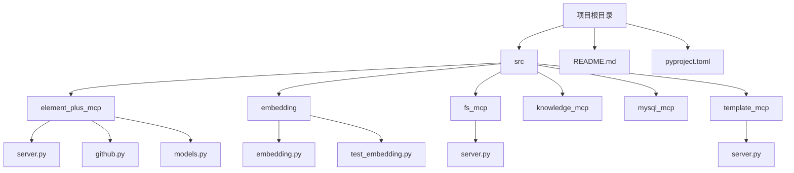
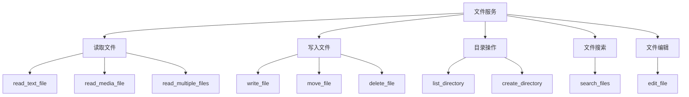
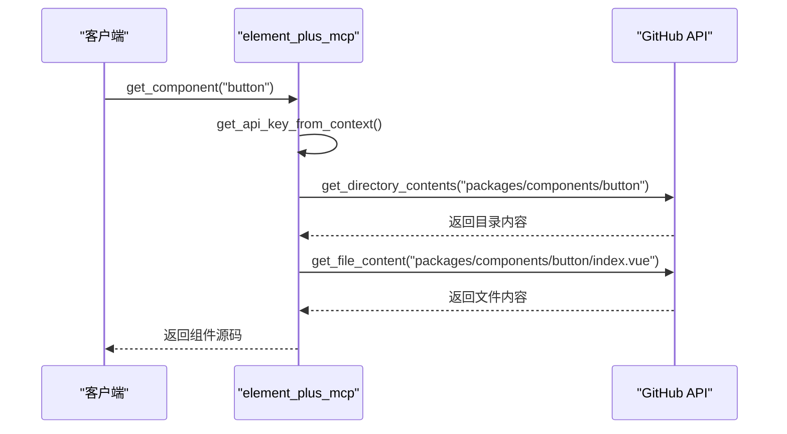

# 快速入门

<cite>
**本文档中引用的文件**   
- [README.md](file://README.md)
- [pyproject.toml](file://pyproject.toml)
- [src/fs_mcp/server.py](file://src/fs_mcp/server.py)
- [src/element_plus_mcp/server.py](file://src/element_plus_mcp/server.py)
- [src/element_plus_mcp/github.py](file://src/element_plus_mcp/github.py)
- [src/mysql_mcp/server.py](file://src/mysql_mcp/server.py)
- [src/template_mcp/server.py](file://src/template_mcp/server.py)
- [src/embedding/embedding.py](file://src/embedding/embedding.py)
</cite>

## 目录
1. [简介](#简介)
2. [项目结构](#项目结构)
3. [环境准备](#环境准备)
4. [服务安装与启动](#服务安装与启动)
5. [核心MCP服务详解](#核心mcp服务详解)
6. [端到端使用示例](#端到端使用示例)
7. [常见问题与解决方案](#常见问题与解决方案)

## 简介

本指南旨在帮助新手开发者快速上手 `test_mcp_server` 项目。该项目是一个基于 Model Context Protocol (MCP) 的测试服务集合，提供了文件系统、数据库、代码模板、组件文档等多种服务。通过本指南，您将学习如何配置环境、安装依赖、启动各个MCP服务，并通过一个完整的示例发送您的第一个请求。

**本文档来源**
- [README.md](file://README.md)

## 项目结构

项目采用模块化设计，每个MCP服务都位于 `src` 目录下的独立子目录中。这种结构清晰地分离了不同功能的服务，便于维护和扩展。



**图示来源**
- [README.md](file://README.md)

**本文档来源**
- [README.md](file://README.md)

## 环境准备

在开始使用本项目之前，您需要完成以下环境准备工作。

### 安装包管理工具 uv

本项目使用 `uv` 作为包管理工具，它比传统的 `pip` 更快、更高效。请根据您的操作系统安装 `uv`。

**Windows 安装命令：**
```bash
powershell -ExecutionPolicy ByPass -c "irm https://astral.sh/uv/install.ps1 | iex"
```

**本文档来源**
- [README.md](file://README.md)

### 安装项目依赖

安装 `uv` 后，您需要同步项目依赖。在项目根目录下执行以下命令：

```bash
uv sync
```

此命令会根据 `pyproject.toml` 文件中的定义，安装所有必需的Python包。

**本文档来源**
- [pyproject.toml](file://pyproject.toml)

## 服务安装与启动

本项目包含多个独立的MCP服务，您可以根据需要选择启动。

### 文件服务 (fs_mcp)

文件服务允许您安全地读写文件系统中的文件。

**启动命令：**
```bash
uv run fs_mcp
```

**默认端口：** 3001

**安全配置：**
该服务通过环境变量 `MCP_ALLOWED_DIRECTORIES` 限制可访问的目录。您需要在 `.env` 文件中配置允许的目录路径，多个路径用分号分隔。

```bash
# .env 文件示例
MCP_ALLOWED_DIRECTORIES=D:\dev;E:\app
```

**本文档来源**
- [README.md](file://README.md)
- [src/fs_mcp/server.py](file://src/fs_mcp/server.py)

### Element Plus 组件服务 (element_plus_mcp)

该服务提供对 Element Plus 组件库的查询功能，可以获取组件的源码、演示代码和元数据。

**启动命令：**
```bash
uv run element_plus_mcp
```

**默认端口：** 3003

**API密钥配置：**
该服务需要 GitHub API 密钥来访问 Element Plus 的仓库。您需要在 `.env` 文件中设置 `GITHUB_API_KEY`。

```bash
# .env 文件示例
GITHUB_API_KEY=your_github_token_here
```

**本文档来源**
- [README.md](file://README.md)
- [src/element_plus_mcp/server.py](file://src/element_plus_mcp/server.py)
- [src/element_plus_mcp/github.py](file://src/element_plus_mcp/github.py)

### MySQL 数据库服务 (mysql_mcp)

该服务提供对 MySQL 数据库的访问，支持查询表结构、执行SQL语句等操作。

**启动命令：**
```bash
uv run mysql_mcp
```

**默认端口：** 3004

**数据库配置：**
您需要在 `.env` 文件中配置数据库连接信息。

```bash
# .env 文件示例
MYSQL_HOST=localhost
MYSQL_PORT=3306
MYSQL_USER=your_username
MYSQL_PASSWORD=your_password
MYSQL_DATABASE=your_database
```

**本文档来源**
- [README.md](file://README.md)
- [src/mysql_mcp/server.py](file://src/mysql_mcp/server.py)

### 模板服务 (template_mcp)

该服务提供代码模板的访问，支持后端、前端和数据库脚本等多种模板。

**启动命令：**
```bash
uv run template_mcp
```

**默认端口：** 3005

**本文档来源**
- [README.md](file://README.md)
- [src/template_mcp/server.py](file://src/template_mcp/server.py)

### 嵌入式服务 (embedding)

该服务用于将文档向量化并存储到 PostgreSQL 数据库中。

**启动命令：**
```bash
uv run embed
```

**配置文件：**
该服务的配置在 `src/embedding/embedding.py` 文件的 `CONFIG` 字典中，包括文档目录、Ollama 服务地址和数据库连接信息。

**本文档来源**
- [pyproject.toml](file://pyproject.toml)
- [src/embedding/embedding.py](file://src/embedding/embedding.py)

## 核心MCP服务详解

### 文件服务功能

文件服务提供了丰富的文件系统操作工具。



**图示来源**
- [src/fs_mcp/server.py](file://src/fs_mcp/server.py)

### Element Plus 服务功能

该服务通过 GitHub API 与 Element Plus 仓库交互。



**图示来源**
- [src/element_plus_mcp/server.py](file://src/element_plus_mcp/server.py)
- [src/element_plus_mcp/github.py](file://src/element_plus_mcp/github.py)

## 端到端使用示例

本示例将演示如何使用 `fs_mcp` 服务读取一个文件。

### 步骤 1: 配置环境

1.  确保已安装 `uv` 并运行 `uv sync`。
2.  在项目根目录创建 `.env` 文件，并添加允许的目录：
    ```bash
    MCP_ALLOWED_DIRECTORIES=E:\GitHub\All_in_Ai\test_mcp_server
    ```

### 步骤 2: 启动服务

在终端中运行：
```bash
uv run fs_mcp
```
您将看到类似 `Uvicorn running on http://0.0.0.0:3001` 的输出，表示服务已启动。

### 步骤 3: 发送请求

使用 `curl` 或 Postman 发送一个 `streamable-http` 请求。

**请求示例：**
```bash
curl -X POST http://localhost:3001/mcp \
  -H "Content-Type: application/json" \
  -H "X-API-KEY: application/json" \
  -d '{
    "method": "read_text_file",
    "params": {
      "path": "README.md"
    }
  }'
```

**预期响应：**
```json
{
  "content": [
    {
      "type": "text",
      "text": "这是一个 MCP 服务测试项目，包含了文件服务、知识库服务等。..."
    }
  ]
}
```

此响应将返回 `README.md` 文件的全部内容。

**本文档来源**
- [README.md](file://README.md)
- [src/fs_mcp/server.py](file://src/fs_mcp/server.py)

## 常见问题与解决方案

### 问题 1: 服务启动失败，提示找不到模块

**错误信息：**
```
ModuleNotFoundError: No module named 'mcp'
```

**解决方案：**
确保您已成功运行 `uv sync` 命令。如果问题仍然存在，请尝试重新安装依赖：
```bash
uv pip uninstall mcp
uv sync
```

**本文档来源**
- [pyproject.toml](file://pyproject.toml)

### 问题 2: 文件服务返回 "Access denied"

**错误信息：**
```
{"content": [{"type": "text", "text": "Access denied: Path '...' is outside allowed directories"}]}
```

**解决方案：**
这是正常的安全机制。请检查您的 `.env` 文件中的 `MCP_ALLOWED_DIRECTORIES` 配置，确保您尝试访问的文件路径包含在允许的目录列表中。

**本文档来源**
- [src/fs_mcp/server.py](file://src/fs_mcp/server.py)

### 问题 3: Element Plus 服务返回 "未配置API密钥"

**错误信息：**
```
获取到api_key： 
请求头中未找到API密钥
```

**解决方案：**
该服务需要有效的 GitHub API 密钥。请前往 GitHub 设置生成一个 Personal Access Token，并将其添加到 `.env` 文件中：
```bash
GITHUB_API_KEY=ghp_your_token_here
```

**本文档来源**
- [src/element_plus_mcp/server.py](file://src/element_plus_mcp/server.py)
- [src/element_plus_mcp/github.py](file://src/element_plus_mcp/github.py)

### 问题 4: 跨域访问被拒绝

**错误信息：**
在浏览器中连接 `streamable-http` 服务时，出现 CORS 错误。

**解决方案：**
本项目的服务端已内置 `CORSMiddleware` 允许所有来源 (`allow_origins=["*"]`)。如果您的客户端有严格的CSP策略，可能需要调整客户端配置或使用代理服务器。

**本文档来源**
- [README.md](file://README.md)
- [src/fs_mcp/server.py](file://src/fs_mcp/server.py)