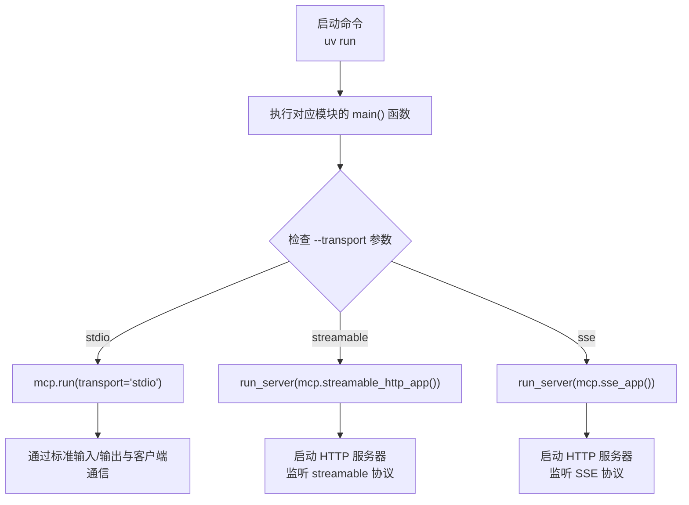
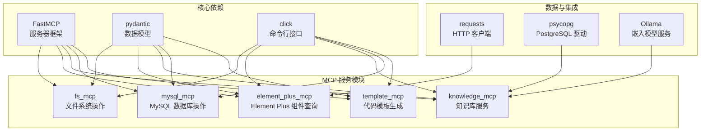

# 技术栈与依赖

<cite>
**本文档中引用的文件**  
- [pyproject.toml](file://pyproject.toml#L1-L41)
- [src/element_plus_mcp/server.py](file://src/element_plus_mcp/server.py#L1-L374)
- [src/element_plus_mcp/models.py](file://src/element_plus_mcp/models.py#L1-L68)
- [src/element_plus_mcp/github.py](file://src/element_plus_mcp/github.py#L1-L79)
- [src/fs_mcp/server.py](file://src/fs_mcp/server.py#L1-L661)
- [src/embedding/embedding.py](file://src/embedding/embedding.py#L1-L552)
- [src/embedding/test_embedding.py](file://src/embedding/test_embedding.py#L1-L356)
- [README.md](file://README.md#L1-L126)
</cite>

## 目录
1. [技术栈与依赖](#技术栈与依赖)  
2. [Python语言版本与开发环境](#python语言版本与开发环境)  
3. [核心依赖项详解](#核心依赖项详解)  
4. [FastMCP框架核心机制](#fastmcp框架核心机制)  
5. [服务启动流程分析](#服务启动流程分析)  
6. [模块化架构与功能实现](#模块化架构与功能实现)  
7. [数据模型与API设计](#数据模型与api设计)  
8. [外部服务集成](#外部服务集成)  
9. [配置与部署建议](#配置与部署建议)

## Python语言版本与开发环境

本项目基于现代Python生态系统构建，对语言版本有明确要求，确保使用最新特性和性能优化。

**Python版本要求**  
项目在 `pyproject.toml` 文件中明确声明了最低版本要求：  
```toml
requires-python = ">=3.13"
```
这表明项目需要 **Python 3.13 或更高版本**。选择此版本是为了利用最新的语言特性、性能改进和标准库增强，确保代码的高效性和可维护性。

**开发环境配置**  
项目推荐使用 `uv` 作为包管理工具，这是一个新兴的、高性能的Python包管理器，旨在替代 `pip` 和 `virtualenv` 的组合，提供更快的依赖解析和安装速度。

安装与同步步骤：
1. **安装 uv**（Windows 示例）：
   ```bash
   powershell -ExecutionPolicy ByPass -c "irm https://astral.sh/uv/install.ps1 | iex"
   ```
2. **同步项目依赖**：
   ```bash
   uv sync
   ```

此外，项目通过 `pyproject.toml` 中的 `[tool.setuptools]` 配置了包结构，将 `src` 目录作为源代码根目录，这是一种现代的、推荐的项目布局方式，有助于避免导入问题。

**Section sources**
- [pyproject.toml](file://pyproject.toml#L1-L41)
- [README.md](file://README.md#L4-L10)

## 核心依赖项详解

项目依赖在 `pyproject.toml` 文件中明确定义，每个库都承担着关键角色。

```toml
dependencies = [
    "click>=8.2.1",
    "mcp[cli]>=1.12.4",
    "mysql-connector-python>=9.4.0",
    "psycopg[binary]>=3.1.0",
    "requests==2.31.0",
]
```

### FastMCP (mcp[cli])
FastMCP 是项目的核心框架，是 `mcp` 包的一个扩展或特定实现。它提供了构建 MCP（Model Context Protocol）服务器的基础能力。

- **作用**：作为服务器框架，它负责处理 MCP 协议的通信、工具注册、请求路由和响应生成。
- **在项目中的体现**：在多个 `server.py` 文件中，通过 `from mcp.server.fastmcp import FastMCP` 导入，并创建服务器实例，例如 `mcp = FastMCP("ElementPlusServer", host="0.0.0.0", port=3003)`。
- **功能**：它抽象了底层通信细节，允许开发者通过简单的装饰器（如 `@mcp.tool()`）将 Python 函数暴露为可调用的工具。

### click
Click 是一个用于创建命令行界面（CLI）的流行 Python 库。

- **作用**：为每个 MCP 服务模块（如 `fs_mcp`, `element_plus_mcp`）提供命令行接口。
- **在项目中的体现**：在 `server.py` 文件中，使用 `@click.command()` 和 `@click.option()` 装饰器定义了 `main` 函数，使其可以通过命令行启动服务器，并接受 `--transport` 和 `--port` 等参数。
- **功能**：实现了服务的可配置启动，支持 `stdio`, `streamable`, `sse` 等不同的传输协议。

### pydantic
Pydantic 是一个数据验证和设置管理库，利用 Python 类型注解进行数据解析和验证。

- **作用**：定义数据模型（Data Models），确保进出服务器的数据结构正确、类型安全。
- **在项目中的体现**：在 `src/element_plus_mcp/models.py` 中，所有数据结构（如 `FileInfo`, `ComponentMetadata`, `ComponentSource` 等）都继承自 `BaseModel`。在 `server.py` 的工具函数中，参数使用 `Annotated` 和 `Field` 进行类型和描述注解。
- **功能**：自动将 JSON 请求体解析为 Python 对象，并在数据不符合模型定义时抛出清晰的验证错误。

### psycopg
Psycopg 是 PostgreSQL 数据库的适配器，用于在 Python 中连接和操作 PostgreSQL。

- **作用**：在 `embedding` 模块中，用于将文档的向量嵌入（embeddings）存储到 PostgreSQL 数据库的 `pgvector` 扩展表中。
- **在项目中的体现**：在 `src/embedding/embedding.py` 和 `test_embedding.py` 中，通过 `psycopg.connect()` 建立数据库连接，并执行 SQL 语句来存储和检索向量数据。
- **功能**：实现了持久化存储和高效的向量相似度搜索，是知识库服务的数据基础。

### requests
Requests 是一个简洁且人性化的 HTTP 库，用于发送 HTTP/1.1 请求。

- **作用**：在 `element_plus_mcp` 模块中，用于调用 GitHub 的 REST API。
- **在项目中的体现**：在 `src/element_plus_mcp/github.py` 中，`make_github_request` 函数使用 `requests.get()` 从 GitHub 仓库获取文件内容和目录结构。
- **功能**：使服务器能够动态地从远程代码仓库（如 element-plus）拉取源码和文档，实现了数据的实时性。

**Section sources**
- [pyproject.toml](file://pyproject.toml#L1-L41)
- [src/element_plus_mcp/models.py](file://src/element_plus_mcp/models.py#L1-L68)
- [src/element_plus_mcp/github.py](file://src/element_plus_mcp/github.py#L1-L79)
- [src/embedding/embedding.py](file://src/embedding/embedding.py#L1-L552)

## FastMCP框架核心机制

FastMCP 框架是整个项目的技术基石，它基于 MCP 协议，提供了一套简洁的 API 来构建可扩展的服务。

### MCP 协议支持
MCP（Model Context Protocol）是一种允许大语言模型（LLM）与外部工具和数据源安全交互的协议。FastMCP 框架实现了该协议的服务器端。

- **工具注册**：通过 `@mcp.tool()` 装饰器，可以将任何 Python 函数轻松注册为一个“工具”（Tool）。这些工具的元数据（名称、参数、描述）会被自动收集。
- **上下文管理**：工具函数可以接收一个 `Context` 类型的参数（如 `ctx: Context`），这为工具提供了访问请求上下文（如 HTTP 头）的能力，用于实现身份验证等高级功能。

### 命令行接口构建
FastMCP 与 Click 库无缝集成，提供了开箱即用的 CLI 支持。

- **启动脚本**：`pyproject.toml` 中的 `[project.scripts]` 部分定义了多个命令，如 `fs_mcp = "fs_mcp.server:main"`。这使得用户可以直接通过 `uv run fs_mcp` 命令启动对应的服务。
- **参数化**：`main` 函数通过 Click 接收 `--transport` 和 `--port` 参数，使得服务的部署方式和网络端口可以灵活配置。

### 服务启动流程
FastMCP 封装了底层的网络服务器（如 Uvicorn），简化了服务的启动过程。



**Diagram sources**
- [src/element_plus_mcp/server.py](file://src/element_plus_mcp/server.py#L31-L374)
- [src/fs_mcp/server.py](file://src/fs_mcp/server.py#L641-L661)

**Section sources**
- [src/element_plus_mcp/server.py](file://src/element_plus_mcp/server.py#L31-L374)
- [src/fs_mcp/server.py](file://src/fs_mcp/server.py#L641-L661)

## 服务启动流程分析

以 `element_plus_mcp` 服务为例，详细分析其启动流程。

1.  **命令执行**：用户在终端执行 `uv run element_plus_mcp`。
2.  **入口点**：根据 `pyproject.toml` 的配置，执行 `src/element_plus_mcp/server.py` 中的 `main` 函数。
3.  **参数解析**：Click 解析命令行参数，默认使用 `stdio` 传输和 `3003` 端口。
4.  **服务器初始化**：在文件顶部，`mcp = FastMCP("ElementPlusServer", host="0.0.0.0", port=3003)` 创建了服务器实例。
5.  **环境加载**：在 `main` 函数中，会检查并加载 `.env` 文件（如果存在），用于配置环境变量（如 API 密钥）。
6.  **启动模式选择**：
    -   如果 `transport` 是 `stdio`，则调用 `mcp.run(transport="stdio")`，服务通过标准输入/输出与客户端（如 Trae）通信。
    -   如果 `transport` 是 `streamable` 或 `sse`，则通过 `CORSMiddleware` 包装应用，并使用 `uvicorn.run()` 启动一个 HTTP 服务器，监听指定端口。
7.  **服务就绪**：服务器启动后，会监听请求，当收到符合 MCP 协议的请求时，会根据请求中的工具名称，调用相应的 `@mcp.tool()` 函数进行处理。

**Section sources**
- [src/element_plus_mcp/server.py](file://src/element_plus_mcp/server.py#L31-L374)

## 模块化架构与功能实现

项目采用清晰的模块化设计，每个功能单元独立成一个子包。



**Diagram sources**
- [README.md](file://README.md#L20-L126)
- [pyproject.toml](file://pyproject.toml#L1-L41)

**Section sources**
- [README.md](file://README.md#L20-L126)

### fs_mcp (文件服务)
提供对本地文件系统的安全访问。
- **核心功能**：`read_text_file`, `write_file`, `list_directory`, `search_files`, `edit_file` 等。
- **安全机制**：通过 `ALLOWED_DIRECTORIES` 全局变量和 `validate_path` 函数，严格限制了可访问的目录范围，防止路径遍历攻击。

### element_plus_mcp (Element Plus 服务)
提供对 Element Plus 前端组件库的查询能力。
- **核心功能**：`get_component` (获取源码), `get_component_demo` (获取示例), `list_components` (列出所有组件)。
- **数据源**：通过 `requests` 库调用 GitHub API，动态从 `element-plus/element-plus` 仓库拉取数据。

### embedding (嵌入式服务)
实现文档的向量化和检索。
- **核心功能**：`embedding.py` 脚本将 `docs` 目录下的文档分块，并使用 Ollama 的嵌入模型生成向量，存储到 PostgreSQL。
- **检索功能**：`test_embedding.py` 提供了一个交互式工具，可以输入查询，进行向量相似度搜索并返回结果。

## 数据模型与API设计

项目使用 Pydantic 定义了清晰、自描述的数据模型。

### 核心数据模型 (element_plus_mcp/models.py)
- **`ComponentSource`**: 表示一个组件的源码，包含组件名、源文件列表、是否找到的标志和错误信息。
- **`SourceFile`**: 表示一个源码文件，包含文件名、编程语言和文件内容。
- **`ComponentDemo`**: 表示组件的演示代码，结构与 `ComponentSource` 类似。
- **`DirectoryStructure`**: 表示一个目录的结构，包含路径、所有者、仓库名、分支、目录项列表等。

这些模型确保了 API 的输入和输出都具有严格的结构，提高了系统的可靠性和可预测性。

**Section sources**
- [src/element_plus_mcp/models.py](file://src/element_plus_mcp/models.py#L1-L68)

## 外部服务集成

项目成功集成了多个外部服务，扩展了其功能边界。

### GitHub API 集成
- **用途**：`element_plus_mcp` 模块通过 GitHub API 获取开源项目的源码和文档。
- **实现**：`github.py` 文件封装了 `requests` 调用，提供了 `get_file_content` 和 `get_directory_contents` 等便捷函数。
- **认证**：支持通过 `GITHUB_API_KEY` 环境变量进行认证，以提高 API 调用速率限制。

### PostgreSQL 与 pgvector 集成
- **用途**：`embedding` 模块使用 PostgreSQL 作为向量数据库，存储文档的嵌入向量。
- **实现**：通过 `psycopg` 驱动连接数据库，并执行包含 `<=>` 操作符（余弦相似度）的 SQL 查询来实现向量搜索。

### Ollama 集成
- **用途**：为 `embedding` 模块提供文本向量化能力。
- **实现**：`embedding.py` 和 `test_embedding.py` 通过 HTTP 请求调用本地运行的 Ollama 服务的 `/api/embeddings` 端点。

**Section sources**
- [src/element_plus_mcp/github.py](file://src/element_plus_mcp/github.py#L1-L79)
- [src/embedding/embedding.py](file://src/embedding/embedding.py#L1-L552)
- [src/embedding/test_embedding.py](file://src/embedding/test_embedding.py#L1-L356)

## 配置与部署建议

### 环境变量配置
- **`GITHUB_API_KEY`**: 用于 `element_plus_mcp` 模块，提高 GitHub API 调用配额。
- **`MCP_ALLOWED_DIRECTORIES`**: 用于 `fs_mcp` 模块，通过分号分隔指定允许访问的目录列表。
- **数据库和 Ollama 配置**: 可在 `embedding.py` 的 `CONFIG` 字典中修改，或通过环境变量注入。

### 部署注意事项
1.  **跨域问题**：当使用 `streamable-http` 协议时，由于浏览器的同源策略，可能会遇到跨域（CORS）问题。项目已通过 `CORSMiddleware` 允许所有来源（`allow_origins=["*"]`），生产环境应配置为具体的可信来源。
2.  **浏览器兼容性**：`stdio` 传输协议无法在浏览器环境中启动，因为它需要执行本地进程。此模式适用于桌面客户端（如 Trae）。
3.  **依赖服务**：运行 `embedding` 相关功能前，需确保 PostgreSQL（含 pgvector 扩展）和 Ollama 服务已启动。

**Section sources**
- [README.md](file://README.md#L15-L126)
- [src/fs_mcp/server.py](file://src/fs_mcp/server.py#L1-L661)
- [src/embedding/embedding.py](file://src/embedding/embedding.py#L1-L552)