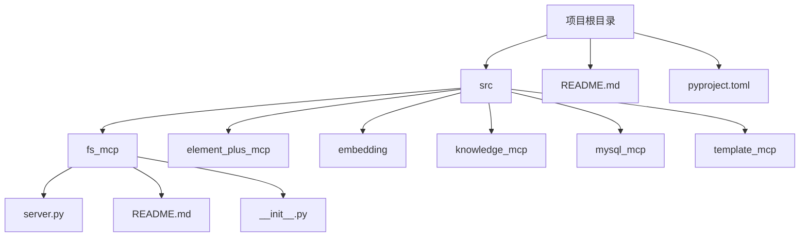
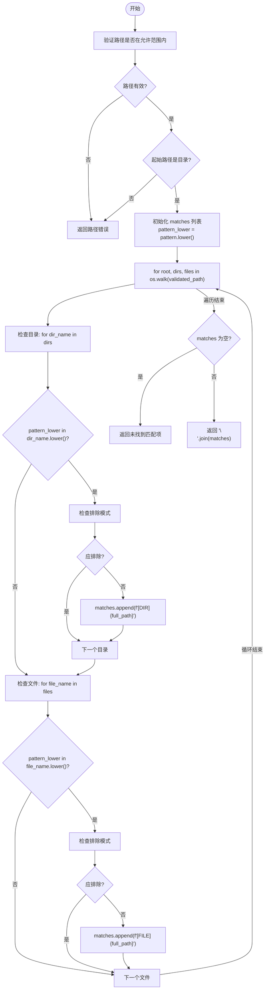
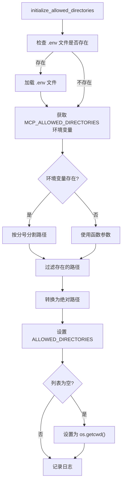
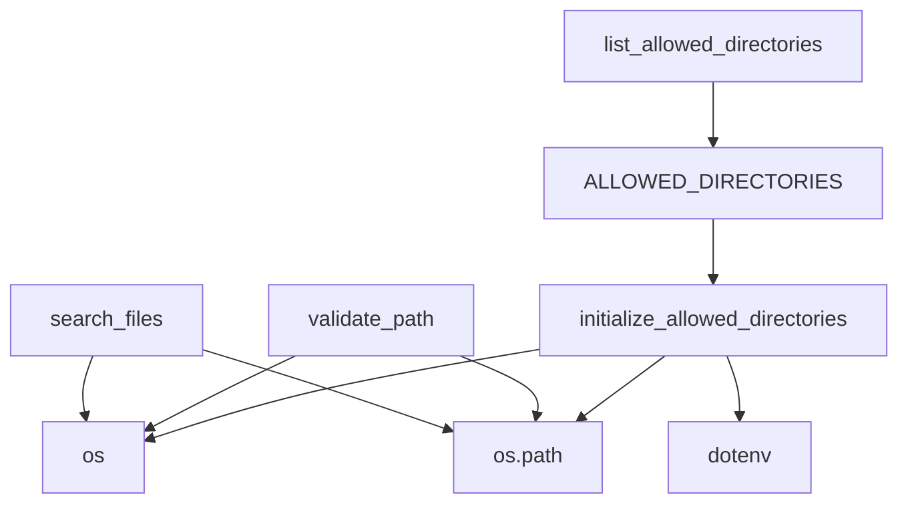

# 文件搜索功能

<cite>
**本文档引用的文件**
- [server.py](file://src/fs_mcp/server.py#L341-L403)
- [server.py](file://src/fs_mcp/server.py#L88-L110)
- [server.py](file://src/fs_mcp/server.py#L58-L85)
- [server.py](file://src/fs_mcp/server.py#L278-L288)
- [README.md](file://src/fs_mcp/README.md#L1-L94)
- [README.md](file://README.md#L1-L125)
</cite>

## 目录
1. [简介](#简介)
2. [项目结构](#项目结构)
3. [核心组件](#核心组件)
4. [架构概述](#架构概述)
5. [详细组件分析](#详细组件分析)
6. [依赖分析](#依赖分析)
7. [性能考量](#性能考量)
8. [故障排除指南](#故障排除指南)
9. [结论](#结论)

## 简介
本文档全面解析了基于 `fs_mcp` 模块实现的文件搜索功能。该功能允许用户在指定目录范围内，通过名称、扩展名或内容进行文件和目录的递归搜索。系统具备安全的路径验证机制，支持通配符模式匹配，并提供排除特定模式的高级功能。搜索过程不区分大小写，确保了更高的匹配灵活性。文档详细说明了搜索范围的限定机制、模糊匹配算法、请求参数配置以及返回结果格式，并结合实际用例探讨了在大型目录结构中的高效检索方法和性能优化建议。

## 项目结构
项目采用模块化设计，`fs_mcp` 模块专门负责文件系统操作。文件搜索功能是其核心工具之一，与其他文件读写、目录管理功能共同构成了完整的文件服务。项目根目录下的 `README.md` 提供了整体项目概述和启动方法，而 `fs_mcp` 模块内的 `README.md` 则详细描述了其提供的各项功能和安全配置。



**图示来源**
- [README.md](file://README.md#L1-L125)

**本节来源**
- [README.md](file://README.md#L1-L125)
- [README.md](file://src/fs_mcp/README.md#L1-L94)

## 核心组件
文件搜索功能的核心组件是 `search_files` 工具函数，它依赖于 `validate_path` 函数进行安全的路径验证，并通过 `ALLOWED_DIRECTORIES` 全局变量和 `initialize_allowed_directories` 函数来管理可访问的目录范围。这些组件共同确保了搜索操作既强大又安全。

**本节来源**
- [server.py](file://src/fs_mcp/server.py#L341-L403)
- [server.py](file://src/fs_mcp/server.py#L88-L110)
- [server.py](file://src/fs_mcp/server.py#L58-L85)

## 架构概述
文件搜索功能的架构围绕安全性和功能性构建。客户端发起搜索请求，服务器首先通过 `validate_path` 验证请求路径是否在 `ALLOWED_DIRECTORIES` 定义的安全范围内。验证通过后，`search_files` 函数使用 `os.walk` 进行深度优先的递归遍历，对每个文件和目录的名称执行不区分大小写的子字符串匹配。匹配结果经过排除模式过滤后，被格式化并返回给客户端。

```mermaid
graph TD
Client[客户端] --> |发起搜索请求| Server[服务器]
Server --> |验证路径| ValidatePath[validate_path]
ValidatePath --> |检查| AllowedDirs[ALLOWED_DIRECTORIES]
ValidatePath --> |路径有效| SearchFiles[search_files]
ValidatePath --> |路径无效| Error[返回错误]
SearchFiles --> |递归遍历| OSWalk[os.walk]
OSWalk --> |获取文件/目录名| ItemName[名称]
ItemName --> |转换为小写| LowerCase[lower()]
ItemName --> |与pattern_lower比较| Match{匹配?}
Match --> |是| ExcludeCheck[检查排除模式]
Match --> |否| NextItem[下一个项目]
ExcludeCheck --> |不应排除| AddToResults[添加到结果集]
ExcludeCheck --> |应排除| NextItem
AddToResults --> |所有项目处理完毕| FormatResult[格式化结果]
FormatResult --> |返回| Client
```

**图示来源**
- [server.py](file://src/fs_mcp/server.py#L341-L403)
- [server.py](file://src/fs_mcp/server.py#L88-L110)

## 详细组件分析
### search_files 函数分析
`search_files` 函数是实现文件搜索的核心。它接收起始路径、搜索模式和可选的排除模式列表作为参数。

#### 请求参数说明
- **path**: 搜索的起始目录路径。此路径必须在服务器配置的允许访问目录列表中。
- **pattern**: 搜索模式。这是一个字符串，函数会在文件和目录名称中搜索该字符串的子字符串。匹配过程不区分大小写。
- **exclude_patterns**: 要排除的模式列表。任何名称中包含这些模式的文件或目录都将被过滤掉。匹配同样不区分大小写。

#### 返回结果格式
函数返回一个字典，其 `content` 字段包含一个文本对象。文本内容为多行字符串，每行代表一个匹配项，格式为 `[DIR] 完整路径` 或 `[FILE] 完整路径`。如果没有找到匹配项，则返回相应的错误信息。



**图示来源**
- [server.py](file://src/fs_mcp/server.py#L341-L403)

**本节来源**
- [server.py](file://src/fs_mcp/server.py#L341-L403)

### 路径验证与安全控制分析
为了防止路径遍历攻击（如 `../../../etc/passwd`），系统实现了严格的路径验证机制。

#### ALLOWED_DIRECTORIES 与 initialize_allowed_directories
`ALLOWED_DIRECTORIES` 是一个全局列表，存储了服务器允许访问的所有目录的绝对路径。`initialize_allowed_directories` 函数负责初始化这个列表。它首先检查是否存在 `.env` 文件并加载环境变量，然后读取 `MCP_ALLOWED_DIRECTORIES` 环境变量（以分号分隔多个路径），将这些路径与函数参数中的路径合并，并转换为绝对路径。如果最终列表为空，则默认允许访问当前工作目录。



**图示来源**
- [server.py](file://src/fs_mcp/server.py#L58-L85)

**本节来源**
- [server.py](file://src/fs_mcp/server.py#L55-L55)
- [server.py](file://src/fs_mcp/server.py#L58-L85)
- [README.md](file://src/fs_mcp/README.md#L88-L94)

#### validate_path 函数
`validate_path` 函数是安全控制的关键。它接收一个路径，将其转换为绝对路径，然后与 `ALLOWED_DIRECTORIES` 中的每个允许目录进行比较。比较时，路径会被规范化并转换为小写（以适应Windows系统），并使用 `os.path.commonpath` 来检查目标路径是否位于允许目录之下。如果所有检查都通过，则返回规范化的绝对路径；否则，抛出 `PermissionError`。

**本节来源**
- [server.py](file://src/fs_mcp/server.py#L88-L110)

### list_allowed_directories 函数分析
`list_allowed_directories` 是一个辅助工具，用于查询服务器当前配置的允许访问目录列表。它无需输入参数，直接返回 `ALLOWED_DIRECTORIES` 列表中的所有路径，方便用户了解搜索的范围限制。

**本节来源**
- [server.py](file://src/fs_mcp/server.py#L278-L288)

## 依赖分析
文件搜索功能依赖于 Python 标准库中的 `os`、`os.path` 和 `shutil` 模块进行文件系统操作。它还依赖于 `pydantic` 库进行参数验证，`mcp` 库定义工具接口，并可选地依赖 `dotenv` 库来加载环境变量配置。这些依赖关系确保了功能的完整性和可配置性。



**图示来源**
- [server.py](file://src/fs_mcp/server.py#L341-L403)
- [server.py](file://src/fs_mcp/server.py#L58-L85)

**本节来源**
- [server.py](file://src/fs_mcp/server.py#L1-L940)

## 性能考量
文件搜索功能的性能主要受以下因素影响：
1.  **搜索范围深度和广度**：`os.walk` 的深度遍历开销与目录树的深度和每个目录中的文件/子目录数量成正比。在大型、深层的目录结构中，搜索可能非常耗时。
2.  **匹配算法**：当前实现使用简单的子字符串包含检查（`in` 操作符），对于每个文件/目录名，都需要将其转换为小写并与 `pattern_lower` 进行比较。虽然算法简单，但在海量文件上仍会产生显著开销。
3.  **排除模式检查**：对于每个匹配项，都需要遍历 `exclude_patterns_lower` 列表进行检查，增加了额外的计算量。

**优化建议**：
- **缩小搜索范围**：尽可能指定更具体的起始路径，避免从根目录或大型项目根目录开始搜索。
- **利用排除模式**：使用 `exclude_patterns` 参数排除 `node_modules`、`.git`、`__pycache__` 等大型且通常不需要搜索的目录，可以显著减少遍历的文件数量。
- **未来优化方向**：可以考虑引入索引机制，预先扫描并建立文件名索引，将搜索时间从 O(n) 降低到 O(1)，但这会增加存储和维护索引的复杂性。

**本节来源**
- [server.py](file://src/fs_mcp/server.py#L341-L403)

## 故障排除指南
- **"Error: 'xxx' is not a directory"**：请确认提供的 `path` 参数确实指向一个存在的目录。
- **"Access denied: Path 'xxx' is outside allowed directories"**：提供的路径不在 `ALLOWED_DIRECTORIES` 列表中。请检查 `MCP_ALLOWED_DIRECTORIES` 环境变量或服务器配置，确保目标目录已被授权。
- **"No files or directories found matching pattern 'xxx'"**：在指定路径下没有找到名称包含搜索模式的文件或目录。请注意搜索不区分大小写，但必须是子字符串匹配。
- **"Error searching files: ..."**：发生了未预期的异常。请检查路径权限、磁盘状态或服务器日志以获取更详细的错误信息。

**本节来源**
- [server.py](file://src/fs_mcp/server.py#L341-L403)
- [server.py](file://src/fs_mcp/server.py#L88-L110)

## 结论
`fs_mcp` 模块提供的 `search_files` 功能是一个安全、灵活的文件搜索工具。它通过严格的路径验证和目录访问控制确保了系统安全，通过不区分大小写的子字符串匹配提供了便捷的搜索体验。虽然其性能受限于深度遍历的固有开销，但通过合理配置允许的目录和使用排除模式，可以在大型项目中实现高效的文件检索。该功能是自动化文件管理和操作工作流中的重要组成部分。