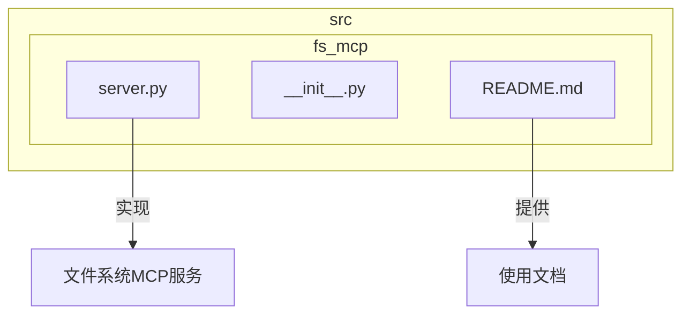
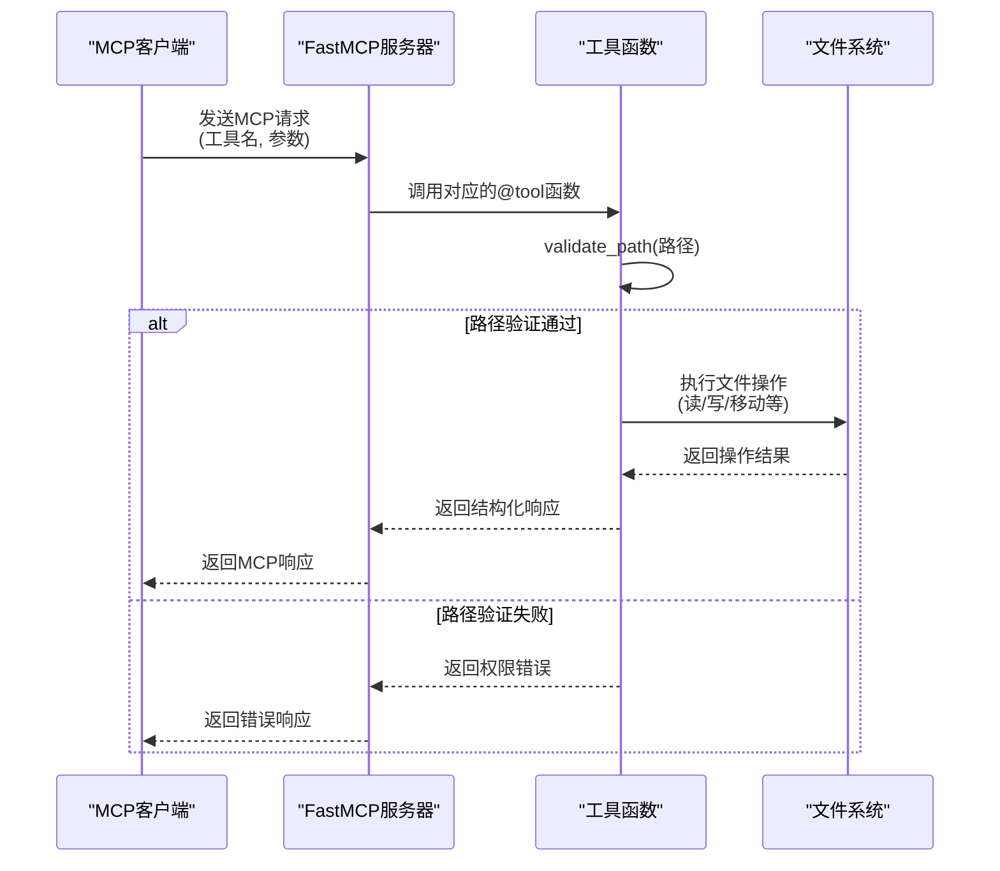
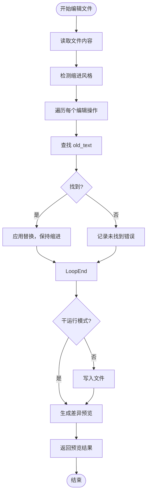
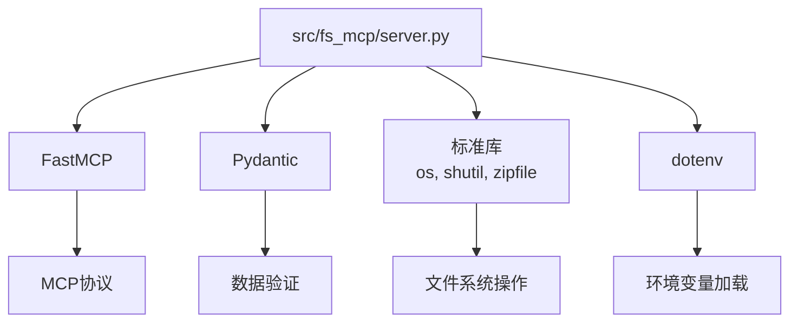

# 文件操作

<cite>
**本文档中引用的文件**   
- [server.py](file://src/fs_mcp/server.py#L1-L880)
- [README.md](file://src/fs_mcp/README.md#L1-L95)
- [README.md](file://README.md#L1-L126)
</cite>

## 目录
1. [简介](#简介)
2. [项目结构](#项目结构)
3. [核心组件](#核心组件)
4. [架构概述](#架构概述)
5. [详细组件分析](#详细组件分析)
6. [依赖分析](#依赖分析)
7. [性能考虑](#性能考虑)
8. [故障排除指南](#故障排除指南)
9. [结论](#结论)

## 简介
本文档深入分析了基于 Model Context Protocol (MCP) 的文件系统服务，重点介绍 `src/fs_mcp` 模块中实现的文件读取、写入、移动、删除等核心操作。该服务通过 `FastMCP` 框架提供安全的文件系统访问能力，支持文本文件、媒体文件的读写，目录管理，文件搜索与元数据查询，以及高级文件编辑和压缩功能。文档详细解释了其接口定义、实现逻辑、安全机制和使用方法，旨在为开发者和用户提供全面的技术参考。

## 项目结构
`fs_mcp` 模块是 `test_mcp_server` 项目中的一个独立组件，专门负责文件系统操作。其结构简洁，主要由 `server.py` 和 `__init__.py` 两个文件构成。`server.py` 是核心实现文件，包含了所有工具函数和服务器逻辑；`__init__.py` 为空，表明该模块可直接导入。整个项目采用模块化设计，`fs_mcp` 与 `element_plus_mcp`、`mysql_mcp` 等其他服务并列，通过统一的 MCP 协议对外提供服务。



**Diagram sources**
- [src/fs_mcp/server.py](file://src/fs_mcp/server.py#L1-L880)
- [src/fs_mcp/README.md](file://src/fs_mcp/README.md#L1-L95)

**Section sources**
- [src/fs_mcp/server.py](file://src/fs_mcp/server.py#L1-L880)
- [src/fs_mcp/README.md](file://src/fs_mcp/README.md#L1-L95)

## 核心组件
`fs_mcp` 模块的核心是 `server.py` 文件中定义的 `mcp` 实例和一系列以 `@mcp.tool()` 装饰器标记的工具函数。这些工具函数构成了服务的 API 接口，允许客户端通过 MCP 协议调用。核心功能包括：
- **文件读写**：`read_text_file`, `write_file`, `read_media_file`
- **目录管理**：`create_directory`, `list_directory`
- **文件操作**：`move_file`, `delete_file`, `compress_to_zip`
- **搜索与元数据**：`search_files`, `get_file_info`
- **高级编辑**：`edit_file`

所有操作都通过 `validate_path` 函数进行路径安全校验，确保操作仅限于预定义的允许目录内，防止路径遍历等安全风险。

**Section sources**
- [src/fs_mcp/server.py](file://src/fs_mcp/server.py#L1-L880)

## 架构概述
该文件系统服务采用典型的微服务架构，基于 `FastMCP` 框架构建。`FastMCP` 作为服务器运行时，注册了多个工具函数。当客户端发起 MCP 请求时，服务器会根据请求的工具名称调用相应的函数，执行文件系统操作，并将结果封装后返回。



**Diagram sources**
- [src/fs_mcp/server.py](file://src/fs_mcp/server.py#L17-L28)
- [src/fs_mcp/server.py](file://src/fs_mcp/server.py#L88-L110)

## 详细组件分析
本节将深入分析 `server.py` 中的关键组件，包括数据模型、核心函数和安全机制。

### 工具函数与接口定义
所有文件操作都通过 `@mcp.tool()` 装饰器暴露为 MCP 工具。函数参数使用 Pydantic 的 `Field` 进行注解，定义了参数的描述、默认值和约束，确保了接口的清晰和健壮。

#### 文件读取与写入
`read_text_file` 和 `write_file` 是最基础的文件操作工具。
- **请求数据结构**:
  - `path` (str): 文件路径，必填。
  - `encoding` (str): 文件编码，默认为 "utf-8"。
  - `head`/`tail` (int): 用于 `read_text_file`，指定读取文件的前N行或后N行。
  - `content` (str): 用于 `write_file`，指定要写入的文本内容。
- **响应数据结构**: 统一返回一个字典，其 `content` 字段是一个包含类型和内容的列表。例如，成功读取文件会返回 `{"content": [{"type": "text", "text": "文件内容..."}]}`。

```python
@mcp.tool()
def read_text_file(
    path: str = Field(..., description="要读取的文件路径"),
    head: int = Field(0, description="要读取的文件的前N行"),
    tail: int = Field(0, description="要读取的文件的后N行"),
    encoding: str = Field("utf-8", description="文件的编码"),
) -> Dict[str, Any]:
    # 实现逻辑
    ...
```

**Section sources**
- [src/fs_mcp/server.py](file://src/fs_mcp/server.py#L113-L151)

#### 高级文件编辑
`edit_file` 工具提供了强大的文件编辑能力，支持多处同时修改和干运行预览。

- **请求数据结构**:
  - `path` (str): 要编辑的文件路径。
  - `edits` (List[EditOperation]): 编辑操作列表。
  - `dry_run` (bool): 是否为干运行模式，默认为 `False`。
  
  其中，`EditOperation` 是一个 Pydantic 模型，定义了单个编辑操作：
  ```python
  class EditOperation(BaseModel):
      old_text: str = Field(..., description="要搜索的文本（可以是子字符串）")
      new_text: str = Field(..., description="要替换的文本")
  ```

- **实现逻辑**:
  1. 读取文件原始内容。
  2. 检测文件的缩进风格（使用 `_detect_indent_style` 函数）。
  3. 对每个 `EditOperation`，在原始内容中查找 `old_text` 并替换为 `new_text`，同时尝试保持原始缩进（使用 `_get_line_indent` 函数）。
  4. 如果是干运行 (`dry_run=True`)，则生成差异 (`diff`) 并返回预览，不保存文件。
  5. 如果不是干运行，则将修改后的内容写回文件。



**Diagram sources**
- [src/fs_mcp/server.py](file://src/fs_mcp/server.py#L489-L491)
- [src/fs_mcp/server.py](file://src/fs_mcp/server.py#L801-L832)

**Section sources**
- [src/fs_mcp/server.py](file://src/fs_mcp/server.py#L493-L588)

#### 文件压缩
`compress_to_zip` 工具可以将单个文件或整个目录压缩成 zip 包。

- **请求数据结构**:
  - `path` (str): 要压缩的文件或目录路径。
  - `output_dir` (Optional[str]): 输出 zip 文件的目录。
  - `compression_level` (int): 压缩级别 (0-9)。
  - `follow_symlinks` (bool): 是否跟随符号链接。
  - `exclude_patterns` (Optional[List[str]]): 要排除的文件模式列表。

- **实现逻辑**:
  1. 验证路径并检查读取权限。
  2. 确定输出目录，并检查写入权限。
  3. 生成 zip 文件名，如果文件已存在则添加数字后缀。
  4. 使用 `zipfile.ZipFile` 创建 zip 文件。
  5. 如果是文件，直接添加；如果是目录，则递归遍历，应用排除模式，并处理空目录。
  6. 计算并返回压缩率等统计信息。

**Section sources**
- [src/fs_mcp/server.py](file://src/fs_mcp/server.py#L619-L799)

### 安全与权限控制
安全是该服务的核心设计原则，主要通过以下机制实现：

#### 目录访问控制
服务通过 `ALLOWED_DIRECTORIES` 全局变量定义了允许访问的目录列表。其初始化过程如下：
1. 检查项目根目录是否存在 `.env` 文件，如果存在则加载。
2. 从环境变量 `MCP_ALLOWED_DIRECTORIES` 中读取目录列表（以分号分隔）。
3. 将环境变量中的目录与代码中传入的目录合并。
4. 将所有目录转换为绝对路径，并过滤掉不存在的目录。
5. 如果最终列表为空，则默认允许访问当前工作目录。

```python
def initialize_allowed_directories(*directories: str) -> None:
    # ... 加载 .env 和环境变量 ...
    ALLOWED_DIRECTORIES = [os.path.abspath(d) for d in directories if os.path.exists(d)]
    if not ALLOWED_DIRECTORIES:
        ALLOWED_DIRECTORIES = [os.getcwd()]
```

**Section sources**
- [src/fs_mcp/server.py](file://src/fs_mcp/server.py#L58-L85)

#### 路径安全校验
`validate_path` 函数是防止路径遍历攻击的关键。它确保任何操作的路径都必须在 `ALLOWED_DIRECTORIES` 列表中的某个目录之下。

- **实现逻辑**:
  1. 将输入路径转换为绝对路径。
  2. 遍历 `ALLOWED_DIRECTORIES` 中的每个允许目录。
  3. 使用 `os.path.commonpath` 计算输入路径和允许目录的公共路径。
  4. 如果公共路径等于允许目录本身，则说明输入路径在该目录之下，验证通过。
  5. 为了兼容 Windows 的大小写不敏感特性，比较前会将路径规范化并转换为小写。
  6. 如果所有允许目录都无法通过验证，则抛出 `PermissionError`。

```python
def validate_path(path: str) -> str:
    abs_path = os.path.abspath(path)
    for allowed_dir in ALLOWED_DIRECTORIES:
        try:
            norm_abs_path = os.path.normpath(abs_path).lower()
            norm_allowed_dir = os.path.normpath(allowed_dir).lower()
            common_path = os.path.commonpath([norm_abs_path, norm_allowed_dir])
            if common_path == norm_allowed_dir:
                return abs_path
        except ValueError:
            continue
    raise PermissionError(f"Access denied: Path '{path}' is outside allowed directories")
```

**Section sources**
- [src/fs_mcp/server.py](file://src/fs_mcp/server.py#L88-L110)

## 依赖分析
`fs_mcp` 模块的依赖关系清晰，主要依赖于 Python 标准库和 `FastMCP` 框架。



**Diagram sources**
- [src/fs_mcp/server.py](file://src/fs_mcp/server.py#L1-L880)

**Section sources**
- [src/fs_mcp/server.py](file://src/fs_mcp/server.py#L1-L880)

## 性能考虑
对于大文件操作，当前实现存在潜在的性能瓶颈：
- **流式处理缺失**：`read_text_file` 和 `write_file` 会一次性将整个文件加载到内存中。对于大文件，这可能导致内存溢出。**优化建议**：实现流式读写接口，分块处理文件。
- **批量操作**：`read_multiple_files` 会顺序读取文件，效率较低。**优化建议**：在支持异步的框架中，可以使用并发或并行处理来加速批量读取。
- **压缩性能**：`compress_to_zip` 在处理大型目录时可能耗时较长。**优化建议**：提供进度反馈，并允许客户端中断操作。

## 故障排除指南
### 常见问题与应对策略
- **权限不足 (PermissionError)**:
  - **原因**: 操作的文件或目录没有相应的读写权限，或路径不在 `ALLOWED_DIRECTORIES` 列表中。
  - **解决**: 检查文件系统权限，并确保 `MCP_ALLOWED_DIRECTORIES` 环境变量配置正确。

- **路径遍历攻击防护**:
  - **现象**: 尝试访问 `../` 等上级目录时返回 "Access denied" 错误。
  - **说明**: 这是 `validate_path` 函数的正常安全行为，旨在防止恶意路径访问。

- **文件锁定 (File Locking)**:
  - **原因**: 目标文件正被其他进程占用。
  - **解决**: 当前实现会直接返回错误。**增强策略**：可以实现重试机制，或在错误信息中提示用户关闭占用程序。

- **编码错误 (UnicodeDecodeError)**:
  - **原因**: 使用错误的编码（如用 `utf-8` 读取 `gbk` 编码的文件）。
  - **解决**: 在调用 `read_text_file` 时，明确指定正确的 `encoding` 参数。

## 结论
`fs_mcp` 模块提供了一套功能丰富且安全的文件系统操作服务。其通过 `FastMCP` 框架暴露工具接口，利用 Pydantic 进行数据验证，并通过严格的路径校验机制保障了安全性。文档详细分析了其核心功能、数据结构、安全机制和潜在的性能优化点。开发者在使用时应重点关注目录权限配置和路径安全，以确保服务的稳定和安全运行。未来可通过引入流式处理来进一步提升大文件操作的性能。