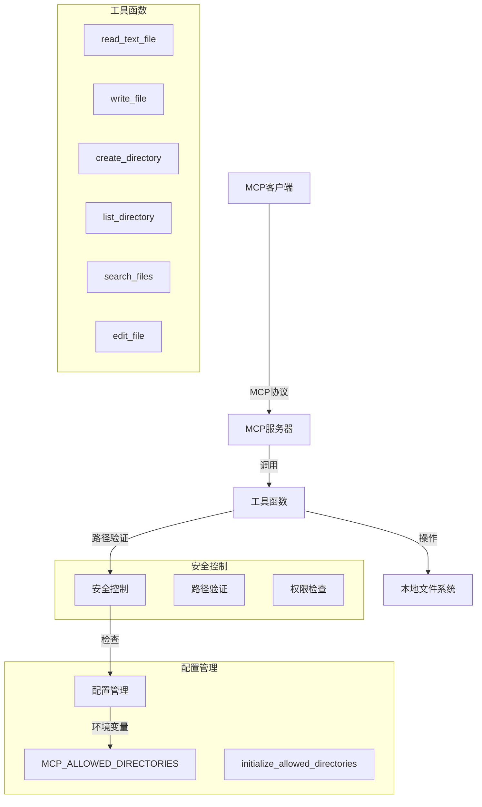
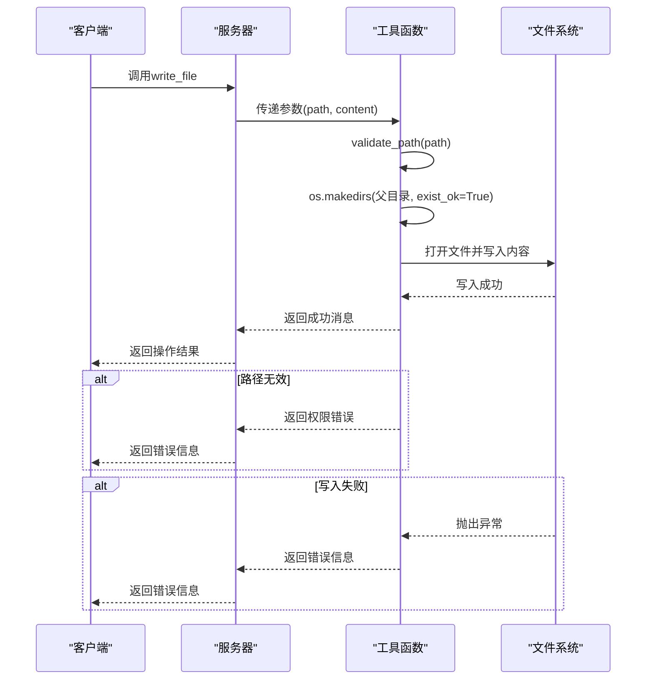
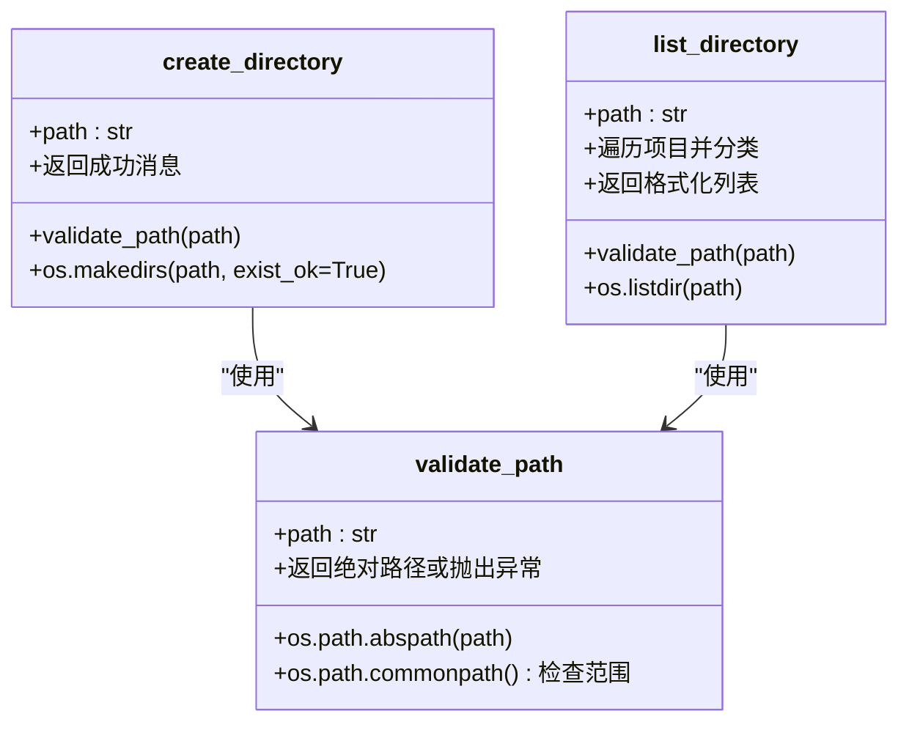
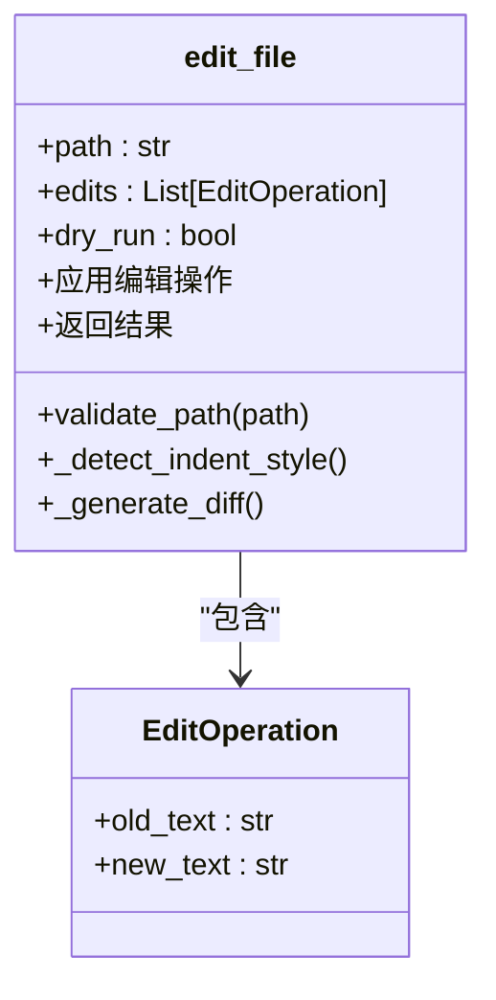
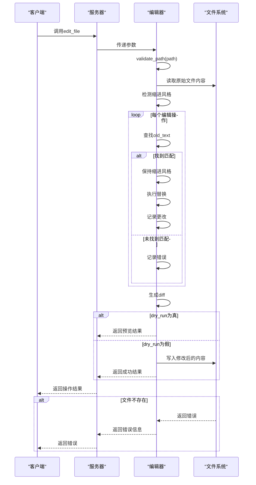
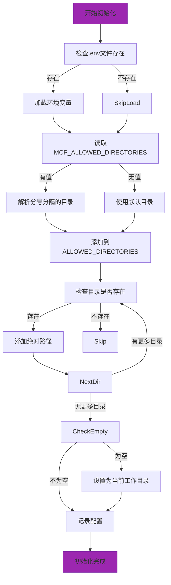

# 文件系统服务

<cite>
**本文档中引用的文件**   
- [server.py](file://src/fs_mcp/server.py#L1-L759)
- [__init__.py](file://src/fs_mcp/__init__.py#L1)
- [README.md](file://src/fs_mcp/README.md#L1-L95)
</cite>

## 目录
1. [项目结构](#项目结构)
2. [核心组件](#核心组件)
3. [架构概述](#架构概述)
4. [详细组件分析](#详细组件分析)
5. [依赖分析](#依赖分析)
6. [性能考虑](#性能考虑)
7. [故障排除指南](#故障排除指南)
8. [结论](#结论)

## 项目结构

文件系统服务（fs_mcp）是MCP（Model Context Protocol）框架的一个模块，位于`src/fs_mcp`目录下。该模块提供了一套安全的文件和目录操作功能，允许通过MCP协议执行文件读写、目录管理、文件搜索等操作。


**图源**
- [server.py](file://src/fs_mcp/server.py#L1-L759)
- [__init__.py](file://src/fs_mcp/__init__.py#L1)
- [README.md](file://src/fs_mcp/README.md#L1-L95)

**本节源**
- [server.py](file://src/fs_mcp/server.py#L1-L759)
- [__init__.py](file://src/fs_mcp/__init__.py#L1)
- [README.md](file://src/fs_mcp/README.md#L1-L95)

## 核心组件

文件系统服务的核心功能由`server.py`文件实现，主要包含以下组件：

- **MCP服务器实例**：通过`FastMCP("FileSystem")`创建，提供文件系统操作的入口。
- **路径验证机制**：`validate_path`函数确保所有操作都在允许的目录范围内，防止路径遍历攻击。
- **工具函数**：通过`@mcp.tool()`装饰器定义的多个文件操作函数，如`read_text_file`、`write_file`、`create_directory`等。
- **数据模型**：基于Pydantic定义的`EditOperation`类，用于文件编辑操作的参数验证。
- **命令行接口**：通过Click库实现的`main`函数，支持通过命令行启动服务器。

这些组件共同构成了一个安全、可扩展的文件系统服务，能够通过MCP协议与客户端进行交互。

**本节源**
- [server.py](file://src/fs_mcp/server.py#L1-L759)

## 架构概述

文件系统服务采用模块化设计，基于FastMCP框架构建，实现了安全的文件系统操作。其架构主要包括以下几个层次：



**图源**
- [server.py](file://src/fs_mcp/server.py#L1-L759)

**本节源**
- [server.py](file://src/fs_mcp/server.py#L1-L759)

## 详细组件分析

### 文件读写功能分析

文件系统服务提供了强大的文件读写功能，包括文本文件和媒体文件的处理。

#### 文本文件读取
`read_text_file`工具函数用于读取文本文件内容，支持多种编码格式和部分内容读取。


**图源**
- [server.py](file://src/fs_mcp/server.py#L118-L153)

**本节源**
- [server.py](file://src/fs_mcp/server.py#L118-L153)

#### 文件写入
`write_file`工具函数用于向文件系统写入文本内容，支持自动创建父目录。



**图源**
- [server.py](file://src/fs_mcp/server.py#L214-L233)

**本节源**
- [server.py](file://src/fs_mcp/server.py#L214-L233)

### 目录管理功能分析

文件系统服务提供了完整的目录管理功能，包括创建、浏览和搜索。

#### 目录创建与浏览
`create_directory`和`list_directory`工具函数分别用于创建目录和列出目录内容。



**图源**
- [server.py](file://src/fs_mcp/server.py#L237-L274)
- [server.py](file://src/fs_mcp/server.py#L252-L274)
- [server.py](file://src/fs_mcp/server.py#L88-L110)

**本节源**
- [server.py](file://src/fs_mcp/server.py#L237-L274)
- [server.py](file://src/fs_mcp/server.py#L252-L274)
- [server.py](file://src/fs_mcp/server.py#L88-L110)

#### 文件搜索
`search_files`工具函数提供递归搜索功能，支持模式匹配和排除规则。


**图源**
- [server.py](file://src/fs_mcp/server.py#L341-L394)

**本节源**
- [server.py](file://src/fs_mcp/server.py#L341-L394)

### 文件编辑功能分析

`edit_file`工具函数提供了高级的文件编辑功能，支持批量编辑、干运行预览和Git风格差异输出。

#### 数据模型
`EditOperation`类定义了编辑操作的数据结构。



**图源**
- [server.py](file://src/fs_mcp/server.py#L456-L458)
- [server.py](file://src/fs_mcp/server.py#L462-L568)

**本节源**
- [server.py](file://src/fs_mcp/server.py#L456-L458)
- [server.py](file://src/fs_mcp/server.py#L462-L568)

#### 编辑流程
文件编辑功能的执行流程如下：



**图源**
- [server.py](file://src/fs_mcp/server.py#L462-L568)

**本节源**
- [server.py](file://src/fs_mcp/server.py#L462-L568)

### 配置与启动分析

文件系统服务的配置和启动通过环境变量和命令行参数实现。

#### 配置管理
`initialize_allowed_directories`函数负责初始化允许访问的目录列表。



**图源**
- [server.py](file://src/fs_mcp/server.py#L49-L84)
- [README.md](file://src/fs_mcp/README.md#L1-L95)

**本节源**
- [server.py](file://src/fs_mcp/server.py#L49-L84)
- [README.md](file://src/fs_mcp/README.md#L1-L95)

#### 命令行接口
`main`函数通过Click库提供命令行接口，支持不同的传输协议和端口配置。

```mermaid
classDiagram
class main {
+transport : str
+port : int
+run_server(app)
+mcp.run()
}
main --> Click["使用Click装饰器"]
main --> CORSMiddleware["使用CORS中间件"]
main --> Uvicorn["使用Uvicorn运行"]
```

**图源**
- [server.py](file://src/fs_mcp/server.py#L688-L741)

**本节源**
- [server.py](file://src/fs_mcp/server.py#L688-L741)

## 依赖分析

文件系统服务依赖于多个外部库和框架，其依赖关系如下：

```mermaid
graph TD
fs_mcp["fs_mcp模块"]
fastmcp["FastMCP框架"]
pydantic["Pydantic"]
click["Click"]
dotenv["python-dotenv"]
uvicorn["Uvicorn"]
starlette["Starlette"]
fs_mcp --> fastmcp
fs_mcp --> pydantic
fs_mcp --> click
fs_mcp --> dotenv
fs_mcp --> uvicorn
fs_mcp --> starlette
subgraph "核心框架"
fastmcp
pydantic
starlette
end
subgraph "工具库"
click
dotenv
uvicorn
end
fastmcp --> pydantic
starlette --> uvicorn
fastmcp --> starlette
```

**图源**
- [server.py](file://src/fs_mcp/server.py#L1-L759)

**本节源**
- [server.py](file://src/fs_mcp/server.py#L1-L759)

## 性能考虑

文件系统服务在设计时考虑了性能和安全性，主要体现在以下几个方面：

1. **路径验证优化**：`validate_path`函数使用`os.path.commonpath`进行路径范围检查，避免了复杂的字符串操作。
2. **批量操作支持**：`read_multiple_files`工具函数支持同时读取多个文件，减少了网络往返次数。
3. **内存效率**：文件读取操作使用上下文管理器，确保文件句柄及时关闭，避免内存泄漏。
4. **错误处理**：每个工具函数都有完善的异常处理机制，确保单个操作失败不会影响整个服务。
5. **并发安全**：基于FastMCP框架，支持多客户端并发访问。

尽管如此，在处理大文件或大量文件时仍需注意性能影响，建议在生产环境中设置合理的超时和资源限制。

## 故障排除指南

在使用文件系统服务时，可能会遇到以下常见问题：

**本节源**
- [server.py](file://src/fs_mcp/server.py#L1-L759)
- [README.md](file://src/fs_mcp/README.md#L1-L95)

### 权限错误
当出现"Access denied"错误时，通常是由于路径不在允许的目录范围内。

**排查步骤**：
1. 检查`MCP_ALLOWED_DIRECTORIES`环境变量配置
2. 确认请求的路径是否在允许的目录内
3. 检查文件系统权限

```python
# 示例：检查允许的目录
@mcp.tool()
def list_allowed_directories() -> Dict[str, Any]:
    """
    列出服务器允许访问的所有目录。
    无需输入参数。
    """
    if not ALLOWED_DIRECTORIES:
        return {"content": [{"type": "text", "text": "No allowed directories configured"}]}

    return {
        "content": [{"type": "text", "text": "\n".join([f"[ALLOWED] {dir_path}" for dir_path in ALLOWED_DIRECTORIES])}]
    }
```

### 路径异常
当出现路径相关错误时，可能是由于路径格式不正确或文件不存在。

**排查步骤**：
1. 验证路径格式是否正确
2. 检查文件或目录是否存在
3. 确认路径是否使用正确的分隔符

### 配置问题
当服务无法启动或功能异常时，可能是配置问题。

**排查步骤**：
1. 检查`.env`文件是否存在且配置正确
2. 确认环境变量已正确加载
3. 查看启动日志中的配置信息

```bash
# 正确的配置示例
MCP_ALLOWED_DIRECTORIES=C:\Users\YourName\Documents;D:\Projects;E:\Data
```

## 结论

文件系统服务（fs_mcp）是一个功能完善、安全可靠的MCP模块，提供了全面的文件系统操作功能。通过深入分析其代码结构和实现细节，我们可以看到该服务具有以下特点：

1. **安全性高**：通过严格的路径验证机制，防止路径遍历攻击。
2. **功能全面**：支持文件读写、目录管理、文件搜索、高级编辑等多种操作。
3. **易于配置**：通过环境变量和命令行参数灵活配置服务行为。
4. **可扩展性强**：基于MCP框架，易于与其他服务集成。

该服务适用于需要安全文件系统访问的AI助手应用场景，为模型提供了与本地文件系统交互的能力，同时确保了操作的安全性。