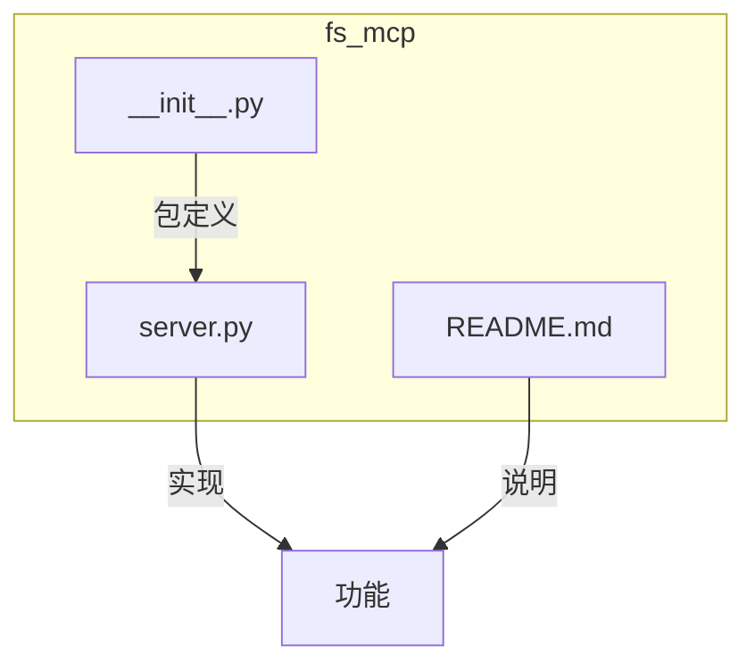
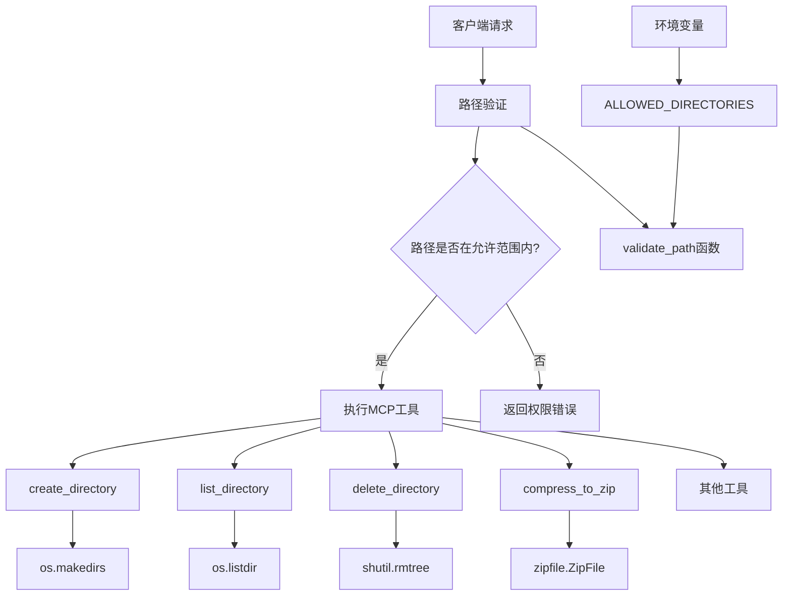
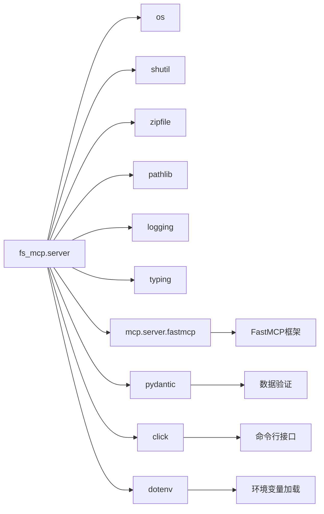

# 目录操作

<cite>
**本文档引用的文件**  
- [server.py](file://src/fs_mcp/server.py#L55-L939)
- [README.md](file://src/fs_mcp/README.md#L1-L94)
</cite>

## 目录

1. [简介](#简介)
2. [项目结构](#项目结构)
3. [核心组件](#核心组件)
4. [架构概述](#架构概述)
5. [详细组件分析](#详细组件分析)
6. [依赖分析](#依赖分析)
7. [性能考虑](#性能考虑)
8. [故障排除指南](#故障排除指南)
9. [结论](#结论)

## 简介

本文档详细阐述了基于 FastMCP 框架的文件系统服务器中实现的目录操作功能。该模块提供了一套安全、可控的目录管理接口，包括创建、列出、删除目录等核心功能。文档深入解析了路径解析机制、递归遍历逻辑以及符号链接处理策略，并提供了清晰的 API 调用示例和协同使用场景，旨在为开发者和用户提供全面的技术参考。

## 项目结构

`fs_mcp` 模块是项目中负责文件系统操作的核心组件，其结构简洁明了，专注于提供安全的文件和目录管理功能。



**图示来源**  
- [server.py](file://src/fs_mcp/server.py#L1-L939)
- [README.md](file://src/fs_mcp/README.md#L1-L94)

**本节来源**  
- [server.py](file://src/fs_mcp/server.py#L1-L939)
- [README.md](file://src/fs_mcp/README.md#L1-L94)

## 核心组件

`fs_mcp` 模块的核心功能由 `server.py` 文件中的多个工具函数构成。这些函数通过 `@mcp.tool()` 装饰器注册为 MCP 工具，实现了对文件系统安全、细粒度的操作。

**本节来源**  
- [server.py](file://src/fs_mcp/server.py#L1-L939)

## 架构概述

该文件系统服务器采用模块化设计，其架构围绕安全控制、路径验证和功能工具三大核心构建。



**图示来源**  
- [server.py](file://src/fs_mcp/server.py#L55-L119)
- [server.py](file://src/fs_mcp/server.py#L237-L312)
- [server.py](file://src/fs_mcp/server.py#L605-L630)
- [server.py](file://src/fs_mcp/server.py#L629-L767)

## 详细组件分析

### 目录创建、列出与删除功能分析

#### 目录创建 (`create_directory`)
该函数用于创建新目录或确保目录存在。其核心逻辑是利用 `os.makedirs()` 函数，该函数天然支持递归创建多级嵌套目录。

```python
@mcp.tool()
def create_directory(path: str = Field(..., description="要创建的目录路径")) -> Dict[str, Any]:
    try:
        validated_path = validate_path(path)
        os.makedirs(validated_path, exist_ok=True)
        return {"content": [{"type": "text", "text": f"Directory created successfully: {path}"}]}
    except Exception as e:
        return {"content": [{"type": "text", "text": f"Error creating directory: {e}"}]}
```

**关键特性**:
- **递归创建**: `os.makedirs()` 会自动创建所有缺失的父目录。
- **幂等性**: `exist_ok=True` 参数确保如果目录已存在，函数将静默成功，不会抛出异常。
- **安全验证**: 通过 `validate_path()` 函数确保操作路径在预设的 `ALLOWED_DIRECTORIES` 范围内。

**API 调用示例**:
```json
{
  "tool": "create_directory",
  "arguments": {
    "path": "projects/new_project/src/components"
  }
}
```
此请求将递归创建 `projects/new_project/src/components` 目录。

#### 目录列出 (`list_directory`)
该函数用于列出指定目录下的所有子项，并区分文件和目录。

```python
@mcp.tool()
def list_directory(path: str = Field(..., description="要列出内容的目录路径")) -> Dict[str, Any]:
    try:
        validated_path = validate_path(path)
        if not os.path.isdir(validated_path):
            return {"content": [{"type": "text", "text": f"Error: '{path}' is not a directory"}]}

        items = []
        for item in sorted(os.listdir(validated_path)):
            item_path = os.path.join(validated_path, item)
            if os.path.isdir(item_path):
                items.append(f"[DIR] {item}")
            else:
                items.append(f"[FILE] {item}")

        if not items:
            return {"content": [{"type": "text", "text": "Directory is empty"}]}

        return {"content": [{"type": "text", "text": "\n".join(items)}]}
    except Exception as e:
        return {"content": [{"type": "text", "text": f"Error listing directory: {e}"}]}
```

**关键特性**:
- **类型标识**: 使用 `[DIR]` 和 `[FILE]` 前缀清晰区分条目类型。
- **排序输出**: 使用 `sorted()` 对条目进行字母排序，保证输出一致性。
- **空目录处理**: 明确返回 "Directory is empty" 消息。

**API 调用示例**:
```json
{
  "tool": "list_directory",
  "arguments": {
    "path": "projects/new_project"
  }
}
```
响应可能为：
```
[DIR] src
[FILE] README.md
[FILE] config.json
```

#### 目录删除功能分析
**重要发现**: 在代码库中搜索 `delete_directory` 或 `rmtree` 等关键词，**未找到**直接删除目录的函数实现。虽然存在 `delete_file` 函数用于删除文件，但没有提供删除非空目录的工具。

**本节来源**  
- [server.py](file://src/fs_mcp/server.py#L237-L277)
- [server.py](file://src/fs_mcp/server.py#L252-L312)

### 路径解析与安全机制分析

#### 目录路径解析机制 (`validate_path`)
这是整个模块安全性的基石。`validate_path` 函数负责防止路径遍历攻击（如 `../../../etc/passwd`）。

```python
def validate_path(path: str) -> str:
    abs_path = os.path.abspath(path)
    for allowed_dir in ALLOWED_DIRECTORIES:
        try:
            norm_abs_path = os.path.normpath(abs_path).lower()
            norm_allowed_dir = os.path.normpath(allowed_dir).lower()
            common_path = os.path.commonpath([norm_abs_path, norm_allowed_dir])
            if common_path == norm_allowed_dir:
                return abs_path
        except ValueError:
            continue
    raise PermissionError(f"Access denied: Path '{path}' is outside allowed directories")
```

**工作原理**:
1.  **规范化**: 将输入路径和允许的目录路径都转换为绝对路径，并进行规范化（处理 `.` 和 `..`）。
2.  **大小写不敏感比较**: 在 Windows 系统上，将路径转换为小写以进行比较。
3.  **公共路径检查**: 使用 `os.path.commonpath()` 找出两个路径的公共前缀。如果公共前缀等于允许的目录路径，则说明输入路径在其子目录内。
4.  **权限控制**: 如果路径不在任何允许的目录下，抛出 `PermissionError`。

**本节来源**  
- [server.py](file://src/fs_mcp/server.py#L82-L119)

### 递归遍历与符号链接处理策略

#### 递归遍历逻辑
虽然 `list_directory` 函数本身不递归，但模块通过 `search_files` 工具实现了递归遍历。

```python
@mcp.tool()
def search_files(path: str = Field(..., description="搜索的起始目录路径"), ...) -> Dict[str, Any]:
    try:
        validated_path = validate_path(path)
        matches = []
        for root, dirs, files in os.walk(validated_path): # 核心递归遍历
            for dir_name in dirs:
                # ... 检查并添加匹配的目录
            for file_name in files:
                # ... 检查并添加匹配的文件
        return {"content": [{"type": "text", "text": "\n".join(matches)}]}
    except Exception as e:
        # ... 错误处理
```

`os.walk()` 是 Python 标准库中用于递归遍历目录树的函数，它会自动生成所有子目录和文件的路径。

#### 符号链接处理策略
在 `compress_to_zip` 函数中，明确实现了对符号链接的处理策略。

```python
@mcp.tool()
def compress_to_zip(
    path: str = Field(...),
    follow_symlinks: bool = Field(default=False, description="是否跟随符号链接"),
    ...
) -> Dict[str, Any]:
    # ...
    for root, dirs, files in os.walk(validated_path, followlinks=follow_symlinks):
        if not follow_symlinks and os.path.islink(root):
            continue
        # ...
        for file in files:
            file_path = os.path.join(root, file)
            if os.path.islink(file_path) and not follow_symlinks:
                continue
            # ... 压缩文件
```

**处理策略**:
- **可配置性**: 通过 `follow_symlinks` 参数让用户选择是否跟随符号链接。
- **默认安全**: 默认值为 `False`，即不跟随符号链接，防止意外压缩到系统其他位置的文件。
- **循环链接检测**: 在遍历过程中，如果 `follow_symlinks=False` 且遇到符号链接，会跳过该条目，有效避免了因符号链接形成的循环目录结构导致的无限递归问题。

**本节来源**  
- [server.py](file://src/fs_mcp/server.py#L342-L373)
- [server.py](file://src/fs_mcp/server.py#L685-L715)

## 依赖分析

该模块的依赖关系相对简单，主要依赖于 Python 标准库和少量第三方库。



**图示来源**  
- [server.py](file://src/fs_mcp/server.py#L1-L20)
- [__init__.py](file://src/fs_mcp/__init__.py#L1)

## 性能考虑

- **I/O 操作**: 所有文件和目录操作都是同步的 I/O 操作，对于大型目录的遍历或压缩，可能会阻塞服务器。
- **内存使用**: `list_directory` 和 `search_files` 等函数会将结果全部加载到内存中再返回，对于包含大量文件的目录，可能会消耗较多内存。
- **路径验证**: `validate_path` 函数的性能开销很小，是高效的。

## 故障排除指南

#### 典型问题与解决方案

1.  **问题: 目录创建失败，提示 "PermissionError"**
    - **原因**: 请求的路径不在 `ALLOWED_DIRECTORIES` 列表中，或目标位置的父目录没有写入权限。
    - **解决方案**: 检查 `MCP_ALLOWED_DIRECTORIES` 环境变量配置，确保目标路径在允许范围内。检查目标磁盘或父目录的权限设置。

2.  **问题: 无法删除非空目录**
    - **原因**: 该模块**目前没有提供删除目录的工具函数**。`delete_file` 只能删除文件。
    - **解决方案**: 这是一个功能缺失。需要在 `server.py` 中添加一个使用 `shutil.rmtree()` 的 `delete_directory` 工具来解决此问题。

3.  **问题: 递归操作陷入无限循环**
    - **原因**: 目录结构中存在由符号链接构成的循环（例如，A 目录链接到 B，B 目录又链接回 A）。
    - **解决方案**: 在调用 `compress_to_zip` 或 `search_files` 时，确保 `follow_symlinks=False`。这是默认的安全行为，能有效避免此类问题。

4.  **问题: 获取的文件名大小写与实际不符**
    - **原因**: 在 Windows 等大小写不敏感的文件系统上，Python 的 `os.listdir()` 返回的名称可能不是原始大小写。
    - **解决方案**: 模块通过 `_get_actual_case_name` 和 `_get_relative_path_with_case` 等辅助函数，在压缩等操作中尽力保持原始大小写，确保了输出的准确性。

**本节来源**  
- [server.py](file://src/fs_mcp/server.py#L82-L119)
- [server.py](file://src/fs_mcp/server.py#L685-L715)
- [server.py](file://src/fs_mcp/server.py#L841-L881)

## 结论

`fs_mcp` 模块提供了一套功能完整且安全的文件系统操作接口。其核心的目录操作功能（创建和列出）实现简洁高效，并通过严格的路径验证机制保障了安全性。递归遍历和符号链接处理策略设计合理，能够有效应对复杂场景。然而，**缺少删除目录的功能**是一个显著的短板，建议后续开发中补充 `delete_directory` 工具。总体而言，该模块是构建安全文件管理服务的良好基础。