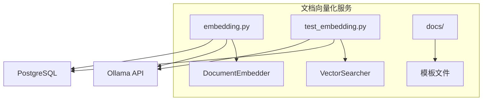
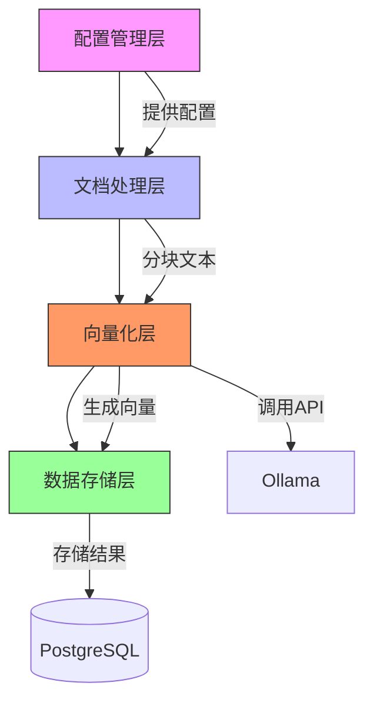
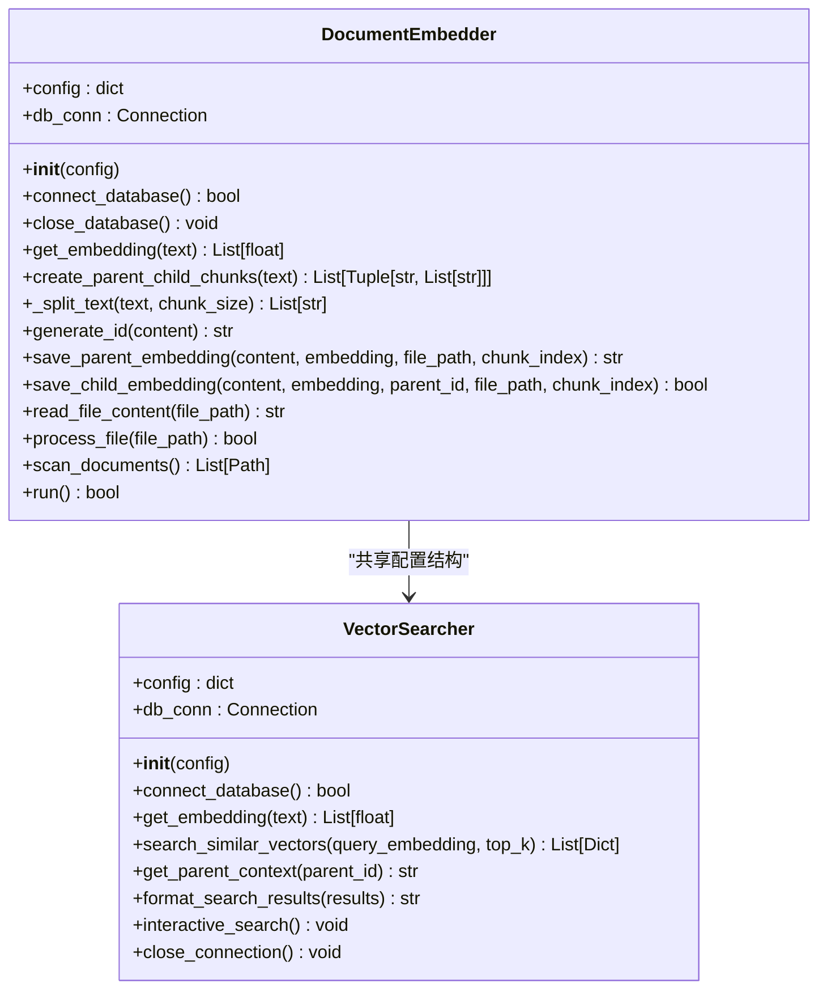
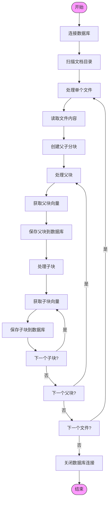
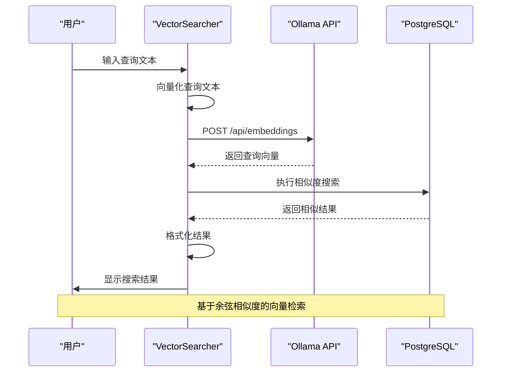
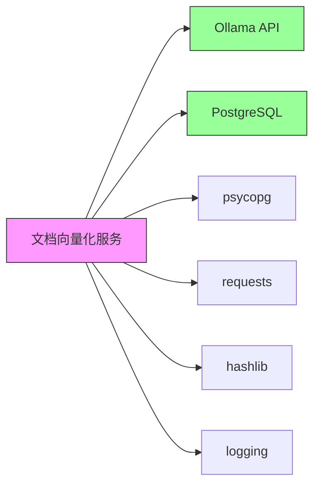

# 文档向量化服务

<cite>
**本文档中引用的文件**  
- [embedding.py](file://src/embedding/embedding.py#L65-L552)
- [test_embedding.py](file://src/embedding/test_embedding.py#L56-L329)
- [README.md](file://README.md#L0-L85)
- [CONFIG](file://src/embedding/embedding.py#L47-L63)
</cite>

## 目录
1. [简介](#简介)
2. [项目结构](#项目结构)
3. [核心组件](#核心组件)
4. [架构概述](#架构概述)
5. [详细组件分析](#详细组件分析)
6. [依赖分析](#依赖分析)
7. [性能考量](#性能考量)
8. [故障排除指南](#故障排除指南)
9. [结论](#结论)

## 简介
文档向量化服务是知识库检索系统的核心组件，负责将原始文档内容转换为可用于语义检索的向量表示。该服务通过调用Ollama的嵌入模型API，将文本内容转换为高维向量，并存储在PostgreSQL数据库中。系统采用父子分块策略，既保留了语义上下文的完整性，又提供了精确的检索粒度。本服务为知识库检索、智能问答等应用场景提供了基础支持。

## 项目结构
文档向量化服务位于`src/embedding`目录下，包含核心处理逻辑、测试脚本和文档模板。服务通过读取配置文件，连接Ollama嵌入模型服务和PostgreSQL数据库，实现文档的自动化向量化处理。

**图示来源**  
- [embedding.py](file://src/embedding/embedding.py#L65-L552)
- [test_embedding.py](file://src/embedding/test_embedding.py#L56-L329)

**本节来源**  
- [embedding.py](file://src/embedding/embedding.py#L1-L552)
- [project_structure](file://#L1-L20)

## 核心组件
文档向量化服务的核心组件包括`DocumentEmbedder`类和`VectorSearcher`类。`DocumentEmbedder`负责文档的读取、分块、向量化和存储，而`VectorSearcher`则负责查询的向量化和相似性搜索。两个组件共享相同的配置结构，确保了数据格式的一致性。

**本节来源**  
- [embedding.py](file://src/embedding/embedding.py#L65-L552)
- [test_embedding.py](file://src/embedding/test_embedding.py#L56-L329)

## 架构概述
文档向量化服务采用分层架构设计，包括配置管理层、文档处理层、向量化层和数据存储层。服务通过配置文件统一管理Ollama API地址、数据库连接信息和分块参数，实现了良好的可配置性和可维护性。

**图示来源**  
- [embedding.py](file://src/embedding/embedding.py#L47-L63)
- [embedding.py](file://src/embedding/embedding.py#L65-L552)

## 详细组件分析
### DocumentEmbedder 分析
`DocumentEmbedder`类是文档向量化服务的核心处理器，负责完整的文档处理流程。

#### 类图

**图示来源**  
- [embedding.py](file://src/embedding/embedding.py#L65-L552)
- [test_embedding.py](file://src/embedding/test_embedding.py#L56-L329)

#### 处理流程

**图示来源**  
- [embedding.py](file://src/embedding/embedding.py#L300-L450)

**本节来源**  
- [embedding.py](file://src/embedding/embedding.py#L65-L552)

### VectorSearcher 分析
`VectorSearcher`类负责向量搜索和知识库检索功能，提供交互式搜索界面。

#### 搜索流程

**图示来源**  
- [test_embedding.py](file://src/embedding/test_embedding.py#L56-L329)

**本节来源**  
- [test_embedding.py](file://src/embedding/test_embedding.py#L56-L329)

## 依赖分析
文档向量化服务依赖于多个外部组件和库，包括Ollama嵌入模型服务、PostgreSQL数据库和Python第三方库。

**图示来源**  
- [embedding.py](file://src/embedding/embedding.py#L1-L20)
- [test_embedding.py](file://src/embedding/test_embedding.py#L1-L20)

**本节来源**  
- [embedding.py](file://src/embedding/embedding.py#L1-L552)
- [test_embedding.py](file://src/embedding/test_embedding.py#L1-L329)

## 性能考量
文档向量化服务在设计时考虑了多项性能优化策略。父子分块结构在保持语义完整性的同时提高了检索精度；分块重叠机制确保了上下文的连续性；数据库自动提交模式简化了事务管理。服务配置中的`parent_chunk_size`和`child_chunk_size`参数可根据实际需求调整，以平衡处理速度和检索质量。向量维度固定为1536，与所使用的嵌入模型相匹配，确保了数据一致性。

## 故障排除指南
常见问题及解决方案：
- **数据库连接失败**：检查`db_config`中的主机、端口、用户名和密码是否正确
- **向量化失败**：确认Ollama服务正在运行且可通过`ollama_url`访问
- **无搜索结果**：尝试降低`similarity_threshold`阈值或增加`top_k`值
- **文件处理缓慢**：检查网络连接和Ollama服务性能，考虑调整分块大小
- **配置不生效**：确保配置文件路径正确，重启服务以加载新配置

**本节来源**  
- [embedding.py](file://src/embedding/embedding.py#L65-L552)
- [test_embedding.py](file://src/embedding/test_embedding.py#L56-L329)

## 结论
文档向量化服务通过将文档内容转换为向量表示，为知识库检索提供了强大的语义搜索能力。服务采用模块化设计，具有良好的可扩展性和可维护性。父子分块策略创新性地平衡了语义完整性和检索精度，为复杂文档的处理提供了有效解决方案。通过合理的配置和优化，该服务能够高效处理大规模文档集合，为智能问答、文档检索等应用场景提供可靠支持。