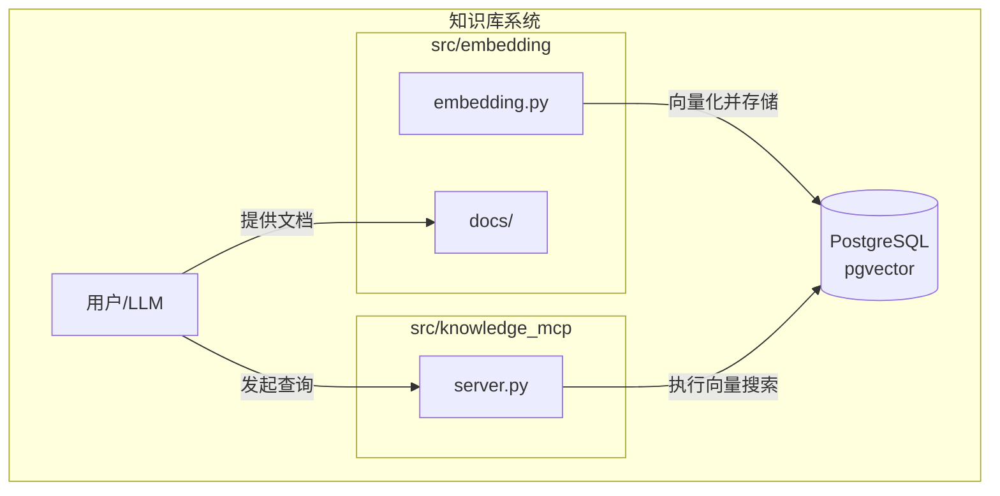
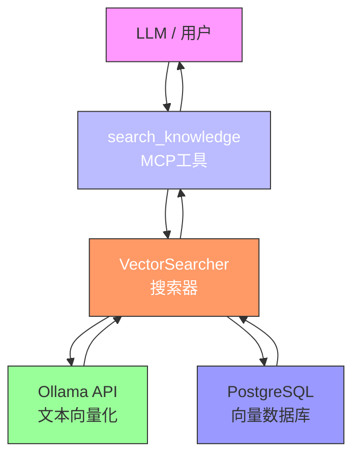
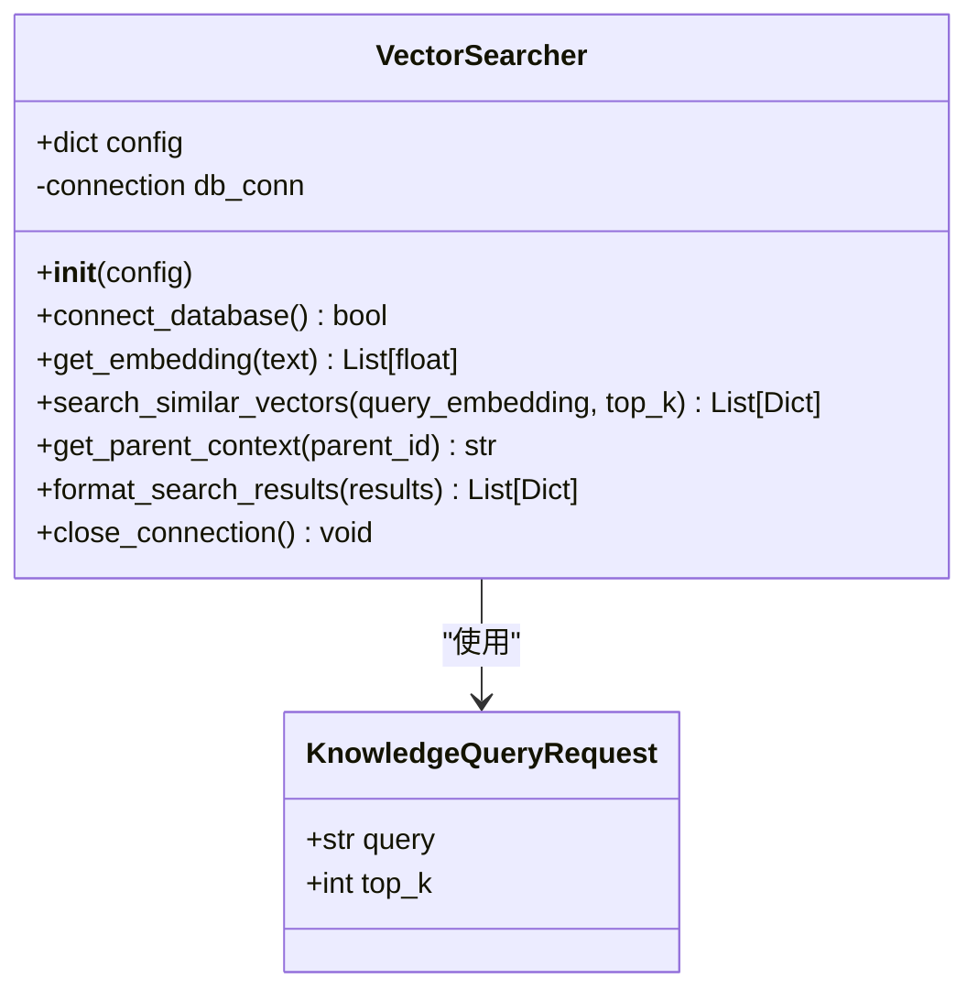
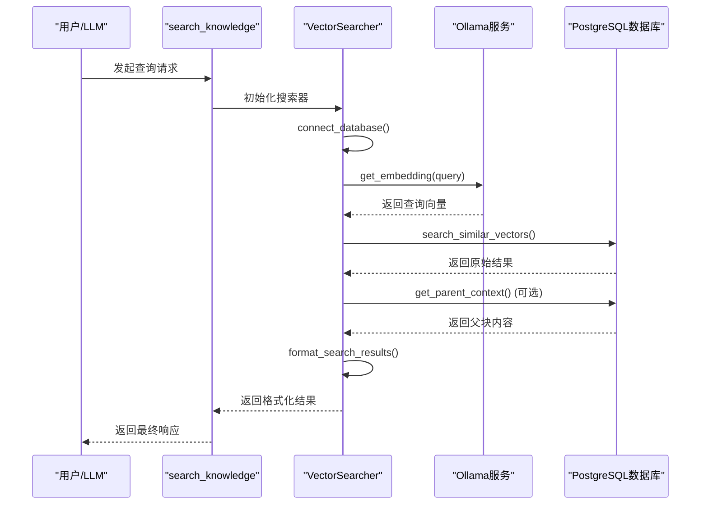
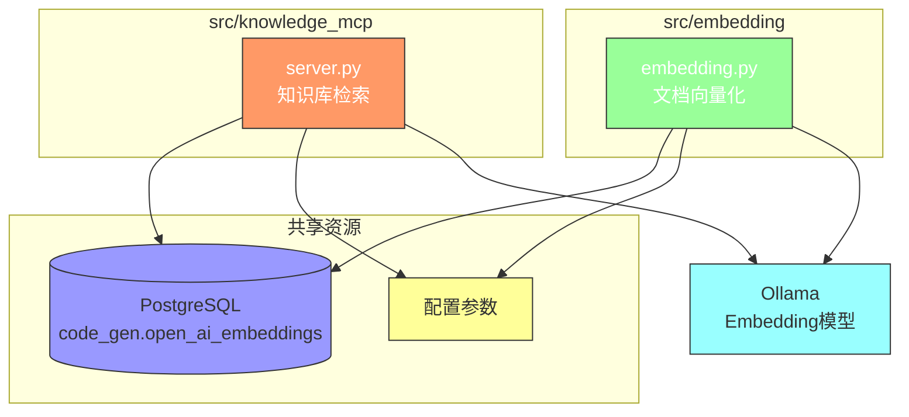

# 知识库检索服务

<cite>
**本文档引用的文件**   
- [server.py](file://src/knowledge_mcp/server.py)
- [embedding.py](file://src/embedding/embedding.py)
- [test_embedding.py](file://src/embedding/test_embedding.py)
- [README.md](file://src/embedding/README.md)
</cite>

## 更新摘要
**已做更改**   
- 更新了“配置项说明”部分，修正了`EMBEDDING_MODEL`环境变量的默认值
- 修正了与`embedding`服务协作关系中关于模型名称不一致的问题
- 更新了“依赖关系分析”中的图示来源注释
- 保持文档其余部分不变，因为代码变更仅为清理性质，不影响功能逻辑

## 目录
1. [简介](#简介)
2. [项目结构](#项目结构)
3. [核心组件](#核心组件)
4. [架构概述](#架构概述)
5. [详细组件分析](#详细组件分析)
6. [依赖关系分析](#依赖关系分析)
7. [性能考虑](#性能考虑)
8. [故障排除指南](#故障排除指南)
9. [结论](#结论)

## 简介
知识库检索服务（knowledge_mcp）是一个基于向量搜索的知识检索系统，旨在为大语言模型（LLM）提供与外部知识库的连接能力。该服务通过向量相似度匹配机制，在预处理的文档知识库中定位最相关的内容，从而增强LLM的上下文理解和回答能力。服务的核心功能是接收自然语言查询，将其转换为向量表示，并在PostgreSQL数据库的向量表中执行高效的相似度搜索，最终返回结构化的检索结果。

## 项目结构
知识库检索服务是`test_mcp_server`项目中的一个独立模块，位于`src/knowledge_mcp`目录下。该模块与负责文档向量化的`embedding`模块紧密协作，共同构成了完整的知识库系统。`embedding`模块负责将原始文档分块、向量化并存储到数据库，而`knowledge_mcp`模块则负责响应查询请求，执行检索。



**图示来源**
- [server.py](file://src/knowledge_mcp/server.py)
- [embedding.py](file://src/embedding/embedding.py)

## 核心组件
知识库检索服务的核心组件是`VectorSearcher`类和`search_knowledge`工具函数。`VectorSearcher`类封装了数据库连接、文本向量化、向量搜索和结果格式化等所有底层操作。`search_knowledge`函数则作为MCP（Model Context Protocol）工具，是外部系统（如LLM）与知识库交互的入口点。该服务依赖于`embedding`模块预先构建的向量数据库，并通过Ollama服务获取文本的向量表示。

**组件来源**
- [server.py](file://src/knowledge_mcp/server.py#L47-L267)
- [server.py](file://src/knowledge_mcp/server.py#L276-L300)

## 架构概述
知识库检索服务的架构遵循清晰的分层设计。最上层是MCP工具接口，负责接收和响应外部查询。中间层是`VectorSearcher`业务逻辑层，协调各个功能模块。底层是外部依赖，包括用于文本向量化的Ollama服务和用于存储与检索的PostgreSQL数据库。这种架构实现了关注点分离，使得服务易于维护和扩展。



**图示来源**
- [server.py](file://src/knowledge_mcp/server.py)
- [embedding.py](file://src/embedding/embedding.py)

## 详细组件分析

### 向量搜索机制分析
`VectorSearcher`类是实现向量搜索的核心。它通过一系列方法完成从查询到结果的完整流程。

#### 向量搜索器类图


**图示来源**
- [server.py](file://src/knowledge_mcp/server.py#L47-L267)
- [server.py](file://src/knowledge_mcp/server.py#L270-L272)

### 检索流程分析
当收到一个查询请求时，服务会执行一个标准的检索流程：连接数据库、向量化查询、执行搜索、格式化结果。

#### 检索流程序列图


**图示来源**
- [server.py](file://src/knowledge_mcp/server.py#L276-L300)
- [server.py](file://src/knowledge_mcp/server.py#L47-L267)

### 查询接口使用方法
知识库检索服务通过`search_knowledge` MCP工具提供查询接口。使用时，需要构造一个符合`KnowledgeQueryRequest`模型的请求。

**请求参数说明**
- **query**: (必填) 要搜索的知识查询内容。
- **top_k**: (可选) 返回最相似的前K个结果，默认值由环境变量`TOP_K`决定。

**使用示例**
```json
{
  "query": "如何实现用户登录功能？",
  "top_k": 3
}
```

### 返回结果解析示例
服务返回的结果是一个结构化的JSON对象，包含查询内容和检索到的结果列表。

**返回结果示例**
```json
{
  "content": [
    {
      "type": "object",
      "data": {
        "query": "如何实现用户登录功能？",
        "results": [
          {
            "id": "a1b2c3d4...",
            "content": "用户登录功能通过调用AuthService.login()方法实现...",
            "chunk_type": "child",
            "file_path": "docs/java/service.java.vm.md",
            "chunk_index": 2,
            "parent_id": "e5f6g7h8...",
            "similarity": 0.87,
            "parent_content": "完整的AuthService类实现，包含login, logout, register等方法..."
          },
          {
            "id": "i9j0k1l2...",
            "content": "前端登录页面通过调用/api/login接口提交用户名和密码...",
            "chunk_type": "child",
            "file_path": "docs/vue/index.vue.vm.md",
            "chunk_index": 1,
            "parent_id": "m3n4o5p6...",
            "similarity": 0.76,
            "parent_content": "完整的Vue组件代码，包含登录表单、验证逻辑和API调用..."
          }
        ]
      }
    }
  ]
}
```

**结果字段说明**
- **id**: 文本块在数据库中的唯一标识。
- **content**: 匹配到的文本内容片段。
- **chunk_type**: 块类型，`parent`表示父块（大语义单元），`child`表示子块（小检索单元）。
- **file_path**: 该内容来源的原始文件路径。
- **chunk_index**: 该块在文件或父块中的索引。
- **parent_id**: 如果是子块，此字段指向其父块的ID。
- **similarity**: 相似度分数，范围0-1，值越高表示与查询越相关。
- **parent_content**: 父块的完整上下文内容，有助于理解匹配片段的完整语义。

**组件来源**
- [server.py](file://src/knowledge_mcp/server.py#L270-L272)
- [server.py](file://src/knowledge_mcp/server.py#L276-L300)

## 依赖关系分析
知识库检索服务与`embedding`服务是紧密协作的关系，它们共享相同的数据库表结构和配置，但职责分离。



**图示来源**
- [server.py](file://src/knowledge_mcp/server.py)
- [embedding.py](file://src/embedding/embedding.py)
- [README.md](file://src/embedding/README.md#L45)

### 协作关系说明
- **数据共享**: 两个服务都操作同一个数据库表 `code_gen.open_ai_embeddings`。`embedding`服务负责写入（INSERT），`knowledge_mcp`服务负责读取（SELECT）。
- **配置一致**: 两者使用相同的数据库连接信息、Ollama服务地址、模型名称和表名，确保了数据的一致性。
- **流程互补**: `embedding`服务是知识库的“构建者”，它将原始文档处理成向量并存入数据库；`knowledge_mcp`服务是知识库的“使用者”，它响应查询并从数据库中检索相关信息。

## 配置项说明
服务的配置主要通过环境变量进行，提供了良好的灵活性和安全性。

**配置项说明**
- **OLLAMA_URL**: Ollama服务的地址，默认为 `http://localhost:11434`。
- **EMBEDDING_MODEL**: 用于文本向量化的模型名称，默认为 `rjmalagon/gte-qwen2-1.5b-instruct-embed-f16`。
- **DB_HOST**: 数据库主机地址，默认为 `localhost`。
- **DB_PORT**: 数据库端口，默认为 `5432`。
- **DB_NAME**: 数据库名称，默认为 `postgres`。
- **DB_USER**: 数据库用户名，默认为 `postgres`。
- **DB_PASSWORD**: 数据库密码，默认为 `1qaz2wsx`。
- **DB_SCHEMA**: 数据库模式名，默认为 `code_gen`。
- **DB_TABLE**: 存储向量的表名，默认为 `open_ai_embeddings`。
- **TOP_K**: 每次搜索返回的最相似结果数量，默认为 `5`。
- **SIMILARITY_THRESHOLD**: 相似度阈值，低于此值的结果将被过滤，默认为 `0.3`。

**组件来源**
- [server.py](file://src/knowledge_mcp/server.py#L30-L44)

## 故障排除指南
在使用知识库检索服务时，可能会遇到一些常见问题。

**常见问题及解决方案**
- **问题**: 数据库连接失败。
  - **原因**: 数据库服务未启动，或连接配置（host, port, user, password）错误。
  - **解决方案**: 检查PostgreSQL服务状态，并核对环境变量中的数据库配置。

- **问题**: 查询向量化失败。
  - **原因**: Ollama服务未启动，或指定的embedding模型未安装。
  - **解决方案**: 确保Ollama服务正在运行，并执行 `ollama pull <model_name>` 安装所需模型。

- **问题**: 搜索结果为空或不相关。
  - **原因**: 知识库中可能没有相关文档，或相似度阈值设置过高。
  - **解决方案**: 检查`docs`目录下是否有相关文档，并确认`embedding`服务已成功运行。可以尝试降低`SIMILARITY_THRESHOLD`环境变量的值。

- **问题**: 服务启动失败。
  - **原因**: 缺少必要的Python依赖包。
  - **解决方案**: 确保已安装`psycopg`和`requests`等依赖包，可以使用`uv sync`或`pip install psycopg requests`进行安装。

**组件来源**
- [server.py](file://src/knowledge_mcp/server.py#L100-L120)
- [server.py](file://src/knowledge_mcp/server.py#L150-L160)
- [server.py](file://src/knowledge_mcp/server.py#L200-L210)

## 结论
知识库检索服务（knowledge_mcp）是一个功能完整、设计清晰的向量搜索系统。它通过与`embedding`服务的紧密协作，实现了从文档知识库中高效检索相关信息的能力。服务采用模块化设计，核心逻辑封装在`VectorSearcher`类中，并通过标准化的MCP工具接口对外提供服务。其配置灵活，易于集成到基于LLM的应用中，为增强模型的知识问答能力提供了坚实的基础。通过理解其向量搜索机制、API使用方法和常见问题解决方案，开发者可以有效地部署和利用该服务来构建更智能的应用。