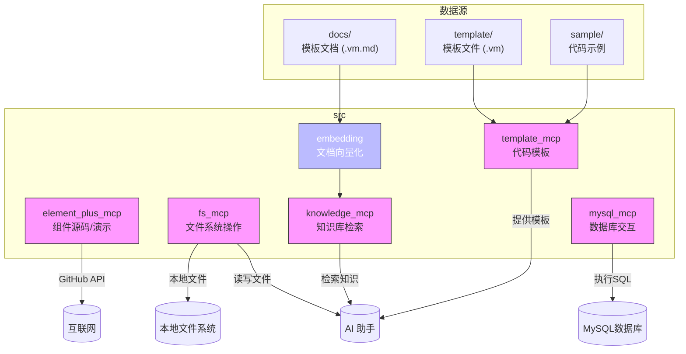
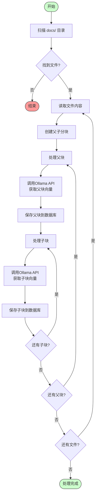
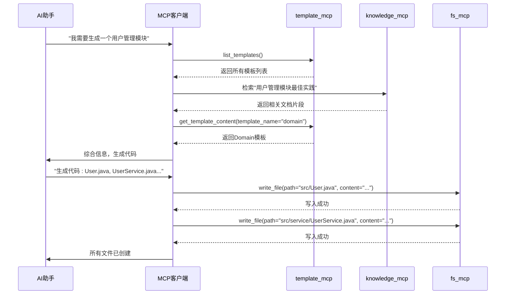

# 项目概述

<cite>
**本文档引用的文件**  
- [README.md](file://README.md)
- [src/element_plus_mcp/README.md](file://src/element_plus_mcp/README.md)
- [src/element_plus_mcp/server.py](file://src/element_plus_mcp/server.py)
- [src/element_plus_mcp/github.py](file://src/element_plus_mcp/github.py)
- [src/fs_mcp/README.md](file://src/fs_mcp/README.md)
- [src/fs_mcp/server.py](file://src/fs_mcp/server.py)
- [src/template_mcp/README.md](file://src/template_mcp/README.md)
- [src/template_mcp/server.py](file://src/template_mcp/server.py)
- [src/embedding/README.md](file://src/embedding/README.md)
- [src/embedding/embedding.py](file://src/embedding/embedding.py)
- [src/knowledge_mcp/server.py](file://src/knowledge_mcp/server.py)
- [src/mysql_mcp/server.py](file://src/mysql_mcp/server.py)
</cite>

## 目录
1. [项目结构分析](#项目结构分析)
2. [核心MCP服务模块详解](#核心mcp服务模块详解)
3. [系统架构与协作机制](#系统架构与协作机制)
4. [关键技术实现分析](#关键技术实现分析)
5. [模块化设计优势与AI开发应用](#模块化设计优势与ai开发应用)

## 项目结构分析

`test_mcp_server` 项目是一个基于 FastMCP 框架构建的模块化后端服务集合，旨在为 AI 助手提供多种能力接口。项目采用清晰的分层模块化设计，每个 MCP（Model Context Protocol）服务独立封装在 `src` 目录下的子目录中，职责分明，易于维护和扩展。

项目主要包含以下核心模块：
- **element_plus_mcp**: 提供对 Element Plus Vue.js 组件库的访问能力。
- **fs_mcp**: 提供安全的文件系统读写与管理功能。
- **template_mcp**: 提供代码生成模板的管理和检索服务。
- **embedding**: 负责文档向量化处理，将知识库内容嵌入到向量数据库。
- **knowledge_mcp**: 提供基于向量数据库的知识库检索能力。
- **mysql_mcp**: 提供与 MySQL 数据库的交互能力。

此外，`embedding/docs` 目录下存放了各类代码模板的文档化版本（`.vm.md`），这些文件是向量化处理的原始数据源，用于支持知识库检索。`template_mcp` 模块则直接管理模板文件（`.vm`）和示例文件（无后缀），用于代码生成。

**图示来源**
- [src/element_plus_mcp/README.md](file://src/element_plus_mcp/README.md)
- [src/fs_mcp/README.md](file://src/fs_mcp/README.md)
- [src/template_mcp/README.md](file://src/template_mcp/README.md)
- [src/embedding/README.md](file://src/embedding/README.md)

**本节来源**
- [README.md](file://README.md)
- [src/element_plus_mcp/README.md](file://src/element_plus_mcp/README.md)
- [src/fs_mcp/README.md](file://src/fs_mcp/README.md)
- [src/template_mcp/README.md](file://src/template_mcp/README.md)
- [src/embedding/README.md](file://src/embedding/README.md)

## 核心MCP服务模块详解

### Element Plus MCP 服务

该模块允许 AI 助手通过 MCP 协议访问 Element Plus 组件库的源码和示例。

**功能与工具**:
- **get_component**: 获取指定组件的完整源码。
- **get_component_demo**: 获取组件的使用演示代码。
- **list_components**: 列出所有可用的组件。
- **get_component_metadata**: 获取组件的元数据信息。
- **get_directory_structure**: 浏览 GitHub 仓库的目录结构。

该服务通过 `github.py` 模块与 GitHub API 交互，从 `element-plus/element-plus` 仓库的 `dev` 分支动态获取数据。用户可通过设置 `GITHUB_API_KEY` 环境变量来提高 API 请求配额。

**本节来源**
- [src/element_plus_mcp/README.md](file://src/element_plus_mcp/README.md)
- [src/element_plus_mcp/server.py](file://src/element_plus_mcp/server.py)
- [src/element_plus_mcp/github.py](file://src/element_plus_mcp/github.py)

### 文件系统 MCP 服务 (fs_mcp)

该模块为 AI 助手提供安全的文件系统操作能力。

**安全机制**:
- **路径验证**: 严格校验路径，防止路径遍历攻击（如 `../../../`）。
- **目录访问控制**: 通过 `MCP_ALLOWED_DIRECTORIES` 环境变量限定 AI 可访问的目录范围。
- **权限检查**: 在执行读写操作前检查文件权限。

**核心功能**:
- **文件操作**: `read_text_file`, `write_file`, `read_media_file` (返回 base64)。
- **目录操作**: `list_directory`, `create_directory`。
- **搜索与元数据**: `search_files` (支持通配符), `get_file_info`。
- **高级编辑**: `edit_file` 支持模式匹配替换、保持缩进和干运行预览。

此服务是 AI 自动化开发中实现“读写项目文件”这一关键能力的基础。

**本节来源**
- [src/fs_mcp/README.md](file://src/fs_mcp/README.md)
- [src/fs_mcp/server.py](file://src/fs_mcp/server.py)

### 模板 MCP 服务 (template_mcp)

该模块是代码生成的“模板中心”，为 AI 提供标准化的代码骨架。

**模板分类**:
- **后端 Java**: 包含 `domain`, `service`, `controller`, `mapper` 等模板。
- **前端 Vue/JS**: 包含 `vue/index.vue.vm`, `js/api.js.vm` 等模板。
- **数据库 SQL**: 包含 `sql/sql.vm` 菜单脚本模板。

**核心工具**:
- **get_template_content**: 根据 `template_name` 获取 `.vm` 模板文件的完整内容。
- **get_sample_content**: 获取 `sample/` 目录下的示例代码内容。
- **list_templates** 和 **list_template_categories**: 用于发现可用的模板。

该服务通过读取 `template/` 目录下的 Velocity 模板文件（`.vm`）来提供内容，这些模板通常包含占位符，由 AI 在生成代码时填充。

**本节来源**
- [src/template_mcp/README.md](file://src/template_mcp/README.md)
- [src/template_mcp/server.py](file://src/template_mcp/server.py)

### 嵌入与知识库 MCP 服务

这两个模块协同工作，构建了项目的“记忆”和“知识”能力。

#### 嵌入服务 (embedding)

该模块负责将非结构化的文档知识转化为机器可检索的向量。

**处理流程**:
1. **扫描文档**: 递归扫描 `docs` 目录，支持 `.md`, `.java`, `.vue` 等多种格式。
2. **文本分块**: 采用“父子分块”策略。先将文档分为较大的“父块”（3000字符），再将父块分为较小的“子块”（1000字符），并设置重叠（100字符）以保持上下文连贯。
3. **向量化**: 调用本地 Ollama 服务的 `nomic-embed-text:v1.5` 模型，将每个文本块转换为 1536 维的向量。
4. **存储**: 将文本内容、向量、文件路径等信息存入 PostgreSQL 的 `pgvector` 扩展表中，并通过 MD5 哈希避免重复处理。

**图示来源**
- [src/embedding/embedding.py](file://src/embedding/embedding.py#L100-L300)

**本节来源**
- [src/embedding/README.md](file://src/embedding/README.md)
- [src/embedding/embedding.py](file://src/embedding/embedding.py)

#### 知识库 MCP 服务 (knowledge_mcp)

该模块对外提供基于向量相似度的知识检索能力。

**工作原理**:
- 当 AI 需要查询某个技术问题（如“如何创建一个 Vue3 的 Form 组件？”）时，`knowledge_mcp` 服务会：
    1. 接收查询文本。
    2. 调用 Ollama API 将查询文本转换为向量。
    3. 在 `pgvector` 数据库中进行相似度搜索，找到最相关的文本块（通常是子块）。
    4. 返回匹配的文本内容及其来源文件路径。
- 由于父块也存储了向量，系统可以同时利用粗粒度（父块）和细粒度（子块）的信息进行检索，提高准确率。

**本节来源**
- [src/knowledge_mcp/server.py](file://src/knowledge_mcp/server.py)
- [src/embedding/embedding.py](file://src/embedding/embedding.py)

### MySQL MCP 服务

该模块提供与 MySQL 数据库的直接交互能力。

**功能**:
- 允许 AI 助手执行 SQL 查询和更新操作。
- 可用于查询数据库结构、验证数据或执行数据初始化脚本。

此服务简化了 AI 在开发过程中与数据库的交互，使其能够像开发者一样“查看数据库”。

**本节来源**
- [src/mysql_mcp/server.py](file://src/mysql_mcp/server.py)

## 系统架构与协作机制

整个 `test_mcp_server` 项目遵循统一的 MCP 协议，各服务模块作为独立的服务器运行，共同为 AI 助手提供一个强大的能力集合。

**统一协议**:
所有 MCP 服务都基于 `FastMCP` 框架实现，对外暴露标准化的工具（Tools）和提示（Prompts）。AI 助手通过一个 MCP 客户端，可以无缝调用这些服务，无需关心底层实现。

**协作流程示例**:
一个典型的 AI 辅助开发流程可能涉及多个服务的协作：
1. **知识获取**: AI 首先通过 `knowledge_mcp` 检索最佳实践和模板文档。
2. **代码生成**: 结合检索到的知识和 `template_mcp` 提供的代码骨架，AI 生成具体的代码。
3. **文件操作**: 使用 `fs_mcp` 将生成的代码写入项目文件系统。
4. **组件集成**: 如果需要集成 UI 组件，AI 可通过 `element_plus_mcp` 获取 `el-table` 的使用示例。
5. **数据交互**: 通过 `mysql_mcp` 验证或操作后端数据库。

这种模块化设计使得系统高度灵活。例如，`embedding` 模块可以独立运行，定期将最新的文档向量化，而 `knowledge_mcp` 则能立即利用这些新知识。

**图示来源**
- [src/template_mcp/server.py](file://src/template_mcp/server.py)
- [src/knowledge_mcp/server.py](file://src/knowledge_mcp/server.py)
- [src/fs_mcp/server.py](file://src/fs_mcp/server.py)

## 关键技术实现分析

### 文档向量化实现 (DocumentEmbedder)

`src/embedding/embedding.py` 中的 `DocumentEmbedder` 类是知识处理的核心。

**关键设计**:
- **父子分块策略**: 通过 `create_parent_child_chunks` 方法实现。大父块（3000字符）保留了完整的语义上下文，小的子块（1000字符）则作为精确检索的单元。这种设计平衡了检索的准确性和召回率。
- **去重机制**: 使用 `generate_id` 方法对文本内容进行 MD5 哈希，作为唯一 ID。在保存到数据库前进行查询，避免了重复向量化，节省了计算资源。
- **错误处理**: 每个关键步骤（数据库连接、API调用、文件读取）都包含 `try-except` 块，并通过 `logging` 模块记录详细信息，确保了处理流程的健壮性。

**本节来源**
- [src/embedding/embedding.py](file://src/embedding/embedding.py)

### 安全的文件操作实现

`fs_mcp` 模块的安全性是其设计的重中之重。

**路径验证**:
服务在处理任何文件路径前，都会将其解析为绝对路径，并检查该路径是否位于 `MCP_ALLOWED_DIRECTORIES` 列表中的任何一个目录之下。任何试图访问受限目录之外的请求都会被拒绝。

**权限检查**:
在执行 `read_text_file` 或 `write_file` 等操作前，服务会使用 Python 的 `os.access()` 函数检查当前进程是否具有相应的读写权限，防止因权限不足导致的意外错误。

**本节来源**
- [src/fs_mcp/server.py](file://src/fs_mcp/server.py)

## 模块化设计优势与AI开发应用

`test_mcp_server` 项目的模块化设计带来了显著的优势：

**优势**:
1. **高内聚低耦合**: 每个 MCP 服务只关注单一职责，代码清晰，易于独立开发、测试和部署。
2. **易于扩展**: 要添加新能力（如 Redis 操作、Kafka 消息），只需创建一个新的 MCP 模块，无需修改现有代码。
3. **技术栈灵活**: 不同的 MCP 服务可以使用最适合其任务的技术栈，例如 `embedding` 依赖 Ollama，而 `fs_mcp` 则专注于本地 I/O。
4. **故障隔离**: 一个服务的崩溃不会直接影响其他服务的运行。

**在AI辅助开发中的应用价值**:
该项目完美诠释了 MCP 协议在 AI 编程中的应用。它将开发者日常工作中的各种“能力”（查文档、读代码、写文件、连数据库）封装成标准化的工具。AI 助手通过调用这些工具，可以像人类开发者一样，完成从需求分析、知识检索、代码生成到文件落地的完整闭环。这极大地提升了 AI 的自主性和实用性，是构建下一代智能开发助手的关键基础设施。